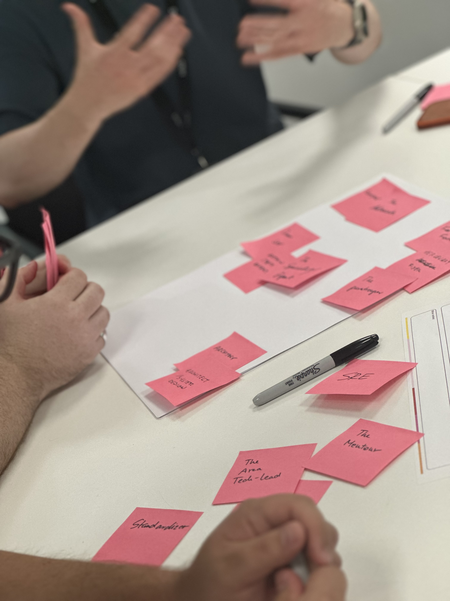

# 01 - Introduction

This manual outlines the rational defaults that define the principles, values, and standards of The AK Way. It reflects our commitment to excellence by aligning teams around shared values and a common cultural foundation. These standards support quality, reliability, and innovation across every engagement.

At Armakuni, we are committed to our vision:

**Return joy and creativity to the world of software engineering.** The AK Way combines **technical approaches**, **cultural considerations**, **customer-centricity**, and **continuous improvement**. Aligning with these defaults helps us consistently exceed client expectations and deliver impactful outcomes.

This living document evolves with our organisation, fostering collaboration, learning, and growth. It provides tools, resources, and best practices to empower teams to create meaningful engagements. Our success depends on working collaboratively, communicating openly, and embracing change. By upholding the values and principles in this manual, we can build a culture of excellence and achieve our vision.

# The Six Pillars

There are six pillars that act as the foundations of the AK Way. They describe the beliefs and working principles that guide every engagement, from shaping teams to delivering value for our clients. Each pillar links to practical behaviours and practices, ensuring our culture is lived day to day, not just written down. The pillars are:

## **1. Great software is built by great teams**

Products succeed or fail based on the capability, trust, and collaboration of the people who build them. Strong teams adapt faster, solve problems creatively, and deliver more reliably.

Invest in cross-functional, T- or comb-shaped teams with clear roles, shared goals, and psychological safety.

**AK Way practices:**

* **Team APIs** to set clear expectations for ways of working and services offered.
* **Cognitive load mapping** to ensure teams can sustainably handle their responsibilities.
* **Team interaction modes** (collaboration, X-as-a-service, facilitating) to define how teams work together.

## **2. Great software is built for customers**

Technology that fails to meet real customer needs creates waste and erodes trust. Successful software delivers value by solving the right problems at the right time.

Engage directly with customers, test assumptions early, and measure success against customer outcomes, not outputs.

**AK Way practices:**

* [**Inceptions**](../03-delivery-team-methodology/principles-practices-and-tools/01-inception.md) to align on vision, value, and customer priorities.
* **User story mapping** to frame work around real user journeys.
* **Customer feedback loops** embedded in delivery to validate progress.

## **3. Work in feedback loops**

Without timely feedback, teams drift, risks grow, and the cost of mistakes multiplies. Frequent feedback enables rapid course correction and continuous learning.

Use iterative delivery, automated tests, monitoring, and customer reviews to validate decisions and adapt quickly.

**AK Way practices:**

* [**Pair programming**](../04-modern-engineering-practices/principles-practices-and-tools/02-pair-programming-and-teaming.md) to share knowledge and expertise across the team.
* [**Test-Driven Development**](../04-modern-engineering-practices/principles-practices-and-tools/05-test-driven-development.md) to get feedback on working software quickly.
* [**Daily standups**](../03-delivery-team-methodology/principles-practices-and-tools/05-daily-stand-up.md) to surface blockers early.
* [**Showcases**](../03-delivery-team-methodology/principles-practices-and-tools/07-team-reviews-and-demos.md) to gather feedback from stakeholders.
* [**Continuous Integration/Continuous Delivery**](../04-modern-engineering-practices/principles-practices-and-tools/09-continuous-integration-continuous-delivery.md) to test and release changes rapidly.

## **4. Make things visible**

Invisible work breeds misalignment, delays, and poor decision-making. Transparency allows teams and stakeholders to prioritise, coordinate, and solve problems early.

**Key practice:** Use team boards, dashboards, and information radiators to make progress, blockers, and risks visible to all.

**AK Way practices:**

* **Information radiators** for delivery status and metrics.
* **Risk backlogs** to track and manage risks openly.
* **Capacity and dependency mapping** to align expectations across teams.

## **5. Automation amplifies human potential**

Manual, repetitive work slows delivery, increases error rates, and drains creative energy. Automation improves consistency and frees people to focus on high-value thinking.

Automate builds, tests, deployments, and routine operational tasks as part of your delivery pipeline.

**AK Way practices:**

* **Automated testing** for quality and regression prevention.
* **Infrastructure as Code** to ensure environments are consistent and repeatable.
* **Dependency management automation** (e.g. Dependabot) to keep systems up to date.

## **6. Continuous improvement is a habit**

Markets, technologies, and teams evolve — so must your processes, skills, and product. Treat improvement as ongoing, not occasional.

**Key practice:** Hold regular retrospectives, run small experiments, and track measurable improvements over time.

**AK Way practices:**

* **Retrospectives** to reflect and act on improvement opportunities.
* **Experiment tracking** to measure the impact of changes.
* **Capability reviews** to identify skill gaps and development needs.

# **How to Use the AK Way**

This manual serves as your guide to success in any client or internal Armakuni initiative involving software delivery. It is structured to introduce concepts in a deliberate sequence — fostering the right mindset first, then providing the practical tools and methods to consistently deliver exceptional results.

## Adopting a Product Mindset

We start by introducing [Product development](../02-product-development/01-product-development-and-management.md), where we develop an understanding of user needs and stakeholder requirements. We put the user at the centre of our work to ensure our solutions effectively address real-world challenges. We recognise the importance of flexibility in product development, enabling us to adapt to learning from customer feedback and data indicators. We emphasise defining clear outcomes as the guiding light throughout the software development lifecycle.

## Aligning with Delivery Methodology

The [Delivery Team Methodology](../03-delivery-team-methodology/delivery-team-methodology.md) section explains how methods are rooted in these key values:

* *Individuals and Interactions* over *Processes and Tools*
* *Working Software* over *Comprehensive Documentation*
* *Customer Collaboration* over *Contract Negotiation*
* *Responding to Change* over *Following a Plan*

We acknowledge the value of the items on the right and work to achieve them; however, we put more value on the lefthand items and will always uphold these values.

By embracing these principles, we foster a culture of adaptability, collaboration, and responsiveness and adopt practices that are in harmony with the Product development practices.

## Implementing Engineering Practices

We adopt various [engineering practices](../04-modern-engineering-practices/01-engineering.md) to facilitate rapid and efficient software development. These practices enable fast flow and drive continuous improvement. From [Continuous Integration/Continuous Delivery](../04-modern-engineering-practices/principles-practices-and-tools/09-continuous-integration-continuous-delivery.md) (CI/CD) to [Infrastructure as Code](../04-modern-engineering-practices/principles-practices-and-tools/11-infrastructure-as-code-iac.md) (IaC) to [Shifting Left on Security](../04-modern-engineering-practices/principles-practices-and-tools/13-shift-left-security.md), each practice plays a vital role in our ability to deliver value quickly, reliably, and consistently.

## Lean Governance

Our [Governance](../05-governance/01-governance.md) section provides necessary oversight without impeding the delivery process. It is lightweight and flexible, allowing autonomous teams while adhering to established standards and guidelines. Decisions are made at the appropriate level and the right time, ensuring that projects stay on track and deliver value to our clients and stakeholders.

If you follow the principles outlined in this manual and embrace the tools and practices provided, you can succeed confidently in any engagement. Let's work together to exceed expectations and deliver outstanding results for our clients and stakeholders.

 