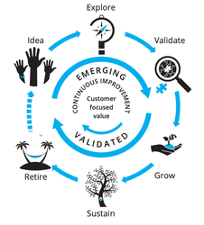

# 01 - Product development and management

Product management is the practice that helps businesses navigate the rapidly changing world of market demands, and user needs when building software-enabled services. This section provides a framework that guides our thinking and actions throughout the various stages of product evolution.

# What is a Product?

A product is an entity that creates a specific value for a group of people, the customers, users and the organisation that develops and provides it. For Armakuni, a product is a software solution that solves a problem or provides a tangible benefit.

Unlike traditional software delivery approaches that view development as a series of projects with defined start and end dates, the product mindset emphasises continuous value delivery and long-term user satisfaction. With the product mindset, software is not just a one-time project but an ongoing undertaking evolving to meet changing user needs and market demands. Instead of focusing solely on project completion, the product mindset prioritises creating sustainable solutions that add value to users and the business throughout the product lifecycle. These sustainable solutions could be features that are continuously updated based on user feedback or a product roadmap that adapts to market changes.

# What are the benefits?

An obvious question is, "Why is this way better than having a certainty of end dates, project plans and pre-agreed timelines?" The short answer is that the needs of users, the business, and the market inevitably change over time, causing the software to change too. Agreed project plans cannot anticipate the impact of future learnings. By taking a product approach, we focus on meeting the users' needs, and by being data-informed, we are confident in our decisions, delivering value as those needs evolve. Reframing software delivery as an evolving product has many benefits over traditional static approaches.

**Higher flexibility**: We collaborate closely with stakeholders, respond swiftly to new learnings, set our destination, adjust our course, and remain flexible rather than tied to a rigid plan.

**Lower costs:** We iterate based on user and business insight, reducing the need for redevelopment and delivering long-term cost savings. Iteration also enables a competitive advantage, as our products remain relevant.

**Higher quality**: Product success is measured based on the value delivered to the user. The whole team focuses on generating value informed by data and user feedback.

## 

# How do I get started?

At Armakuni, we understand that building and maintaining a product mindset and culture requires​​ consistent intention and effort. The '[Principles, Mindset and Tools](principles-practices-and-tools/01-principles-mindset-and-tools.md)' section is a comprehensive guide that highlights the values and tools that will help along the product journey. It includes principles such as user-centricity and continuous improvement, mindset shifts like embracing change and learning from failures, and tools like user feedback platforms and agile methodologies. We recommend grasping the principles before proceeding to the tools. Use the principles to guide the decision-making process.

The [Product Lifecycle](02-product-lifecycle.md) section introduces a lean framework for understanding the different stages a product will go through in its lifetime. This strategic framework can help us set goals and adopt strategies and tools best suited for each stage, enabling us to make better decisions and stay ahead of the curve.

 