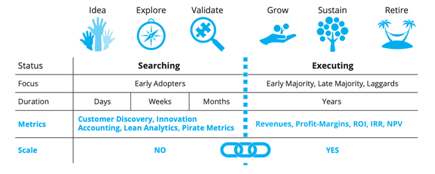
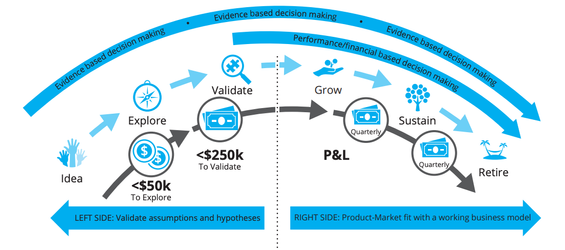

# 02 - Product Lifecycle

Depending on where your product is in its lifecycle, it will help inform the strategies you use to develop it. In this section, we describe the six stages of product development. Understanding each stage enables you to focus on the right activities for your users, the business, and the level of investment needed at each stage.

The six stages are:

# Idea

During the idea stage, teams generate hypotheses using customer and market insights. After brainstorming several hypotheses, they select one to focus on. Teams review the chosen hypothesis for risky assumptions and brainstorm effective ways to test them.

# Explore

In the Explore stage, teams conduct experiments to test their riskiest assumptions. This stage focuses on customer needs, pain points, and the "job to be done." Teams gather valuable insights that will inform the development process through interviews, surveys, and prototype testing.

# Validate

During the Validate stage, teams use the insights gathered from the Explore stage to develop a solution for customers, starting with a minimum viable version. The goal is to create a product that delivers value to customers in increments. Additionally, the solution development process tests aspects of the business model, including pricing, costs, and distribution channels.

# Grow

After demonstrating traction in the previous stage, the team focuses on growing and scaling the product based on a validated business model. The main objectives during the growth stage are to increase customer numbers, revenues, and profits through targeted marketing, sales, and expansion efforts.

# Sustain

Over time, all products reach a level of maturity as markets become saturated, competitors enter the market, or technology changes. When this occurs, products enter the Sustain stage. During this stage, the focus shifts to sustaining revenues and profits while optimising operations and reducing costs.

# Retire

Eventually, every product reaches the end of its lifecycle. During the Retire stage, the team ensures customers are not inconvenienced by implementing a plan to mitigate any adverse effects. The plan may include offering alternative products or services, providing ample notice, and assisting customers with transitioning away from the product.

The first three stages, idea, explore and validate, involve testing the validity of ideas to find product-market fit. The second three stages, grow, sustain, and retire, involve executing the business model and exploiting it efficiently until the product is ready to be retired.

We recommend reading ["Lean Product Lifecycle"](https://www.leanproductlifecycle.com/) to learn more about the product lifecycle.

 

 