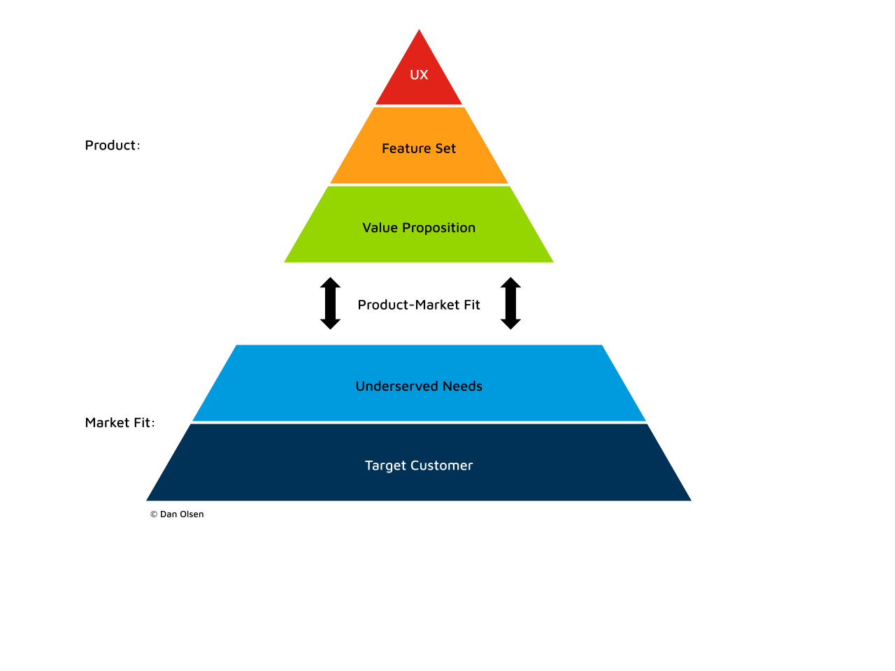

# 08 - Product Market Fit

The Product-Market Fit framework is an actionable model designed to iteratively develop a minimum viable product (MVP) that effectively satisfies the underserved needs of its target customers. As the name suggests, this framework ensures that the product fits the identified market well.

 

# When is it useful?

This framework helps you to converge on an MVP by testing different ideas with your target customers. Therefore, this is most useful in the Idea, Explore, and Validate stages of the Product development lifecycle.

# How do you use it?

The framework provides six steps to help you achieve product-market fit. We use the word "achieve" because we want to measure whether there is a strong alignment between a product's value proposition and the underserved needs of target customers. The measures need to indicate that customers or users are enthusiastically buying, using, and sharing their experiences with your product with others.

## Step 1: Determine your target customer

Begin by thoroughly understanding your target market. Ask questions such as, "Who might buy this product?" and "Will it meet their needs?" Conduct market research and use segmentation to identify niche requirements, exploring questions like, "What are their pain points, needs, and preferences?" Create user personas representing your ideal audience to help the team empathise with the target users. This approach aids in visualising products that would be valuable for specific consumer types.

Find more resources on [User Research](02-user-centric-product-development.md).

## Step 2: Identify underserved customers' needs

Underserved needs refer to situations where users find their current tools inadequate for fully meeting their requirements. In this step, engage with target customers to understand their dissatisfaction and explore how your product can address these gaps. Ask questions like, "What are you unhappy with?" and "What changes would make a difference?" Conduct one-on-one sessions using MVP prototypes, screen mockups, or competitor products if available. Closely observe customer interactions and ask open-ended questions to gain deeper insights.

## Step 3: Define your value proposition

Defining your product's value proposition involves determining how your product will better meet customer needs than alternatives. This process includes narrowing down the potential needs your product could address to those with the maximum positive impact. Carefully select the unique features that will differentiate your product from competitors and outperform them so that customers will use it and tell others about it.

Try this [Value Proposition Canvas.](https://www.strategyzer.com/library/the-value-proposition-canvas)

## Step 4: Specify your MVP feature set

After understanding the differentiated value, the next step is to specify the minimum and unique feature set required to get the product into the hands of target customers as quickly as possible.

"Minimum" is the key term here. We want to avoid spending excessive time building a product only to discover later that customers don't like it. The goal is to develop simply enough to create significant value for the target customer. Customers will provide feedback if something essential is missing, allowing you to iterate quickly and make necessary improvements.

[Iterate and experiment](04-iterative-and-experiment-driven.md) to assess what works for your target users.

## Step 5: Create your MVP prototype

At this stage, we aim to produce a version of the product that gathers enough feedback from customers before the next iteration. This prototype can vary in its level of completion. Initially, this might involve using medium-fidelity wireframes or high-fidelity mockups to demonstrate user experience (UX) design to customers. Modern UX tools can make these mockups interactive, simulating a "real" experience with static data.

However, ensuring a smooth transition from wireframes to a working software MVP is crucial. In high-pressure projects with tight deadlines, there's a risk of getting stuck in a cycle of repeated "sign off in Figma" stages without progressing to a functional MVP. Focusing on quickly developing live, working versions for customer testing is essential. Once we have working software, using Figma-style mockups is no longer required, as implementing design ideas directly in releasable software generates faster feedback.

Collaboration between technology and UX specialists within the team is vital. They should work together to determine the fastest way to implement the MVP feature set and ensure continuous, incremental improvements based on real user feedback.

Find out more about [User Experience Design and Testing](02-user-centric-product-development.md) techniques

## Step 6: Test your MVP with customers

Gathering consumer feedback is a crucial step toward achieving product-market fit. Allowing consumers to test the product helps developers understand what works and what doesn't. To ensure valuable feedback, it's essential to involve the target customers. Use a "screener" survey to verify that participants match the desired target customer profile, avoiding demands that might steer the product in the wrong direction.

Testing the MVP is most effective in a one-on-one setting with each customer. Carefully observe what the customer says and does as they interact with the MVP. Avoid leading or closed questions, such as "Wasn't this easy to do?" or "Did you like feature X?". Instead, use open-ended questions like "What did you think of X?" to encourage customers to share their honest thoughts and experiences.

Conduct these tests in batches of 5-8 participants. This sample size is large enough to identify issues with the product while minimising repetitive feedback. Analysing these patterns will help prioritise concerns for the next iteration, ensuring continuous improvement and alignment with customer needs.

# Measuring with Metrics

Direct customer research provides qualitative data. For Products that have reached a stage where we have active customers or are in beta release stages, we can also generate quantitative data to guide the decision-making process. For example, consider measuring things like:

* Acquisition rate — You want adoption of your product at a high enough rate to show sustained growth
* Retention — Not only do you need to acquire users, but you need to keep them
* Engagement — Are enough users or customers using your product regularly and getting value from it?
* Revenue — Are enough of your users or customers choosing to pay for your product or service?
* Learn more about how to [measure product market fit](https://blog.logrocket.com/product-management/what-is-product-market-fit-measure-examples/#how-to-measure-product-market-fit)

# Rinse and repeat

Each iteration of these steps should move the MVP closer to achieving more positive and fewer negative customer responses. Analysing patterns and feedback will guide the product's evolution, ensuring it meets customer needs more effectively with each cycle.

Once the product achieves product-market fit, the focus should shift to maintaining this fit for sustained success. Maintaining fit requires the team to continuously monitor customer needs and emerging trends, ensuring the product remains aligned and relevant. It's also important to continue fostering a team culture built on principles of customer satisfaction and continuous improvement.