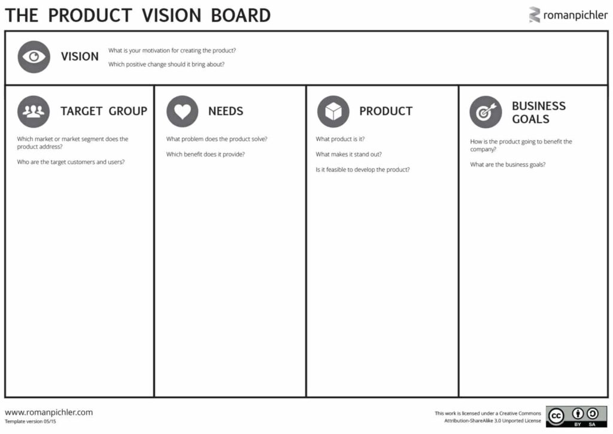

# 09 - Product Vision and Product Strategy

A product vision is a clear and compelling description of your product's future aspirations. It outlines the product's purpose and desired outcomes. A well-defined product vision guides the entire product team, aligning everyone around a shared ambition. A successful vision statement should be concise, inspirational and memorable.

A product strategy is a high-level plan that helps you realise your vision and succeed. By answering questions about the target user group, user needs, value proposition, differentiation and business goals it aligns to, a product strategy informs a roadmap for the product's development and success.

# When should you use it?

Having a vision and strategy in the initial *Idea* phase helps align efforts from the start to the *Explore* and *Validate* stages. Documenting the vision early on aids in making significant product-related decisions, reminding us of the ultimate goal and filtering out distracting ideas. The initial strategy provides direction for other frameworks used in the early stages, such as [Product-Market fit](08-product-market-fit.md) or Product Discovery. As we validate and learn through these tools, we iteratively refine the strategy, ensuring it remains relevant and compelling.

# How do you do it?

Tools like [Product Vision Board](https://www.romanpichler.com/blog/the-product-vision-board/), by Roman Pichler, provide a lightweight structure for capturing both the vision and the strategy:

 

This can be collaborated on in a workshop between the product team, the leadership team and any interested parties, such as client leadership, if the product is for a client. As can be seen in the picture, it has five areas to fill out:

## 1. Target Group

This section should describe the target user groups that will benefit from the product and clarify who the "users" and "customers" are. Attempting to capture too many unrelated target segments under one umbrella can quickly result in the product being unable to satisfy the needs of any single group, and it will likely not result in a successful product. It's best to group users by their needs or goals,  ask why are they using this product, what are they aiming to achieve? Once you have identified the groups prioritise them.

* The target user groups should be defined based on User Research, as described [here](02-user-centric-product-development.md).

## 2. Needs

In the Needs section, we clearly define the primary user problems or opportunities the product aims to solve and answer key questions such as, "Why would someone pay for this product?" Understanding customer needs involves delving into the behaviours and motivations of the target user. When completing this section, it's crucial to distinguish customer needs from product features. The "what" from the needs will guide the "how" in the form of a feature set that responds to those needs.

## 3. Product

Here, we summarise the product's critical attributes for its success. These essential features address the users' needs and differentiate your product. It's important to avoid making a long list of all potential features; we can add the finer details during the building phase. Focus on selecting up to five main ideas that will effectively meet the users' needs and set the product apart - we want headlines not details at this stage.

## 4. Business Goals

Business goals articulate why the organisation should invest in this product. The goals must illustrate the value that can be generated for the business, and how this product can contribute to achieving existing goals within the company strategy. For instance, instead of stating, "Make more money," a more precise goal would be "Increase revenue by introducing a subscription model."

## 5. Vision

It can be helpful to leave the creation of the vision to last and work out the other sections first. The vision brings all the threads together into a compelling statement. Creating the statement after working out the strategy creates a greater sense of ownership within the team who have contributed to it, which leads to stronger motivation to help the product succeed.

A product vision must be inspirational, concise, memorable, easy to repeat, and, most importantly, supported by everyone in the product team, including key business stakeholders. A well-defined product vision should guide strategic decision-making, rally stakeholders, and give the entire product team an aligned sense of purpose.

Take [LinkedIn's vision](https://about.linkedin.com/), for example, which says, "Create economic opportunity for every member of the global workforce". It clearly outlines who its product is for (global workforce) and the value it aims to provide (economic opportunity).

It's important not to describe the solution in the vision statement, the vision may be unattainable, as it's an ambition, a moonshot. The solution is likely to evolve over time as new insight is gained. You may find the vision statement already exists, if so work through the strategy sections and then review the vision statement and refine it if needed.

See: <https://www.romanpichler.com/blog/tips-for-writing-compelling-product-vision/>