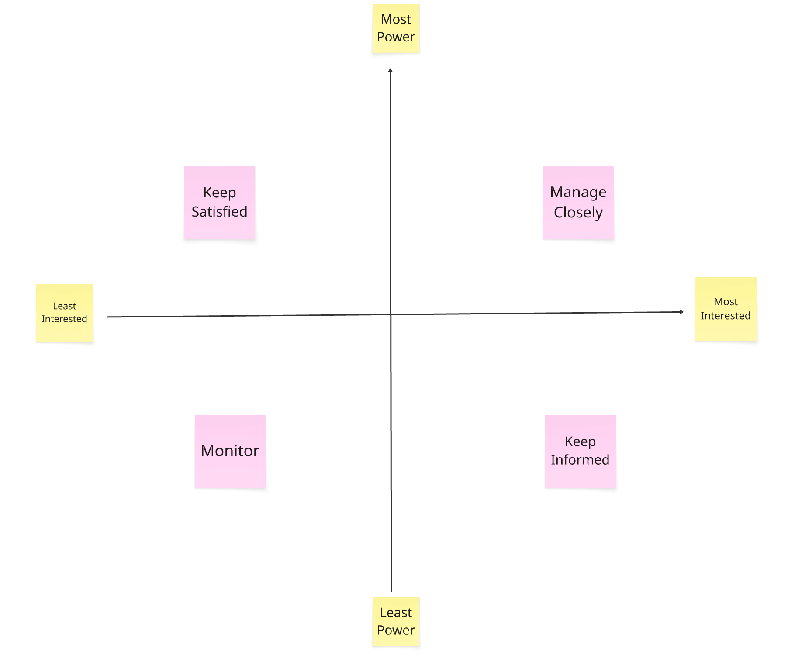

# 11 - Effective Stakeholder Engagement

Effective stakeholder engagement is essential for successful product management. It is about enabling stakeholders to contribute meaningfully, transforming them into partners rather than a force that is against you. This is a perpetual need in Product and Engineering, and it's in your gift to cultivate this mindset and behaviour. Effective stakeholder engagement is a thread that weaves in and around every interaction, from the tools and methods we use to the human skills we exercise.

As we navigate the complex landscape of Product Engineering and strive for the best outcomes, these five principles help unlock effective stakeholder engagement:

1. Understand Your Stakeholder Landscape
2. Cultivate Empathy and Build Relationships
3. Collaborate with Compassionate Boundaries
4. Work Transparently and Intentionally
5. Act with Accountability

# **1. Understand Your Stakeholder Landscape**

Effective engagement begins with understanding the people you are working with. Map your stakeholders to understand their roles, interests, and influence. A classic method is to categorise them to help focus your engagement efforts:

* Keep Satisfied: High power / Low interest
* Manage Closely: High power / High interest
* Monitor: Low power / Low interest
* Keep Informed: Low power / High interest

 

Beyond mapping and engagement planning, identify your allies and champions. These are the people who are invested in your product's success and are willing to advocate for your work, identify those you can convert into champions too.

Building on these relationships can help you navigate challenges and build momentum. By understanding who your stakeholders are and what motivates them, you can tailor your approach to meet their needs, and get the best from them and their contributions.

# **2. Cultivate Empathy and Build Relationships**

Stakeholder engagement is a fundamentally human-centric practice. To build a robust foundation, cultivate connections and foster compassion, which means understanding stakeholders as individuals, beyond their roles. Show genuine interest in their motivations and concerns to build the trust that is the foundation of effective teamwork, as described in [The Five Dysfunctions of the Team](https://en.wikipedia.org/wiki/The_Five_Dysfunctions_of_a_Team).

By framing stakeholders as partners rather than thinking of them as obstacles, you can move from transactional interactions to true partnership. This trust will be invaluable when you need to make tough decisions or navigate conflicting priorities. When stakeholders feel heard and respected, they are more likely to support your vision and contribute positively.

Enable your stakeholder to understand users and their needs with compassion. Bring stakeholders close to users, involve them directly in user research and findings playbacks. Connect Stakeholders with the challenges and opportunities, provide context to support them in making meaningful contributions. Also consider the intangibles, pay attention to the subtleties of communication, influence and negotiation to supercharge your stakeholder engagement powers. [Getting More](https://gettingmore.com/) is a valuable guide to honing negotiation skills.

# **3. Collaborate with Compassionate Boundaries**

True collaboration means 'doing with, not to'. Empower your core team while ensuring your stakeholders feel like an integral part of the journey. When you collaborate, you are not dictating the path forward but rather co-creating it. This requires fostering psychological safety, where all parties feel safe to belong, learn, contribute and challenge without fear of negative repercussions. This includes everyone being accountable for our actions and behaviours.

Be curious, show interest in stakeholders' perspectives, explore their ideas with an open mind and a willingness to understand their viewpoint. Agree on their role, within the work, for shared clarity and to avoid misunderstandings. Use the [Team Onion model](https://teamonion.works/) to set up the core team as decision-makers, and stakeholders as Collaborators or Supporters, ensure there is buy-in to act in the agreed way. Another helpful framing is to position stakeholders as part of the [Extended Team](https://www.romanpichler.com/blog/stakeholders-on-the-product-team/), as described by Roman Pichler.

It's important to practice compassionate boundaries. This means being empathetic to your stakeholders' needs while also advocating for your and your team's needs.

# **4. Work Transparently and Intentionally**

Transparency and clear communication are vital for keeping stakeholders aligned and engaged. Be intentional about your communication by working in the open by design and using '[clean language](https://www.toolshero.com/communication-methods/david-groves-clean-language/)' to foster understanding. Make [agreements](https://www.linkedin.com/posts/stephendchandler_expectation-vs-agreementmp3-powered-by-activity-7087425109497430016-bd-B/), rather than set expectations, to enable all parties to move forward together with the least friction. For example, agree on who can deputise for a stakeholder if they are unavailable and what happens if they miss an opportunity for input in the regular cadence of connection points.

Build and maintain a consistent cadence for engagement, create regular opportunities for stakeholders to contribute, make participation easy and predictable. To avoid becoming a bottleneck of information, make information self-serve where possible. [Making Work Visible](https://itrevolution.com/product/making-work-visible/) enables stakeholders to see how their feedback is being incorporated and understand the rationale behind decisions.

Finally, guide their contributions by clearly articulating what you need from them, whether it's input, feedback, or a decision. Provide regular feedback on how their contributions are being used and the impact they are making. Role model desired behaviours, demonstrating the collaboration and communication you find most valuable.

# **5. Act with Accountability**

Effective engagement is an ongoing effort that requires accountability. Always be data-informed in your decision-making. Use metrics, user feedback and market research to validate your product strategy, priorities and decisions. This approach builds credibility and helps you make a compelling case for your decisions.

Finally, hold yourself accountable for stakeholder engagement, you might want to set yourself goals, to help you focus on areas of improvement. Tracking your progress and tune into how stakeholders are engaging with you and the work. Be willing to adjust your approach based on what you learn. By being accountable, you demonstrate to your stakeholders that you are committed to delivering results and that their input is an essential part of that journey.