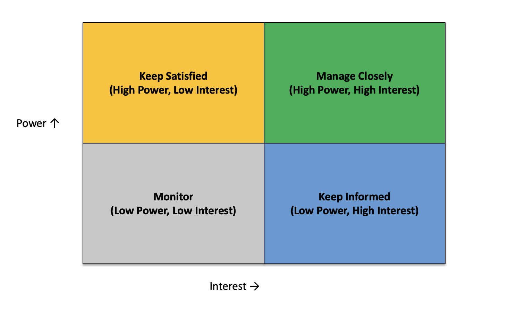

# 01.08 Stakeholder Mapping

### DEFINITIONS

*Stakeholder*: In this exercise a stakeholder is any organisations, teams and individuals outside of the delivery team for this engagement, that have a level of interest in this engagement and a level of power to influence the delivery.

*Stakeholder mapping*: This exercise helps us visualise all the interested parties on a 2x2 grid (*the stakeholder map*) to make it explicit to the attendees how they would manage each of these stakeholder's expectations during the course of the each phase of the engagement.

*Landing zone*: Similar to the previous activity, we'll use a landing zone to place names of stakeholders before placing them on the stakeholder map.

### DURING THE WORKSHOP

Time Needed: 30 minutes

Introduce the activity to the attendees by sharing definitions above. ie, ask the attendees to think of all the organisations, teams and individuals who have an interest in the outcomes of the engagement and who have any influence on the engagement goals or outputs.

Add potential stakeholders to the landing zone - many will come from the actors activity.

Add full names and job titles for clarity where possible.

Try to deconstruct organisations into teams, and teams into individuals where you can.

Place each stakeholder onto the map (use illustration below as example) according to the following definitions:

* Power - How much are they able to impact the work?
* Interest - How much will the work affect them?

Based on the quadrant, the team will agree to manage expectations and establish channels suitable for each quadrant (as shown in the picture below) 