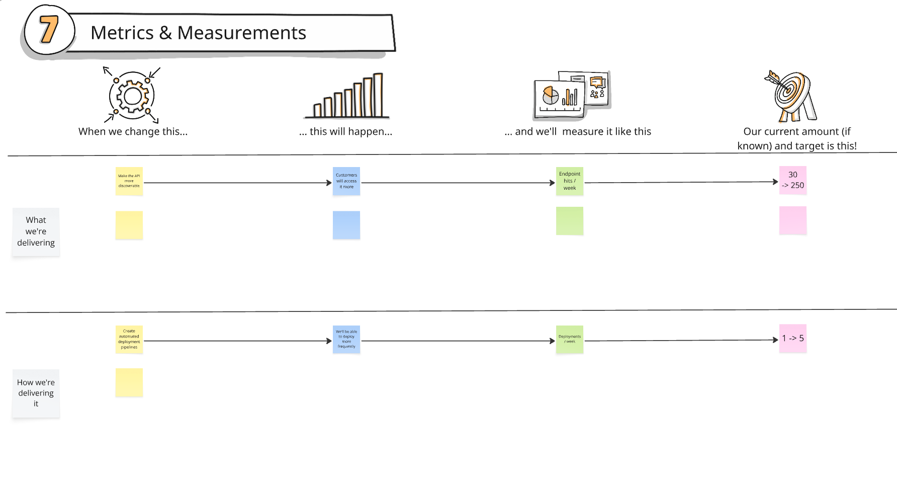

# 01.10 - Metrics and Measurements

### DEFINITIONS

Metrics and Measurements: These are indicators that the team's work will impact during the current phase.

### BEFORE THE WORKSHOP

Prepare a section on the whiteboard with 4 columns with titles:

* When we change this..
* …this will happen…
* …and we'll measure it like this…
* our current amount (if known) and target value

Here is an example of how it can be structured alongside examples to guide participants:

 

### DURING THE WORKSHOP

Time Needed: 30 minutes

Explain the concept to the participants.

Start by placing an item (e.g. build a dashboard for users) into the first column, likely inspired by the goals decided earlier in the activity.

Populate the second column, and ask the attendees to think of what will change as a result of working on that item (e.g. users can see the information on their own and no longer need to call the call-centres).

Populate the third column, by asking the attendees, how can we measure the change? (e.g. calls received at call-centre per week).

Populate the last column with current numbers for the specified metric and the desired change.

Note: Ideally we want metrics that we can start measuring right away so that we have as much data as possible.

Note: Don't just consider what may increase or decrease. It is also valuable to think of how behaviours, patterns or time metrics (e.g. cycle time, lead time) will change.