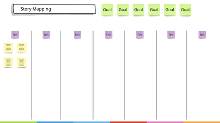

# 01.12 - Story Mapping

### DEFINITIONS

**(User) Story:** An artefact capturing a need of a user or an actor from the product. This will typically follow the structure:

"As an {actor type}, I want {a feature from the product}, So that {I can achieve an outcome}"

**Epic**: A group of related stories that can fulfil a goal. A goal may be fulfilled by one or more epics.

**Story mapping**: An activity to translate goals into the set of epics that will fulfil it.

### BEFORE THE WORKSHOP

Prepare the "Story Mapping Board" section on the whiteboard with this layout

 

### DURING THE WORKSHOP

Time Needed: 60 minutes

Copy the goals from activity 3 to the top of the story mapping board.

Map the goals into top level epics, and place one in each area.

Populate enough stories for the first iteration around each epic - they don't need to be and shouldn't be complete at this stage.

Add any supplemental stories required, such as to mitigate risks.