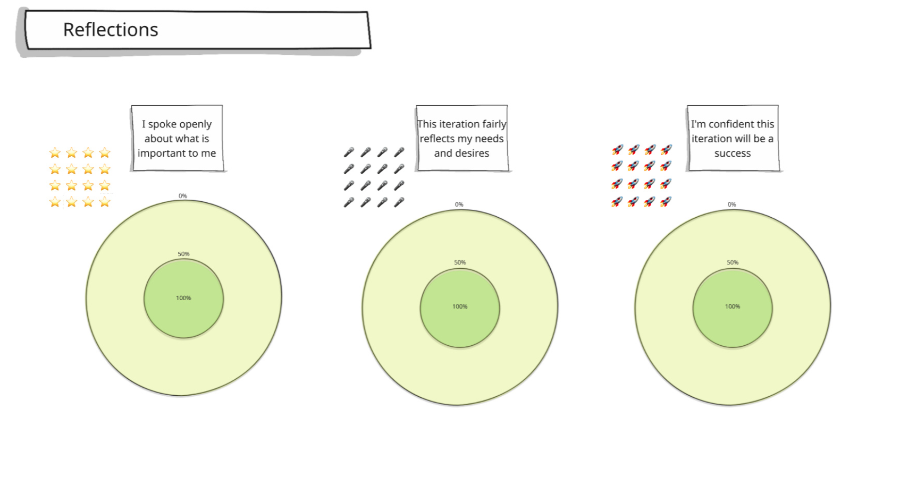

# 01.14 - Wrap up

BEFORE THE WORKSHOP

Prepare a section of the whiteboard to collect feedback about the process. An example is below.

 

Time Needed: 15 minutes

This is a way for attendees to reflect on the session they have had all day. Ask the attendees to spend a couple of minutes placing an icon in each circle to represent their feelings about each aspect. Use "private mode" settings on tools such as Miro to maintain anonymity.

Give space to discuss, if attendees feel safe sharing, if they have any feedback on the process, and if someone wants to share their thoughts about any off-target votes without necessarily needing to share their vote.