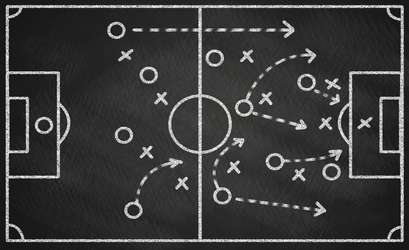
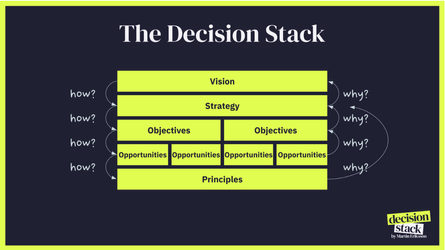
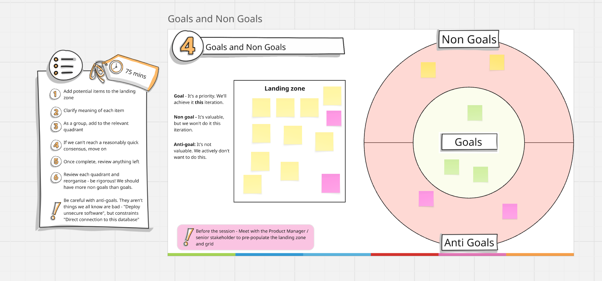
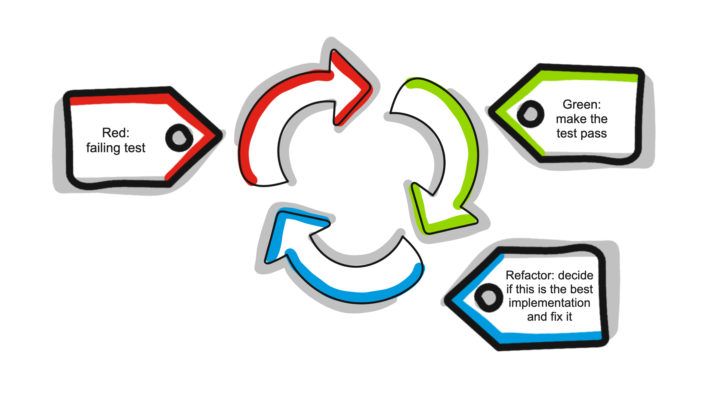
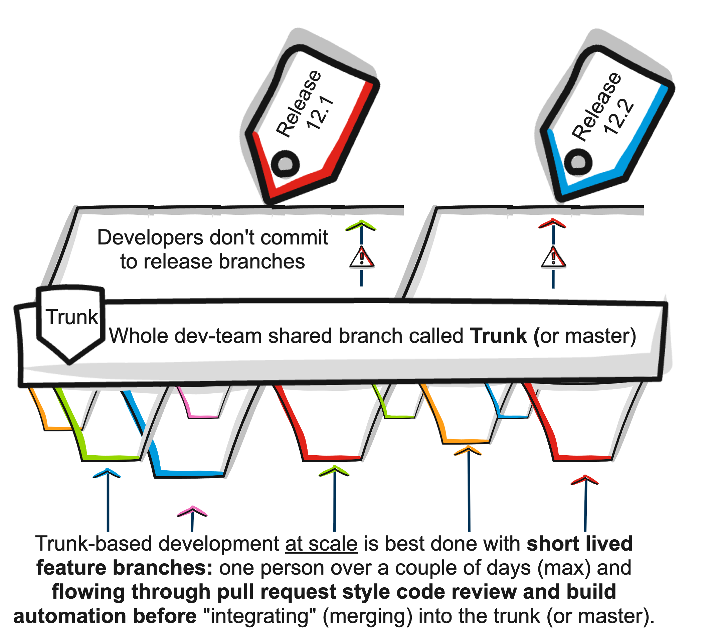

<div class="cover">
  <h1 class="cover-title">The AK Way</h1>
  <p class="cover-subtitle">Armakuni's principles, values, and standards for software delivery</p>
</div>

<section class="toc-page">
<h1 class="toc-title">Table of Contents</h1>
<nav class="toc"><ul>
  <li class="toc-section"><a href="#introduction">Introduction</a><ul>
    <li class="toc-item"><a href="#introduction-2">Introduction</a></li>
  </ul></li>
  <li class="toc-section"><a href="#product-development">Product Development</a><ul>
    <li class="toc-item"><a href="#product-development-and-management">Product development and management</a></li>
    <li class="toc-item"><a href="#product-lifecycle">Product Lifecycle</a></li>
    <li class="toc-item"><a href="#principles-mindset-and-tools">Principles, Mindset and Tools</a></li>
    <li class="toc-item"><a href="#user-centric-product-development">User-Centric Product Development</a></li>
    <li class="toc-item"><a href="#data-informed">Data Informed</a></li>
    <li class="toc-item"><a href="#iterative-and-experiment-driven">Iterative and Experiment Driven</a></li>
    <li class="toc-item"><a href="#working-in-the-open">Working in the Open</a></li>
    <li class="toc-item"><a href="#empowered-teams">Empowered Teams</a></li>
    <li class="toc-item"><a href="#defining-and-measuring-outcomes">Defining and Measuring Outcomes</a></li>
    <li class="toc-item"><a href="#product-market-fit">Product Market Fit</a></li>
    <li class="toc-item"><a href="#product-vision-and-product-strategy">Product Vision and Product Strategy</a></li>
    <li class="toc-item"><a href="#objectives-key-results-okrs">Objectives & Key Results (OKRs)</a></li>
    <li class="toc-item"><a href="#effective-stakeholder-engagement">Effective Stakeholder Engagement</a></li>
    <li class="toc-item"><a href="#impact-mapping">Impact Mapping</a></li>
  </ul></li>
  <li class="toc-section"><a href="#delivery-team-methodology">Delivery Team Methodology</a><ul>
    <li class="toc-item"><a href="#delivery-team-methodology-2">Delivery Team Methodology</a></li>
    <li class="toc-item"><a href="#why-run-an-inception">Why Run an Inception?</a></li>
    <li class="toc-item"><a href="#how-to-run-an-inception">How to Run an Inception</a></li>
    <li class="toc-item"><a href="#setting-up-an-inception">Setting up an Inception</a></li>
    <li class="toc-item"><a href="#team-introductions-and-alignment">Team Introductions and Alignment</a></li>
    <li class="toc-item"><a href="#organisational-north-star">Organisational North Star</a></li>
    <li class="toc-item"><a href="#engagementproject-north-star">Engagement/Project North Star</a></li>
    <li class="toc-item"><a href="#north-star">North Star</a></li>
    <li class="toc-item"><a href="#actors-and-roles">Actors and Roles</a></li>
    <li class="toc-item"><a href="#goals-non-goals-and-anti-goals">Goals, Non-Goals and Anti-Goals</a></li>
    <li class="toc-item"><a href="#stakeholder-mapping">Stakeholder Mapping</a></li>
    <li class="toc-item"><a href="#risks-and-mitigations">Risks and Mitigations</a></li>
    <li class="toc-item"><a href="#metrics-and-measurements">Metrics and Measurements</a></li>
    <li class="toc-item"><a href="#emergent-architecture">Emergent Architecture</a></li>
    <li class="toc-item"><a href="#story-mapping">Story Mapping</a></li>
    <li class="toc-item"><a href="#working-agreement">Working Agreement</a></li>
    <li class="toc-item"><a href="#wrap-up">Wrap up</a></li>
    <li class="toc-item"><a href="#inception">Inception</a></li>
    <li class="toc-item"><a href="#iteration-planning">Iteration Planning</a></li>
    <li class="toc-item"><a href="#story-slicing">Story Slicing</a></li>
    <li class="toc-item"><a href="#product-qualities-in-user-stories">Product Qualities in User Stories</a></li>
    <li class="toc-item"><a href="#user-stories">User Stories</a></li>
    <li class="toc-item"><a href="#team-board">Team Board</a></li>
    <li class="toc-item"><a href="#daily-stand-up">Daily Stand-up</a></li>
    <li class="toc-item"><a href="#retrospectives">Retrospectives</a></li>
    <li class="toc-item"><a href="#team-reviews-and-demos">Team Reviews and Demos</a></li>
    <li class="toc-item"><a href="#information-radiator">Information Radiator</a></li>
  </ul></li>
  <li class="toc-section"><a href="#modern-engineering-practices">Modern Engineering Practices</a><ul>
    <li class="toc-item"><a href="#engineering">Engineering</a></li>
    <li class="toc-item"><a href="#principles-practices-and-tools">Principles, Practices, and Tools</a></li>
    <li class="toc-item"><a href="#engineering-principles-and-practices">Engineering Principles and Practices</a></li>
    <li class="toc-item"><a href="#pair-programming-and-teaming">Pair Programming and Teaming</a></li>
    <li class="toc-item"><a href="#version-control-using-git">Version Control Using Git</a></li>
    <li class="toc-item"><a href="#static-code-analysis">Static Code Analysis</a></li>
    <li class="toc-item"><a href="#test-driven-development">Test-Driven Development</a></li>
    <li class="toc-item"><a href="#trunk-based-development">Trunk-Based Development</a></li>
    <li class="toc-item"><a href="#code-reviews">Code Reviews</a></li>
    <li class="toc-item"><a href="#code-review-guidelines">Code Review Guidelines</a></li>
    <li class="toc-item"><a href="#continuous-integrationcontinuous-delivery">Continuous Integration/Continuous Delivery</a></li>
    <li class="toc-item"><a href="#walking-skeleton">Walking Skeleton</a></li>
    <li class="toc-item"><a href="#infrastructure-as-code-iac">Infrastructure as Code (IaC)</a></li>
    <li class="toc-item"><a href="#test-in-production">Test in Production</a></li>
    <li class="toc-item"><a href="#shift-left-security">Shift Left Security</a></li>
    <li class="toc-item"><a href="#dependancy-management">Dependancy Management</a></li>
    <li class="toc-item"><a href="#observability">Observability</a></li>
  </ul></li>
  <li class="toc-section"><a href="#governance">Governance</a><ul>
    <li class="toc-item"><a href="#governance-2">Governance</a></li>
    <li class="toc-item"><a href="#risk-management">Risk Management</a></li>
    <li class="toc-item"><a href="#raci-matrix">RACI Matrix</a></li>
  </ul></li>
  <li class="toc-section"><a href="#resources">Resources</a><ul>
    <li class="toc-item"><a href="#glossary">Glossary</a></li>
    <li class="toc-item"><a href="#target-audiences">Target Audiences</a></li>
    <li class="toc-item"><a href="#how-to-contribute">How to contribute</a></li>
    <li class="toc-item"><a href="#road-map">Road Map</a></li>
    <li class="toc-item"><a href="#tone-of-voice">Tone of voice</a></li>
  </ul></li>
</ul></nav></section>

<h1 id="introduction" class="section-title">Introduction</h1>

<h2 id="introduction-2" class="doc-title">Introduction</h2>

This manual outlines the rational defaults that define the principles, values, and standards of The AK Way. It reflects our commitment to excellence by aligning teams around shared values and a common cultural foundation. These standards support quality, reliability, and innovation across every engagement.

At Armakuni, we are committed to our vision:

**Return joy and creativity to the world of software engineering.** The AK Way combines **technical approaches**, **cultural considerations**, **customer-centricity**, and **continuous improvement**. Aligning with these defaults helps us consistently exceed client expectations and deliver impactful outcomes.

This living document evolves with our organisation, fostering collaboration, learning, and growth. It provides tools, resources, and best practices to empower teams to create meaningful engagements. Our success depends on working collaboratively, communicating openly, and embracing change. By upholding the values and principles in this manual, we can build a culture of excellence and achieve our vision.

## The Six Pillars

There are six pillars that act as the foundations of the AK Way. They describe the beliefs and working principles that guide every engagement, from shaping teams to delivering value for our clients. Each pillar links to practical behaviours and practices, ensuring our culture is lived day to day, not just written down. The pillars are:

### **1. Great software is built by great teams**

Products succeed or fail based on the capability, trust, and collaboration of the people who build them. Strong teams adapt faster, solve problems creatively, and deliver more reliably.

Invest in cross-functional, T- or comb-shaped teams with clear roles, shared goals, and psychological safety.

**AK Way practices:**

* **Team APIs** to set clear expectations for ways of working and services offered.
* **Cognitive load mapping** to ensure teams can sustainably handle their responsibilities.
* **Team interaction modes** (collaboration, X-as-a-service, facilitating) to define how teams work together.

### **2. Great software is built for customers**

Technology that fails to meet real customer needs creates waste and erodes trust. Successful software delivers value by solving the right problems at the right time.

Engage directly with customers, test assumptions early, and measure success against customer outcomes, not outputs.

**AK Way practices:**

* **Inceptions** to align on vision, value, and customer priorities.
* **User story mapping** to frame work around real user journeys.
* **Customer feedback loops** embedded in delivery to validate progress.

### **3. Work in feedback loops**

Without timely feedback, teams drift, risks grow, and the cost of mistakes multiplies. Frequent feedback enables rapid course correction and continuous learning.

Use iterative delivery, automated tests, monitoring, and customer reviews to validate decisions and adapt quickly.

**AK Way practices:**

* **Pair programming** to share knowledge and expertise across the team.
* **Test-Driven Development** to get feedback on working software quickly.
* **Daily standups** to surface blockers early.
* **Showcases** to gather feedback from stakeholders.
* **Continuous Integration/Continuous Delivery** to test and release changes rapidly.

### **4. Make things visible**

Invisible work breeds misalignment, delays, and poor decision-making. Transparency allows teams and stakeholders to prioritise, coordinate, and solve problems early.

**Key practice:** Use team boards, dashboards, and information radiators to make progress, blockers, and risks visible to all.

**AK Way practices:**

* **Information radiators** for delivery status and metrics.
* **Risk backlogs** to track and manage risks openly.
* **Capacity and dependency mapping** to align expectations across teams.

### **5. Automation amplifies human potential**

Manual, repetitive work slows delivery, increases error rates, and drains creative energy. Automation improves consistency and frees people to focus on high-value thinking.

Automate builds, tests, deployments, and routine operational tasks as part of your delivery pipeline.

**AK Way practices:**

* **Automated testing** for quality and regression prevention.
* **Infrastructure as Code** to ensure environments are consistent and repeatable.
* **Dependency management automation** (e.g. Dependabot) to keep systems up to date.

### **6. Continuous improvement is a habit**

Markets, technologies, and teams evolve — so must your processes, skills, and product. Treat improvement as ongoing, not occasional.

**Key practice:** Hold regular retrospectives, run small experiments, and track measurable improvements over time.

**AK Way practices:**

* **Retrospectives** to reflect and act on improvement opportunities.
* **Experiment tracking** to measure the impact of changes.
* **Capability reviews** to identify skill gaps and development needs.

## **How to Use the AK Way**

This manual serves as your guide to success in any client or internal Armakuni initiative involving software delivery. It is structured to introduce concepts in a deliberate sequence — fostering the right mindset first, then providing the practical tools and methods to consistently deliver exceptional results.

### Adopting a Product Mindset

We start by introducing **Product development**, where we develop an understanding of user needs and stakeholder requirements. We put the user at the centre of our work to ensure our solutions effectively address real-world challenges. We recognise the importance of flexibility in product development, enabling us to adapt to learning from customer feedback and data indicators. We emphasise defining clear outcomes as the guiding light throughout the software development lifecycle.

### Aligning with Delivery Methodology

The **Delivery Team Methodology** section explains how methods are rooted in these key values:

* *Individuals and Interactions* over *Processes and Tools*
* *Working Software* over *Comprehensive Documentation*
* *Customer Collaboration* over *Contract Negotiation*
* *Responding to Change* over *Following a Plan*

We acknowledge the value of the items on the right and work to achieve them; however, we put more value on the lefthand items and will always uphold these values.

By embracing these principles, we foster a culture of adaptability, collaboration, and responsiveness and adopt practices that are in harmony with the Product development practices.

### Implementing Engineering Practices

We adopt various **engineering practices** to facilitate rapid and efficient software development. These practices enable fast flow and drive continuous improvement. From **Continuous Integration/Continuous Delivery** (CI/CD) to **Infrastructure as Code** (IaC) to **Shifting Left on Security**, each practice plays a vital role in our ability to deliver value quickly, reliably, and consistently.

### Lean Governance

Our **Governance** section provides necessary oversight without impeding the delivery process. It is lightweight and flexible, allowing autonomous teams while adhering to established standards and guidelines. Decisions are made at the appropriate level and the right time, ensuring that projects stay on track and deliver value to our clients and stakeholders.

If you follow the principles outlined in this manual and embrace the tools and practices provided, you can succeed confidently in any engagement. Let's work together to exceed expectations and deliver outstanding results for our clients and stakeholders.

 

<h1 id="product-development" class="section-title">Product Development</h1>

<h2 id="product-development-and-management" class="doc-title">Product development and management</h2>

Product management is the practice that helps businesses navigate the rapidly changing world of market demands, and user needs when building software-enabled services. This section provides a framework that guides our thinking and actions throughout the various stages of product evolution.

## What is a Product?

A product is an entity that creates a specific value for a group of people, the customers, users and the organisation that develops and provides it. For Armakuni, a product is a software solution that solves a problem or provides a tangible benefit.

Unlike traditional software delivery approaches that view development as a series of projects with defined start and end dates, the product mindset emphasises continuous value delivery and long-term user satisfaction. With the product mindset, software is not just a one-time project but an ongoing undertaking evolving to meet changing user needs and market demands. Instead of focusing solely on project completion, the product mindset prioritises creating sustainable solutions that add value to users and the business throughout the product lifecycle. These sustainable solutions could be features that are continuously updated based on user feedback or a product roadmap that adapts to market changes.

## What are the benefits?

An obvious question is, "Why is this way better than having a certainty of end dates, project plans and pre-agreed timelines?" The short answer is that the needs of users, the business, and the market inevitably change over time, causing the software to change too. Agreed project plans cannot anticipate the impact of future learnings. By taking a product approach, we focus on meeting the users' needs, and by being data-informed, we are confident in our decisions, delivering value as those needs evolve. Reframing software delivery as an evolving product has many benefits over traditional static approaches.

**Higher flexibility**: We collaborate closely with stakeholders, respond swiftly to new learnings, set our destination, adjust our course, and remain flexible rather than tied to a rigid plan.

**Lower costs:** We iterate based on user and business insight, reducing the need for redevelopment and delivering long-term cost savings. Iteration also enables a competitive advantage, as our products remain relevant.

**Higher quality**: Product success is measured based on the value delivered to the user. The whole team focuses on generating value informed by data and user feedback.

### 

## How do I get started?

At Armakuni, we understand that building and maintaining a product mindset and culture requires​​ consistent intention and effort. The '**Principles, Mindset and Tools**' section is a comprehensive guide that highlights the values and tools that will help along the product journey. It includes principles such as user-centricity and continuous improvement, mindset shifts like embracing change and learning from failures, and tools like user feedback platforms and agile methodologies. We recommend grasping the principles before proceeding to the tools. Use the principles to guide the decision-making process.

The **Product Lifecycle** section introduces a lean framework for understanding the different stages a product will go through in its lifetime. This strategic framework can help us set goals and adopt strategies and tools best suited for each stage, enabling us to make better decisions and stay ahead of the curve.

 

<h2 id="product-lifecycle" class="doc-title">Product Lifecycle</h2>

Depending on where your product is in its lifecycle, it will help inform the strategies you use to develop it. In this section, we describe the six stages of product development. Understanding each stage enables you to focus on the right activities for your users, the business, and the level of investment needed at each stage.

The six stages are:

## Idea

During the idea stage, teams generate hypotheses using customer and market insights. After brainstorming several hypotheses, they select one to focus on. Teams review the chosen hypothesis for risky assumptions and brainstorm effective ways to test them.

## Explore

In the Explore stage, teams conduct experiments to test their riskiest assumptions. This stage focuses on customer needs, pain points, and the "job to be done." Teams gather valuable insights that will inform the development process through interviews, surveys, and prototype testing.

## Validate

During the Validate stage, teams use the insights gathered from the Explore stage to develop a solution for customers, starting with a minimum viable version. The goal is to create a product that delivers value to customers in increments. Additionally, the solution development process tests aspects of the business model, including pricing, costs, and distribution channels.

## Grow

After demonstrating traction in the previous stage, the team focuses on growing and scaling the product based on a validated business model. The main objectives during the growth stage are to increase customer numbers, revenues, and profits through targeted marketing, sales, and expansion efforts.

## Sustain

Over time, all products reach a level of maturity as markets become saturated, competitors enter the market, or technology changes. When this occurs, products enter the Sustain stage. During this stage, the focus shifts to sustaining revenues and profits while optimising operations and reducing costs.

## Retire

Eventually, every product reaches the end of its lifecycle. During the Retire stage, the team ensures customers are not inconvenienced by implementing a plan to mitigate any adverse effects. The plan may include offering alternative products or services, providing ample notice, and assisting customers with transitioning away from the product.

The first three stages, idea, explore and validate, involve testing the validity of ideas to find product-market fit. The second three stages, grow, sustain, and retire, involve executing the business model and exploiting it efficiently until the product is ready to be retired.

We recommend reading ["Lean Product Lifecycle"](https://www.leanproductlifecycle.com/) to learn more about the product lifecycle.

 

 

<h2 id="principles-mindset-and-tools" class="doc-title">Principles, Mindset and Tools</h2>

Our commitment to 'Product as a Practice' approach is paramount. Product practice centres on user experience (UX), business value (business), and technical feasibility (tech), and underscores the importance of these three key elements working in unison within a single delivery team. Collaboration across these domains is essential for creating successful products at pace. Here, you'll find insights and strategies to help you integrate and balance these elements effectively.

 

Image credit: Martin Eriksson, from [Product Management is a Team Sport](https://www.mindtheproduct.com/product-management-team-sport/)

The Ak Way strives for shared principles and a shared mindset that fosters harmony across all disciplines, working together as a single unit. We start by understanding Principles and Mindset:

## Principles Enable Consistency of Good Practice

Principles provide a foundation for the delivery team's daily activities and decision-making. They create a structured environment that enables us to be more consistent, effective, and aligned with our values and goals. These principles reflect best practices at Armakuni.

## Overarching Principles

These principles, broken down into the what, how, and why, guide our practice when developing software. While these principles are universal, generating principles specific to your team and product may also be valuable. To explore this further, start with the [Anatomy of Product Principles](https://www.productplan.com/learn/product-principles/).

### We Are User-Centric

* **Our commitment to being user-centric is unwavering.** We place the user at the heart of our thinking and decisions, ensuring their needs and desires are always our top priority.
* **How:** We use various methods and tools, including user research, surveys, interviews, and usability testing, to continuously generate a deep understanding of our users.
* **Why:** Understanding our users' needs, desires, and behaviours ensures we can always authentically represent them, leading to products that truly meet their needs.

### We Are Data-Informed

* **What:** We gather qualitative and quantitative data from various sources to ensure our evidence and insight are robust.
* **How:** We collect data using various methods, analyse and synthesise it, and apply the "[just enough](https://agilemodeling.com/essays/barelygoodenough.htm)" mental model to support action bias and mitigate decision paralysis.
* **Why:** Data informs us to make well-founded decisions while using our knowledge and contextual understanding to draw conclusions and take action.

### We Are Iterative and Experiment-Driven

* **What:** We test our assumptions, ideas, hypotheses, prototypes, solutions, code, processes and methods.
* **How:** We work in cycles with short feedback loops, reflecting often and applying what we learn to continually course correct and improve.
* **Why:** An iterative and experiment-driven approach allows us to learn from failures and continuously improve, ensuring we deliver value early and often.

### We Work in the Open

* **What:** We are intentional and considerate when communicating and engaging with each other and our stakeholders.
* **How:** We share lessons and information generously, build habits and patterns that support open communication, and use tools and platforms that facilitate transparency.
* **Why:** Working in the open fosters transparency, collaboration, and shared learning, making it easier for us to achieve our goals.

### We Are Empowered

* **What:** Our Product teams are entrusted with the power to make product decisions and take action.
* **How:** Stakeholders actively support and unblock the team while processes facilitate fast flow. Teams have the autonomy and resources to drive the product forward.
* **Why:** Teams closest to the product make decisions and take swift action, driving faster flow and more effective problem-solving.

### In Summary Our Principles Are:

* We are **user-centric**
* We are **data-informed**
* We are **iterative and experiment-driven**
* We **work in the open**
* We are **empowered**

## Mindset Informs How We Think and Act

A product mindset embodies the best practices outlined in this manual, which have become the gold standard for working in the product industry. At its core, a product mindset means being user-centric. With current data and insight, ensuring a deep understanding of your users and their needs means you can authentically represent them, build products they will love to use, and ultimately deliver more value quickly.

Your mindset influences your approach to product development and management significantly. A growth mindset, characterised by a willingness to learn, adapt, and iterate, is essential for navigating the uncertainties and challenges inherent in product development. Focusing on continuous improvement and being open to feedback are hallmarks of the productive product management mindset we strive to achieve.

## Product Vision and Strategy

Vision and strategy are not just important; they are essential in product management. They provide direction, align efforts, guide decision-making, and motivate teams. A clear product vision sets a long-term goal and purpose, inspiring stakeholders and ensuring everyone is working towards the same objective. The strategy outlines the steps to achieve this vision, helping to prioritise tasks, manage resources, and maintain focus. Together, they differentiate the product in the market, address customer needs, and ensure continuous improvement, ultimately driving its success from inception to market leadership.

* Learn about a lightweight approach to defining a **Product Vision and Product Strategy**.

## Decision Stack for Local Decision-Making at Pace

To support fast flow, we must ensure we have clarity and alignment. Martin Eriksson's Decision Stack is a structured approach to decision-making that empowers product teams to make local decisions quickly and efficiently, utilising direction from company strategy and goals. A decision stack streamlines the decision-making process by providing a framework for evaluating options based on predefined criteria, reducing ambiguity and enabling teams to move forward with confidence. This approach ensures that decisions are aligned with the overall product strategy while supporting flexibility and autonomy at the team level.

* Read more about <https://www.thedecisionstack.com/what-is-the-decision-stack/>

 

<h2 id="user-centric-product-development" class="doc-title">User-Centric Product Development</h2>

User-centricity emphasises the importance of understanding, empathising with, and designing for the end user throughout the product lifecycle.

## **User-Centric Thinking**

User-centric thinking involves placing the user at the centre of the design process. By prioritising users' needs, preferences, and experiences, product teams can create more intuitive, valuable, and impactful solutions. User-centric thinking goes beyond gathering user feedback. It requires actively involving users in the design and development process, ensuring their needs, preferences, and expectations are surfaced, prioritised, and met.

Understanding what we mean by a "user" is essential to becoming user-centric.

## **The difference between client, customer and user**

When considering a product, it is easy to confuse a user with related concepts, such as the client or the customer.

**The *client*** is the entity or organisation that purchases or commissions the product, often with specific business requirements and objectives.

**The *customer*** is the individual or entity that pays for the product or service. They may or may not be the same as the client.

**The *user*** is the individual who interacts directly with the product and may or may not represent a paying customer.

While each of these three kinds of people influences the product, we focus here specifically on the user because we want to design a product that meets the needs of every user who interacts with the system. A satisfied user will fuel product adoption, usage, and success. Conversely, many dissatisfied users will lead to a product's decline.

## **Understanding users**

To understand a user's needs, behaviours, and preferences, you must engage directly with the user.

### **User Research**

User research involves gathering insights into user needs, behaviours, and preferences through interviews, surveys, and observations.

* Refer to Nielsen Norman Group for a [thorough guide to user research](https://www.nngroup.com/articles/guide-ux-research-methods/)
* Use [Empathy Maps](https://miro.com/templates/empathy-map/) to collate research findings

### **User Experience Design**

User experience (UX) design focuses on creating intuitive, user-friendly interfaces and interactions that enhance the overall user experience. UX designers use principles of usability, accessibility, and human-computer interaction to design interfaces that are easy to use, visually appealing, and enjoyable for users.

* The [Laws of UX](https://lawsofux.com/) describe the design concepts that support successful user experience.
* Creating and testing wireframes, interactive prototypes, and designs with a tool like [Figma](https://www.figma.com/) is helpful.
* Note: Wireframes are adequate as an early communication/validation tool if you don't yet have working software. However, don't treat wireframes as requirements documents or contracts for delivery teams to build. Once we have releasable software, iterating the design on live software produces faster feedback using tools like A/B testing.

### **Usability Testing**

Usability testing helps evaluate a product's effectiveness and efficiency by observing how users interact with it. It can identify usability issues, pain points, and areas for improvement, enabling product teams to refine the product and iteratively enhance the user experience.

* Learn more about the recommended methods and approach to [Usability Testing](https://www.nngroup.com/articles/usability-testing-101/)

## **Iterate**

A successful product undergoes several cycles of design, implementation, and feedback. The user must be at the centre of each cycle, ensuring we don't lose sight of what they need.

<h2 id="data-informed" class="doc-title">Data Informed</h2>

Being data-informed means using data to guide decision-making and drive product improvements. By leveraging data effectively, we can gain valuable insights into user behaviour, preferences, and needs, enabling us to create products that better meet user expectations and deliver more significant business value.

* Learn more about the [difference between data, findings and insight](https://www.nngroup.com/articles/data-findings-insights-differences/)

## Data-informed vs Data-driven

Data-informed decision-making means using data to inform decisions without allowing it to dictate decisions outright. While data is valuable for providing insights and guiding product direction, it's essential to balance it with other factors, such as user feedback, market trends, the business context, experience, and goals. Data-informed decision-making allows teams to consider the bigger picture and make confident decisions aligned with user needs and business objectives.

## Quantitative and Qualitative data

Effective decision-making in product development requires a balance of qualitative and quantitative data. *Quantitative* data provides valuable insights into what is happening, user behaviour and product performance at scale. *Qualitative* data offers more profound insights into why by surfacing user needs, preferences, and motivations. By using both data types, teams can better understand their users and make more informed decisions.

* Learn more about [Quantitative and Qualitative data from Nielson Norman Group](https://youtu.be/LmWPygSxMms?feature=shared)

## Identifying Assumptions and Gaps in Data

Without evidence to inform decisions, all we have are assumptions. If we act on assumptions, we will likely waste time and not meet users' needs; we must always turn our assumptions into hypotheses and test them. Teams should run **experiments** to gather the necessary insight when data or evidence is missing. By running experiments, product teams can fill in gaps in their data to make more informed decisions based on evidence rather than speculation or opinion. We must never forget that we are not our users, so we must not make product decisions based purely on our perspective.

## Making bets

Placing bets is a lightweight, flexible way to decide how to proceed with your product, strategy, and more. By definition, a bet is outcome-focused, supporting rapid learning and innovation. When we place a bet, we assume something will happen and then check in to see how it's progressing.

A bet captures the interplay between assumptions, desired outcomes, experimentation, risk, and reward. By placing small bets with a short timeframe, we can gather information that helps us decide the best next step. Small bets can also clarify the odds for larger, future bets.

* [Learn more about bets from Kate Leto](https://www.mindtheproduct.com/get-team-experimenting-using-one-little-word/)

## Professional Judgement and Mitigating Bias

We must use our professional judgement and experience to interpret data and decide on the best subsequent action. Tuning into our judgement can help us identify areas that need further exploration and draw conclusions from information.

Be mindful of [cognitive bias](https://www.mindtools.com/a0ozgex/cognitive-bias); it's human nature to bring bias into our work. When using our judgement and interpreting data, we must mitigate against our bias to avoid detrimentally influencing a decision or action.

To mitigate bias, look for ways to challenge what you believe you see. Discuss your thoughts with others, surround yourself with a diverse group, and don't be afraid to listen to dissenting views. You can also seek out people and information that challenge your opinions or assign someone on your team to play "devil's advocate" for significant decisions. Constructive controversy will help here.

By combining data with professional judgment, teams can uncover valuable insights and opportunities for improvement.

## Maintaining Curiosity

By constantly seeking to understand why users behave the way they do and why specific outcomes occur, product teams can discover meaningful insights and opportunities for enhancement. Curiosity drives continuous learning and improvement, enabling product teams to stay ahead of user needs and market trends.

## Making Confident Decisions

Being data-informed enables teams to make confident decisions based on evidence and insights rather than assumptions and opinions. Teams reduce uncertainty and make more confident decisions by leveraging data effectively, satisfied that their choices contain evidence and insights.

<h2 id="iterative-and-experiment-driven" class="doc-title">Iterative and Experiment Driven</h2>

Successful product development hinges on the ability to iterate quickly and learn from each step of the process. This approach ensures that products are continuously improved and aligned with user needs and market demands.

* Utilise the Lean [Build-Measure-Learn](https://amplitude.com/blog/build-measure-learn-the-product-management-lifecycle-loop) approach to achieve this

## Embrace Experimentation and Learning

In product development, experimentation is crucial. It involves testing hypotheses, gathering data, and gaining insights into user behaviour, preferences, and needs. By conducting various forms of tests, such as A/B testing, prototype testing, usability testing and user research, product teams can validate assumptions, identify areas for improvement, and make informed decisions.

* Use the [Armakuni Experiment Canvas](https://drive.google.com/file/d/1gAWIrjDFfOyJ52tS0YYCci3b_pinfu9S/view?usp=sharing) to design experiments
* Be scientific in your approach to experiments with a [hypothesis framework](https://optimiseordie.medium.com/hypothesis-kit-v4-4a1441f77ddc)

## Fail Fast, Fail Smart

We view failure as a learning opportunity. By embracing failure in a managed way, product teams can iterate quickly, identify issues early on, and adjust accordingly. This approach minimises risks, conserves resources, and contributes to delivering better products. As Thomas Edison said, "I have not failed. I've just found 10,000 ways that won't work." Failing fast means setting clear objectives, defining success metrics, and fostering a culture of experimentation.

## Deliver Incremental Value

Focus on delivering minor, incremental improvements rather than aiming for a fully featured product release. This approach allows product teams to quickly provide value to users, effectively gather feedback, and make necessary course corrections. Avoiding "Big Bang releases" reduces risks and surprises, enabling more responsive and adaptive development.

## Gather Real User Feedback

Involving users early and continuously in the development process ensures that products meet their needs and expectations. A real user interacting with live software produces the most accurate feedback for validating assumptions, identifying issues, and guiding product direction. By involving the whole delivery team in user research, you gain a comprehensive understanding of user feedback that covers usability, technical feasibility, and market relevance. This ongoing interaction between the delivery team and the users is vital for conducting informed experiments and leading to valuable decisions.

* Refer to Nielsen Norman Group for a [thorough guide to user research](https://www.nngroup.com/articles/guide-ux-research-methods/)

## Stay Continuously Informed

Product teams monitor user feedback, analytics, and market trends to inform them about their products' performance. Continuously informed teams can respond swiftly to alterations in user needs, market conditions, and competitive pressures, ensuring that the product remains competitive and aligned with user expectations.

* [Continuous discovery](https://www.producttalk.org/2023/08/getting-started-with-discovery/) enables you to build successful products
* Use the [Opportunity Solution Tree](https://www.producttalk.org/2023/12/opportunity-solution-trees/) to visualise your discovery to stay aligned and drive outcomes
* Another vital area to remain continuously informed throughout is **Product Market Fit**

<h2 id="working-in-the-open" class="doc-title">Working in the Open</h2>

Product teams foster trust, encourage innovation, and achieve better user outcomes by adopting an open approach. Working in the open makes the product development process more transparent and collaborative, reducing certain risks and enabling everyone to share accountability for the product lifecycle.

* Learn more about fostering trust in team environment, from [The Five Dysfunctions of a Team book](https://en.wikipedia.org/wiki/The_Five_Dysfunctions_of_a_Team)

## Open by Design, with Intent

Being open by design means intentionally designing processes, practices, and systems that are transparent and accessible to stakeholders. Incorporate openness into relevant aspects of the product development process, from decision-making to communication to documentation. Be intentional about the informational you share and how you share it, consider the user experience.

* [Week Notes](https://www.usethehumanvoice.com/formats/)
* [Demos](https://www.mindtheproduct.com/make-product-demo-stands/) (show and tells)
* [Coding in the open](https://about.gitlab.com/topics/version-control/what-is-innersource/)

## Make Work Visible

[Making work visible](https://itrevolution.com/product/making-work-visible/) makes product teams more effective by supporting collaboration and alignment. By visualising their work, product teams ensure that everyone clearly understands what it means for a product to go from the idea stage to being in the hands of the user. More importantly, making work visible can help us understand bottlenecks in the flow of ideas into development and getting the product into the hands of users. When working in the open, product teams can work together more effectively to find solutions and make course corrections when needed.

* Create a [line of commitment](https://theway.armakuni.com/guru-attachments/brief-summary-of-making-work-visible_0ded7cb2.pdf) to visualise intended work on your shared board.

## Innovation is Stimulated

Working in the open with [Psychological Safety](https://psychsafety.co.uk/the-four-stages-of-psychological-safety/) fosters innovation by encouraging the sharing of ideas, feedback, and insights across the team and teams. When everyone has visibility into the work undertaken, they can contribute ideas, offer feedback, and collaborate on solutions. By fostering a culture of openness and collaboration, product teams can tap into the collective knowledge and creativity of the entire team, driving innovation and creativity.

## Positive Outcomes are More Easily Achieved

Product teams that work openly achieve better user outcomes and deliver more successful products. Transparency, collaboration, and trust enable teams to work more effectively, make better decisions, and respond more quickly to user needs and feedback, leading to positive outcomes.

<h2 id="empowered-teams" class="doc-title">Empowered Teams</h2>

Empowered teams are at the heart of successful software development. By empowering teams to make decisions, work autonomously, and take ownership of their work, The Ak Way fosters a culture of innovation, collaboration, and continuous improvement.

## Core team

A product requires a long-lived cross-functional team of people closest to it or the problem it addresses. The individuals within the team do not have to stay there for a long time, to be long lived the team's culture, purpose and knowledge is long lived, the appropriate mechanisms are needed to enable that.  This team therefore has the knowledge, expertise, and context to make informed decisions quickly and effectively. Empowering core teams to rapidly create user and business aligned solutions ensures product success. As the product progresses through the lifecycle stages, the team must bring appropriate people to collaborate with at the relevant point(s).

* Use the [Team Onion Model](https://teamonion.works/) to design and empower teams

## Autonomous Working

Empowered teams are trusted to make decisions, act independently, and take ownership of their work. With support and minimal oversight, they're able to respond more creatively and effectively to user needs. This autonomy fosters innovation and leads to stronger outcomes for both the product and the organisation.

It also builds happier, more motivated teams. When people feel trusted and responsible for their work, they develop a more profound sense of pride and commitment. This results in higher morale, greater productivity, and more meaningful contributions to shared success.

* Motivation comes from [autonomy, mastery and purpose](https://www.ted.com/talks/dan_pink_the_puzzle_of_motivation?language=en)

## Support from leadership

The role of leadership is to support, enable, and unblock work for the product teams. Leaders provide experience-based insight, coaching, and guidance to help teams succeed. Teams and leaders must earn and build trust so that anti-patterns such as micromanagement or false reassurance around big upfront design, etc., don't occur.

## Psychological safety

[Psychological safety](https://www.ccl.org/articles/leading-effectively-articles/what-is-psychological-safety-at-work/#:\~:text=Psychological%20safety%20is%20the%20belief,questions%2C%20concerns%2C%20or%20mistakes.) is essential for high-performing teams to deliver results. It requires those in leadership positions to cultivate a safe environment and for everyone to hold themselves to account for their actions and behaviours. Building and maintaining a psychologically safe culture takes time and effort. The return is happier, more engaged, and motivated teams that perform at a higher level. Teams make better decisions, embrace continuous learning as the norm, and enhance innovation, creativity, and resilience.

Without psychological safety, there are negative impacts on employee well-being, including stress, burnout, attrition, and the organisation's overall performance.

<h2 id="defining-and-measuring-outcomes" class="doc-title">Defining and Measuring Outcomes</h2>

Defining good, measurable outcomes for our work is crucial for understanding the value we're trying to deliver. By setting clear objectives, we can better track progress and achieve success.

### The Difference Between Outputs and Outcomes

It's helpful to note the difference between outputs and outcomes in product management. Outputs are the tangible features or deliverables, such as new software functionalities. Outcomes are the broader impacts or benefits these outputs create, typically a behaviour change such as increased user satisfaction and higher engagement rates.

Outcomes describe what we want to achieve and what success looks like. They should be something our users (internal or external) and the business would recognise as valuable.

Outcomes should be agreed upon when we set the direction for a new undertaking, change direction, or recalibrate. We can also revisit them when we plan a new feature.

Setting outcomes is a team sport. It should involve the delivery team, people outside the team with whom they will work or collaborate with closely, and the work's leaders and sponsors.

### How Goals, Objectives, Outputs and Outcomes Relate

A goal describes the broad direction towards achieving an outcome:

"Cater for a memorable birthday party."

An objective makes goals specific, measurable and time-bound:

"Sandwiches for 20 people that everyone can enjoy"

An output is a defined deliverable that (may) achieve an objective, outcome or goal:

"10 cheese sandwiches and 10 ham sandwiches"

A desired outcome succinctly describes the desired change or impact - it's the benefit derived from achieving a goal:

"Happy memories and full stomachs"

Goal

Objective

Output

Outcome

Cater for a memorable birthday party

Sandwiches for 20 people that everyone can enjoy

Sandwiches for different dietary requirements

Happy memories

Full stomachs

[Credit: Jamie Arnold and Emily Webber](https://www.jamiearnold.com/blog/2019/8/12/outcomes-goals-and-objectives)

### Indicators Of Good Outcomes

A well-defined outcome provides a focal point for the team and serves as a guiding light for their efforts. It helps the team quickly identify and conserve their time and energy for the most critical work.

Here is a helpful guide to defining effective and measurable outcomes:

* The outcome is narrow enough that it creates a focus
* The outcome is appropriate for the time that is available to work on it
* The outcome can change from iteration to iteration (for example, quarter to quarter)
* The team knows how to determine the most crucial metric (the one that creates the most value right now)

## How do you measure outcomes?

**Objectives and Key Results (OKRs)** are a simple, popular way of thinking about outcomes, the path to achieving them and how to measure them.

### Leading and Lagging Indicators Of Outcomes

When setting metrics, it's essential to consider lagging and leading indicators.

* Leading indicators predict future performance outcomes - and help guide adjustments in your day-to-day actions,
* Lagging indicators measure past outcomes -  and help measure past success and inform long-term strategy.

The leading indicators you select depend on your business model, type of product, and product goals. Teams should use both types of indicators when defining performance metrics. For example, in an online streaming platform aiming to increase subscription renewals:

A *leading indicator* example could be the "Number of User Engagement Activities," which measures user engagement through activities such as video views and interactions. This indicator provides early insight into user satisfaction and potential subscription renewals.

Conversely, a *lagging indicator* such as the "Subscription Renewal Rate" measures the percentage of subscribers renewing their subscriptions, offering insight into the platform's ability to retain subscribers over time.

By tracking these indicators, the product team can assess the effectiveness of content, features, and retention strategies, making informed decisions to improve subscriber retention and project success.

* Learn more about Leading and Lagging Indicators from [Amplitude](https://amplitude.com/blog/leading-lagging-indicators)

### Anti-patterns and Pitfalls

Objectives (such as OKRs) can cascade down from the top of an organisation and help create alignment. However, they are less likely to succeed if the team delivering the objective is not engaged in setting the goals or measures. The team will not have a complete and shared understanding of the rationale and will not feel as invested or motivated.

Teams defining their outcomes without input from leadership can result in them going in different directions, reducing organisational coherence.

Using OKRs as the only measure creates a restricted view. It's best to use them to track time-bound initiatives and innovation work in conjunction with longer-lived KPIs to understand their impact on the broader business metrics and goals.

<h2 id="product-market-fit" class="doc-title">Product Market Fit</h2>

The Product-Market Fit framework is an actionable model designed to iteratively develop a minimum viable product (MVP) that effectively satisfies the underserved needs of its target customers. As the name suggests, this framework ensures that the product fits the identified market well.

 

## When is it useful?

This framework helps you to converge on an MVP by testing different ideas with your target customers. Therefore, this is most useful in the Idea, Explore, and Validate stages of the Product development lifecycle.

## How do you use it?

The framework provides six steps to help you achieve product-market fit. We use the word "achieve" because we want to measure whether there is a strong alignment between a product's value proposition and the underserved needs of target customers. The measures need to indicate that customers or users are enthusiastically buying, using, and sharing their experiences with your product with others.

### Step 1: Determine your target customer

Begin by thoroughly understanding your target market. Ask questions such as, "Who might buy this product?" and "Will it meet their needs?" Conduct market research and use segmentation to identify niche requirements, exploring questions like, "What are their pain points, needs, and preferences?" Create user personas representing your ideal audience to help the team empathise with the target users. This approach aids in visualising products that would be valuable for specific consumer types.

Find more resources on **User Research**.

### Step 2: Identify underserved customers' needs

Underserved needs refer to situations where users find their current tools inadequate for fully meeting their requirements. In this step, engage with target customers to understand their dissatisfaction and explore how your product can address these gaps. Ask questions like, "What are you unhappy with?" and "What changes would make a difference?" Conduct one-on-one sessions using MVP prototypes, screen mockups, or competitor products if available. Closely observe customer interactions and ask open-ended questions to gain deeper insights.

### Step 3: Define your value proposition

Defining your product's value proposition involves determining how your product will better meet customer needs than alternatives. This process includes narrowing down the potential needs your product could address to those with the maximum positive impact. Carefully select the unique features that will differentiate your product from competitors and outperform them so that customers will use it and tell others about it.

Try this [Value Proposition Canvas.](https://www.strategyzer.com/library/the-value-proposition-canvas)

### Step 4: Specify your MVP feature set

After understanding the differentiated value, the next step is to specify the minimum and unique feature set required to get the product into the hands of target customers as quickly as possible.

"Minimum" is the key term here. We want to avoid spending excessive time building a product only to discover later that customers don't like it. The goal is to develop simply enough to create significant value for the target customer. Customers will provide feedback if something essential is missing, allowing you to iterate quickly and make necessary improvements.

**Iterate and experiment** to assess what works for your target users.

### Step 5: Create your MVP prototype

At this stage, we aim to produce a version of the product that gathers enough feedback from customers before the next iteration. This prototype can vary in its level of completion. Initially, this might involve using medium-fidelity wireframes or high-fidelity mockups to demonstrate user experience (UX) design to customers. Modern UX tools can make these mockups interactive, simulating a "real" experience with static data.

However, ensuring a smooth transition from wireframes to a working software MVP is crucial. In high-pressure projects with tight deadlines, there's a risk of getting stuck in a cycle of repeated "sign off in Figma" stages without progressing to a functional MVP. Focusing on quickly developing live, working versions for customer testing is essential. Once we have working software, using Figma-style mockups is no longer required, as implementing design ideas directly in releasable software generates faster feedback.

Collaboration between technology and UX specialists within the team is vital. They should work together to determine the fastest way to implement the MVP feature set and ensure continuous, incremental improvements based on real user feedback.

Find out more about **User Experience Design and Testing** techniques

### Step 6: Test your MVP with customers

Gathering consumer feedback is a crucial step toward achieving product-market fit. Allowing consumers to test the product helps developers understand what works and what doesn't. To ensure valuable feedback, it's essential to involve the target customers. Use a "screener" survey to verify that participants match the desired target customer profile, avoiding demands that might steer the product in the wrong direction.

Testing the MVP is most effective in a one-on-one setting with each customer. Carefully observe what the customer says and does as they interact with the MVP. Avoid leading or closed questions, such as "Wasn't this easy to do?" or "Did you like feature X?". Instead, use open-ended questions like "What did you think of X?" to encourage customers to share their honest thoughts and experiences.

Conduct these tests in batches of 5-8 participants. This sample size is large enough to identify issues with the product while minimising repetitive feedback. Analysing these patterns will help prioritise concerns for the next iteration, ensuring continuous improvement and alignment with customer needs.

## Measuring with Metrics

Direct customer research provides qualitative data. For Products that have reached a stage where we have active customers or are in beta release stages, we can also generate quantitative data to guide the decision-making process. For example, consider measuring things like:

* Acquisition rate — You want adoption of your product at a high enough rate to show sustained growth
* Retention — Not only do you need to acquire users, but you need to keep them
* Engagement — Are enough users or customers using your product regularly and getting value from it?
* Revenue — Are enough of your users or customers choosing to pay for your product or service?
* Learn more about how to [measure product market fit](https://blog.logrocket.com/product-management/what-is-product-market-fit-measure-examples/#how-to-measure-product-market-fit)

## Rinse and repeat

Each iteration of these steps should move the MVP closer to achieving more positive and fewer negative customer responses. Analysing patterns and feedback will guide the product's evolution, ensuring it meets customer needs more effectively with each cycle.

Once the product achieves product-market fit, the focus should shift to maintaining this fit for sustained success. Maintaining fit requires the team to continuously monitor customer needs and emerging trends, ensuring the product remains aligned and relevant. It's also important to continue fostering a team culture built on principles of customer satisfaction and continuous improvement.

<h2 id="product-vision-and-product-strategy" class="doc-title">Product Vision and Product Strategy</h2>

A product vision is a clear and compelling description of your product's future aspirations. It outlines the product's purpose and desired outcomes. A well-defined product vision guides the entire product team, aligning everyone around a shared ambition. A successful vision statement should be concise, inspirational and memorable.

A product strategy is a high-level plan that helps you realise your vision and succeed. By answering questions about the target user group, user needs, value proposition, differentiation and business goals it aligns to, a product strategy informs a roadmap for the product's development and success.

## When should you use it?

Having a vision and strategy in the initial *Idea* phase helps align efforts from the start to the *Explore* and *Validate* stages. Documenting the vision early on aids in making significant product-related decisions, reminding us of the ultimate goal and filtering out distracting ideas. The initial strategy provides direction for other frameworks used in the early stages, such as **Product-Market fit** or Product Discovery. As we validate and learn through these tools, we iteratively refine the strategy, ensuring it remains relevant and compelling.

## How do you do it?

Tools like [Product Vision Board](https://www.romanpichler.com/blog/the-product-vision-board/), by Roman Pichler, provide a lightweight structure for capturing both the vision and the strategy:

 

This can be collaborated on in a workshop between the product team, the leadership team and any interested parties, such as client leadership, if the product is for a client. As can be seen in the picture, it has five areas to fill out:

### 1. Target Group

This section should describe the target user groups that will benefit from the product and clarify who the "users" and "customers" are. Attempting to capture too many unrelated target segments under one umbrella can quickly result in the product being unable to satisfy the needs of any single group, and it will likely not result in a successful product. It's best to group users by their needs or goals,  ask why are they using this product, what are they aiming to achieve? Once you have identified the groups prioritise them.

* The target user groups should be defined based on User Research, as described **here**.

### 2. Needs

In the Needs section, we clearly define the primary user problems or opportunities the product aims to solve and answer key questions such as, "Why would someone pay for this product?" Understanding customer needs involves delving into the behaviours and motivations of the target user. When completing this section, it's crucial to distinguish customer needs from product features. The "what" from the needs will guide the "how" in the form of a feature set that responds to those needs.

### 3. Product

Here, we summarise the product's critical attributes for its success. These essential features address the users' needs and differentiate your product. It's important to avoid making a long list of all potential features; we can add the finer details during the building phase. Focus on selecting up to five main ideas that will effectively meet the users' needs and set the product apart - we want headlines not details at this stage.

### 4. Business Goals

Business goals articulate why the organisation should invest in this product. The goals must illustrate the value that can be generated for the business, and how this product can contribute to achieving existing goals within the company strategy. For instance, instead of stating, "Make more money," a more precise goal would be "Increase revenue by introducing a subscription model."

### 5. Vision

It can be helpful to leave the creation of the vision to last and work out the other sections first. The vision brings all the threads together into a compelling statement. Creating the statement after working out the strategy creates a greater sense of ownership within the team who have contributed to it, which leads to stronger motivation to help the product succeed.

A product vision must be inspirational, concise, memorable, easy to repeat, and, most importantly, supported by everyone in the product team, including key business stakeholders. A well-defined product vision should guide strategic decision-making, rally stakeholders, and give the entire product team an aligned sense of purpose.

Take [LinkedIn's vision](https://about.linkedin.com/), for example, which says, "Create economic opportunity for every member of the global workforce". It clearly outlines who its product is for (global workforce) and the value it aims to provide (economic opportunity).

It's important not to describe the solution in the vision statement, the vision may be unattainable, as it's an ambition, a moonshot. The solution is likely to evolve over time as new insight is gained. You may find the vision statement already exists, if so work through the strategy sections and then review the vision statement and refine it if needed.

See: <https://www.romanpichler.com/blog/tips-for-writing-compelling-product-vision/>

<h2 id="objectives-key-results-okrs" class="doc-title">Objectives & Key Results (OKRs)</h2>

Objectives and Key Results (OKRs) is a goal-setting framework used by teams and organisations to define and track objectives and their outcomes. They are a great way to track time-bound change projects and innovation work, such as product development. It's helpful to use OKRs in conjunction with KPIs (Key Performance Indicators) which track the long-lived performance metrics of a service or business.

**Objectives** are the ambitious, qualitative goals that an organisation or team aims to achieve. They should be ambitious, inspire, and be qualitative.

**Key Results** are specific, measurable, and quantifiable outcomes that indicate progress towards the objective.

* For a thorough explanation of OKRs see: <https://eleganthack.com/the-art-of-the-okr-redux/>
* To better understand how OKRs and KPIs work in conjunction see:[ ](https://www.perdoo.com/resources/online-guides/okr-guide#okrs-vs-kpis) <https://www.perdoo.com/resources/online-guides/okr-guide#okrs-vs-kpis>

## How do you do it?

* An objective should define what we want to accomplish. At a company level, project, product or individual level. For a given piece of work, each set of OKRs should include 1 to 3 objectives.
* Each objective should have 1 to 5 key results, which must be measurable and tracked. Measuring and tracking key results shows progress toward the objective, within a specific time period, typically a quarter.
* OKRs should:
* focus on what's important, do not describe the sum of the tasks.
* be ambitious and audacious in order to drive real value. Do not limit your ambition, with achievable goals, OKRs are intended to be 70% achievable. If you are achieving more than that your OKRs are not ambitious enough. Audacious goals, mean we ultimately achieve more than we would if we limit ourselves to what feels comfortable.

## The benefits of creating OKRs

Creating effective OKRs – and using them sparingly – can:

* increase organisational performance and employee engagement
* improve focus and the ability to prioritise
* align colleagues and teams with the organisational / product vision
* improve commitment\*  \*– acting as a social contract created across a team or an organisation that brings people together with a shared purpose
* enable progress tracking
* create a culture that is unafraid of calculated risk

## What good objectives should look like

Good objectives must be:

* of significant value to the organisation / client
* inspirational
* action-oriented
* frequently reviewed – objectives should be reviewed quarterly. Key results should be measured continually, and reported on at least monthly.
* transparent – objectives (and their Key Results and associated metrics), at every level of the organisation, should be published for all too see
* unambiguous – the objective must clearly identify what will be achieved – avoiding phrases like "best in class" or "number 1"

## What good key results should look like

Key results must be:

* specific
* time-bound
* ambitious yet realistic
* measurable and verifiable

If you achieve 100% of your KRs, they are too easy, 50% means it's too hard and not delivering enough. You should strive to achieve 70%, this will deliver value, whilst stretching the team and what's possible.

You must be able to continuously measure and verify your key results. And you need to know where you're starting, so you ideally need to have baseline metrics. Or at least relatable metrics to compare to.

## Some examples of OKRs

### Uber

*Objective*: Increase Geographic Coverage of Drivers

*Key results*:

* Increase coverage of San Francisco to 100%
* Increase coverage for all active cities to 75%
* Decrease pickup time to < 10 mins in any coverage area during peak hours of usage

### YouTube

*Objective*: Increase Average Watch-time Per User

*Key results*:

* Increase total viewership time to XX minutes daily
* Expand native YouTube application to two new OSs
* Reduce video loading times by X%

## Anti-patterns and pitfalls

OKRs are not a silver bullet. They are a tool, and rigidly following any process won't guarantee meaningful outcomes.

* **Output, not Outcome**
* Anti-pattern: Writing OKRs that focus on deliverables (e.g. "Launch feature X") rather than the impact of those deliverables (e.g. "Increase conversion rate by 10%").
* Why this matters: It measures activity, not whether the activity was valuable.
* **Too Many OKRs**
* Anti-pattern: Defining a long list of OKRs for each team or individual.
* Why this matters: Dilutes focus and leads to scattered, ineffective effort.
* **Top-Down Imposition**
* Anti-pattern: Senior leadership defines OKRs in isolation and cascades them down without team input.
* Why this matters: It erodes ownership and may misalign with actual constraints or opportunities on the ground.
* **Tying OKRs to Performance Reviews**
* Anti-pattern: Linking OKRs directly to performance evaluations or bonuses.
* Why this matters: Encourages sandbagging and discourages ambitious goals or honest reflection.
* **Set and Forget**
* Anti-pattern: Writing OKRs at the start of a quarter and never revisiting them.
* Why this matters: Disconnects OKRs from day-to-day decision-making and prevents course correction.
* **Lack of Alignment**
* Anti-pattern: Teams create OKRs in silos, without considering cross-team dependencies or broader organisational goals.
* Why this matters: Leads to local optimisation that undermines overall progress.
* **Binary Scoring**
* Anti-pattern: Evaluating OKRs as simply "done/not done" at the end of the cycle.
* Why this matters: Ignores progress, learning, and context. A 70% achievement rate is often a sign of good ambition, not failure.
* **Over-Reliance on Metrics**
* Anti-pattern: Believing every key result must be quantifiable, even when qualitative indicators would better capture progress.
* Why this matters: Forces artificial metrics and ignores nuance in complex or exploratory work.
* **Business-as-Usual OKRs**
* Anti-pattern: Writing OKRs that describe routine work already expected to happen.
* Why this matters: Doesn't stretch thinking or focus attention on what's strategically important or uncertain.
* **No Feedback Loop**
* Anti-pattern: Failing to reflect on why certain OKRs were or weren't achieved, and not improving the process.
* Why this matters: OKRs become a ritual rather than a learning mechanism.

<h2 id="effective-stakeholder-engagement" class="doc-title">Effective Stakeholder Engagement</h2>

Effective stakeholder engagement is essential for successful product management. It is about enabling stakeholders to contribute meaningfully, transforming them into partners rather than a force that is against you. This is a perpetual need in Product and Engineering, and it's in your gift to cultivate this mindset and behaviour. Effective stakeholder engagement is a thread that weaves in and around every interaction, from the tools and methods we use to the human skills we exercise.

As we navigate the complex landscape of Product Engineering and strive for the best outcomes, these five principles help unlock effective stakeholder engagement:


1. Understand Your Stakeholder Landscape
2. Cultivate Empathy and Build Relationships
3. Collaborate with Compassionate Boundaries
4. Work Transparently and Intentionally
5. Act with Accountability

## **1. Understand Your Stakeholder Landscape**

Effective engagement begins with understanding the people you are working with. Map your stakeholders to understand their roles, interests, and influence. A classic method is to categorise them to help focus your engagement efforts:

* Keep Satisfied: High power / Low interest
* Manage Closely: High power / High interest
* Monitor: Low power / Low interest
* Keep Informed: Low power / High interest

 

Beyond mapping and engagement planning, identify your allies and champions. These are the people who are invested in your product's success and are willing to advocate for your work, identify those you can convert into champions too.

Building on these relationships can help you navigate challenges and build momentum. By understanding who your stakeholders are and what motivates them, you can tailor your approach to meet their needs, and get the best from them and their contributions.

## **2. Cultivate Empathy and Build Relationships**

Stakeholder engagement is a fundamentally human-centric practice. To build a robust foundation, cultivate connections and foster compassion, which means understanding stakeholders as individuals, beyond their roles. Show genuine interest in their motivations and concerns to build the trust that is the foundation of effective teamwork, as described in [The Five Dysfunctions of the Team](https://en.wikipedia.org/wiki/The_Five_Dysfunctions_of_a_Team).

By framing stakeholders as partners rather than thinking of them as obstacles, you can move from transactional interactions to true partnership. This trust will be invaluable when you need to make tough decisions or navigate conflicting priorities. When stakeholders feel heard and respected, they are more likely to support your vision and contribute positively.

Enable your stakeholder to understand users and their needs with compassion. Bring stakeholders close to users, involve them directly in user research and findings playbacks. Connect Stakeholders with the challenges and opportunities, provide context to support them in making meaningful contributions. Also consider the intangibles, pay attention to the subtleties of communication, influence and negotiation to supercharge your stakeholder engagement powers. [Getting More](https://gettingmore.com/) is a valuable guide to honing negotiation skills.

## **3. Collaborate with Compassionate Boundaries**

True collaboration means 'doing with, not to'. Empower your core team while ensuring your stakeholders feel like an integral part of the journey. When you collaborate, you are not dictating the path forward but rather co-creating it. This requires fostering psychological safety, where all parties feel safe to belong, learn, contribute and challenge without fear of negative repercussions. This includes everyone being accountable for our actions and behaviours.

Be curious, show interest in stakeholders' perspectives, explore their ideas with an open mind and a willingness to understand their viewpoint. Agree on their role, within the work, for shared clarity and to avoid misunderstandings. Use the [Team Onion model](https://teamonion.works/) to set up the core team as decision-makers, and stakeholders as Collaborators or Supporters, ensure there is buy-in to act in the agreed way. Another helpful framing is to position stakeholders as part of the [Extended Team](https://www.romanpichler.com/blog/stakeholders-on-the-product-team/), as described by Roman Pichler.

It's important to practice compassionate boundaries. This means being empathetic to your stakeholders' needs while also advocating for your and your team's needs.

## **4. Work Transparently and Intentionally**

Transparency and clear communication are vital for keeping stakeholders aligned and engaged. Be intentional about your communication by working in the open by design and using '[clean language](https://www.toolshero.com/communication-methods/david-groves-clean-language/)' to foster understanding. Make [agreements](https://www.linkedin.com/posts/stephendchandler_expectation-vs-agreementmp3-powered-by-activity-7087425109497430016-bd-B/), rather than set expectations, to enable all parties to move forward together with the least friction. For example, agree on who can deputise for a stakeholder if they are unavailable and what happens if they miss an opportunity for input in the regular cadence of connection points.

Build and maintain a consistent cadence for engagement, create regular opportunities for stakeholders to contribute, make participation easy and predictable. To avoid becoming a bottleneck of information, make information self-serve where possible. [Making Work Visible](https://itrevolution.com/product/making-work-visible/) enables stakeholders to see how their feedback is being incorporated and understand the rationale behind decisions.

Finally, guide their contributions by clearly articulating what you need from them, whether it's input, feedback, or a decision. Provide regular feedback on how their contributions are being used and the impact they are making. Role model desired behaviours, demonstrating the collaboration and communication you find most valuable.

## **5. Act with Accountability**

Effective engagement is an ongoing effort that requires accountability. Always be data-informed in your decision-making. Use metrics, user feedback and market research to validate your product strategy, priorities and decisions. This approach builds credibility and helps you make a compelling case for your decisions.

Finally, hold yourself accountable for stakeholder engagement, you might want to set yourself goals, to help you focus on areas of improvement. Tracking your progress and tune into how stakeholders are engaging with you and the work. Be willing to adjust your approach based on what you learn. By being accountable, you demonstrate to your stakeholders that you are committed to delivering results and that their input is an essential part of that journey.

<h2 id="impact-mapping" class="doc-title">Impact Mapping</h2>

Conceived primarily by Gojko Adzic, Impact Mapping is a collaborative and fast strategic planning technique that eliminates waste during the product development process by helping teams align their activities with the objectives of the business in which they operate.

By clearly communicating the actors within the team's sphere of influence and their respective behaviours the team believe they could influence (the impacts), Impact Maps enable teams to discuss the relative merits of pursuing each Impact, facilitating effective prioritisation. This process highlights an important set of hypotheses - "if actor X did more/less of behaviour Y, then our progress towards goal Z will be furthered."

Furthermore, Impact Maps link each proposed deliverable back to an impact, surfacing yet another set of hypotheses - "by delivering X, we hypothesise that actor Y will change behaviour Z."

To learn more about Impact Maps and how they could help your team make much more effective roadmap decisions, visit the official [Impact Mapping website](https://www.impactmapping.org/) or take a look at the [go-to book](https://www.impactmapping.org/book.html) on the subject.

<h1 id="delivery-team-methodology" class="section-title">Delivery Team Methodology</h1>

<h2 id="delivery-team-methodology-2" class="doc-title">Delivery Team Methodology</h2>

Our delivery teams are guided by a range of methodologies and practices, from an agile mindset to continuous integration and continuous delivery. These approaches support efficiency, collaboration, and high-quality software delivery.

A team's primary purpose is to deliver value to the end-user, typically through the creation of software. There are multiple ways to articulate value, including:

* Timeliness - providing the right thing at the right time
* Usefulness/Delight - it must benefit (and ideally delight) the end user
* Maintainable - delivered products and features must support future needs for maintenance and extension
* Operable / Observable - it must provide the necessary functionality to safely and reliably operate in production
* Financially optimised - it should use technology efficiently to lower operative costs
* Reduced risk - it should not introduce any undue risk
* Predictable - the end user should have continual visibility of progress. Stakeholders must be able to predict progress with reasonable reliability.

## Principles

We build on several industry-leading methodologies and practices to achieve a fast flow of value:

### 1. Rely on Individuals and Interactions over Processes and Tools

Aligned with agile methods, we keep processes and tools lightweight and adaptable. If particular processes or tools impede the flow of value, they should be removed or adapted. The delivery team has the autonomy to adjust processes and tools to fulfil their responsibilities.

### 2. Working software is the primary measure of success

We judge progress primarily by the availability of working software in a production (or production-like) environment - rather than relying on reports, task lists or burn-down charts. Working software means software delivered into an environment where a customer uses (or tests it in real-world conditions). Progress reports other than working software should be considered of secondary importance.

### 3. Frequent customer collaboration

Teams create all software by working closely with the customer. An end-user should sit with the team daily, reviewing progress and participating in defining the next steps of development. Where this is not feasible, we strive for a minimum of weekly touchpoints for customer collaboration with the team. To support cross-functional work, the whole team must work with the customer - not just a User Researcher or Product Manager. This approach allows the team to empathise with the users' needs and desires, empowering them to build and deliver with that in mind.

### 4. Constantly respond to change

Rather than waiting for a significant upfront design phase, which often misses crucial aspects of the implementation, we start projects without expecting the scope or definition of the product to be fully understood. We identify and prioritise the most critical use case, user journey, or story to implement. We implement this to completion. Only then do we consider the next priority. We improve/expand upon already delivered functionality every time we start a new iteration. This approach enables us to adapt to changes when requirements evolve due to user feedback or a deeper understanding of user needs.

## Start with an Inception

All engagements must start with an **Inception**. This approach helps align the team and stakeholders around the scope and expectations. The objective is to understand the organisational context better and produce a prioritised backlog, so the team has everything they need to begin delivering immediately.

We recommend that you dedicate at least an entire day to this process, though depending on the complexity of the work Inceptions can span multiple days. The inception should set the stage for the next two or three months of development. After that period, be prepared to re-incept and re-align scope, expectations, and direction.

## Choose your toolset

The "agile" and "lean" families of methodologies have many different approaches. We recommend starting with the list below. The team should continuously adapt this list based on findings from retrospectives.

### 1. Communication

Strong communication underpins reliance on individuals and interactions, so it is essential to have the right tools to support effective communication. Avoid tools that do not facilitate team autonomy, as they can undermine the work's success.

#### Slack/Teams

Every team member should either be co-located or have access to a communication tool such as Slack or Teams. The tool must enable at least the following:

* Instant messaging
* Exchange of files
* Video calls
* **Pair programming and Teaming** (screen share, keyboard control, etc.) from a developer's workstation

#### Confluence / DevOps wiki / GitHub wiki

Store documentation of designs and decisions in a location accessible to all team members. If desired, maintain architecture decision records ([ADRs](https://github.com/joelparkerhenderson/architecture-decision-record)) in source control. The tool must enable at least the following:

* The documentation should be accessible to everyone in the organisation without prior approval
* All team members can structure and add/remove pages
* All team members should be able to comment/suggest edits

#### Daily meeting(s)

The team should collaborate continuously through pair programming (or sometimes mob programming). It may also be helpful to have designated daily meetings. **Daily meetings**, sometimes referred to as 'stand up', may support the following:

* Communication of status with stakeholders
* Identifying external blockages
* Ensuring team goals are progressing

#### Task management

The team should have a shared space to communicate planned and ongoing activities. This space can be a conventional **Team board**, or if the team is comfortable trying new ideas, they can explore tree-structured dependency diagrams (like shared mind maps) or [event modelling](https://eventmodeling.org/posts/what-is-event-modeling/) to slice a system into a set of deliverable products collaboratively.

### 2. Working software delivered to production

A team must deliver working software to the production (or production-like) environment as soon as possible. Ideally, a team should deliver software into production during the first week of development. This approach is called the **Walking Skeleton**.

We recommend the following practices to achieve working software delivered to production:

#### Test in Production

Test in Production is a technique which uses software deployed to a production environment as the location for acceptance testing. We prefer it over the traditional approach of using a distinct QA/UAT environment. Use a tenancy model to allow test tenants for test isolation where necessary.

#### Continuous Deployment

We fully automate the software deployment process when deploying it into production. We achieve this through a widespread understanding of **CI/CD methods**, which are well-established as supporting safe and reliable software deployment in highly regulated environments.

#### Automated Acceptance testing

Automated acceptance tests should gate all software, replacing manual testing before deployment to production. Note that some manual testing may still be necessary in production, but this happens after deployment. QA engineers may design the automated acceptance suite, although developers should implement the tests themselves.

#### Infrastructure as Code

Create and configure all environments using Infrastructure as Code (IaC). This approach is vital for supporting the fast flow of working software into production. To achieve this, use tools such as Terraform, CloudFormation, or Bicep.

The team should regularly rehearse the removal and regeneration of the production environment to ensure the IaC code meets the requirements. This technique is crucial during the early delivery stages.

#### Observe and Generate feedback

The software in production should produce insights about usage patterns to inform experimentation and decision-making about the product. Metrics should be both technical and business-facing.

### 3. Collaborate with your customers

You must involve customers in your daily work. Sometimes, customers are unavailable or unwilling to work with a team. In this situation, we recommend appointing an [XP-style Customer role](http://www.extremeprogramming.org/rules/customer.html) to champion the customer's needs and desires. When daily collaboration isn't possible, use Iteration planning with the customer to prioritise the most crucial functionality to implement.

#### Use of design/wireframe tools

Tools like Figma are a powerful way to iterate on user interface ideas quickly. However, it is essential to note that using these tools can delay the implementation of UI within Working Software. Teams should limit the use of design tools to quickly explore initial thoughts or sketches and work to convert the output directly into working software. At no point should the team claim delivery of value to the user based solely on static designs or wireframes.

#### Team Reviews/Demos

We recommend using **"Sprint Demos"**, borrowed from the Scrum methodology. These meetings allow teams to demonstrate the value they deliver to stakeholders and customers and encourage knowledge sharing and a shared context across the team. Ideally, the team will work with customers daily, and regular organic discussions and demonstrations may replace these meetings.

#### User stories/Use cases

When iterating quickly with users, capturing the core functionality in an **abstract form** is essential. The primary reason is to explain the reasoning for design decisions. These artefacts will prove valuable for communication within the team and between stakeholders and the team. However, it is vital to keep the primary measure of delivery as working software rather than "offline" artefacts like these.

#### Information radiators

An **Information Radiator** is a practice that makes a team's work and status immediately visible to stakeholders and other teams. A team is not required to show their "internal workings" (or inner game) to those outside it. We empower teams to work in whatever way serves them best, with complete autonomy. Teams earn autonomy by proactively broadcasting their progress to those outside the team, making it available without request. (See <https://www.agilealliance.org/glossary/information-radiators/>)

### 4. Respond to change

The team must be able to pivot quickly to meet emerging needs and priorities, including adjusting team working practices and delivery goals. Below are a couple of practices that help with this.

#### Retrospective

Teams should hold a **retrospective** meeting at the end of each delivery iteration. Retrospectives allow the team to articulate necessary changes to how they are working. To ensure these meetings are helpful, they must have clear actions, and the team must make time to implement any improvements to their system of work. No part of the team's adopted "methodology" should be seen as fixed. Meetings/processes/working practices - these should all be available for the team to adjust as they see fit, in line with delivering on the user or customer needs.

#### Plan for change

Creating detailed plans containing a long list of features and hours spent estimating effort creates a false sense of certainty. This creates waste, as teams invest time and effort into work that may not go live for months—or ever. The investment of time creates a feeling of attachment to the long backlog of work or an agreed-upon list of milestones and can prevent teams from adapting to new learnings and changing direction.

Prioritising the most valuable features removes the need for backlogs and estimates. If a "backlog" is maintained, it should be considered a casual list of potential work instead of a rigid delivery commitment for weeks or months. At the **start of each iteration**, the team, together with the Customer, should choose the subsequent most important functionality to implement.

<h2 id="why-run-an-inception" class="doc-title">Why Run an Inception?</h2>

An Inception sets the stage for successful delivery. Instead of rushing straight into the work, the team pauses to make sure they're aligned on the *why*, *what*, and *how*.

**The benefits:**

* **Alignment**: Create a clear *North Star* that defines the initiative's direction and prevents scope drift.
* **Shared Understanding**: Everyone understands the goals, scope, requirements, and constraints. Questions and uncertainties are raised early.
* **Faster Delivery**: By defining the scope and initial backlog upfront, the team can start delivering value sooner.
* **Risk Management**: Foreseeable risks and dependencies are identified upfront, and strategies are created to mitigate them.
* **Team Building**: People meet, build rapport, and decide how they'll work together, creating stronger collaboration from the start.

The investment of 1 - 2 days in an inception pays back many times over during delivery.

<h2 id="how-to-run-an-inception" class="doc-title">How to Run an Inception</h2>

Inceptions usually run over 1–2 days. Good preparation makes a big difference.

#### Before the Workshops

**Choose facilitators**: Ideally a pair or trio, with at least one experienced Inception facilitator. Share or alternate roles.

**Invite the right people**:

* The delivery team
* Client sponsor / senior stakeholder
* Any collaborating client teams
* The Armakuni SRO
* Key stakeholders with context or insight

Share the full agenda and, if needed, introductory material so everyone knows why this workshop is important.

**Allocate sufficient time**: Keep activities time-boxed and build in breaks to maintain focus and energy.

**Gather materials**:

* *Online*: Miro or Mural + a video tool (Teams, Meet, Zoom). Set up boards in advance.
* *In-person*: Whiteboards or a clear wall, plenty of sticky notes and pens.

**Pre-work**: Collect information ahead of time (e.g. organisational North Star, high-level goals, initial stakeholders).

<h2 id="setting-up-an-inception" class="doc-title">Setting up an Inception</h2>

#### Facilitators

* Run the session with **two (or three) facilitators**.
* One experienced, one learning, or a standby in case of technical issues.
* Share the load: one can guide the activity while the other monitors group energy, captures notes, or handles logistics.

#### Who to Invite

Bring the **right mix of people**, including:

* The **delivery team**.
* The **client sponsor / senior stakeholder**.
* Client representatives or collaborators.
* Stakeholders with influence or high interest in the initiative.

If the full set isn't possible, ensure at least a few people have enough domain knowledge to give context.

#### Timing

* Inceptions typically run for a day.
* Energy fades quickly, so schedule breaks generously.
* Share the **agenda and objectives in advance**, so participants know what to expect.

#### Materials

* **Online**: A whiteboard tool (Miro/Mural), video conferencing (Teams/Zoom/Meet).
* **In-person**: Large whiteboards or walls, sticky notes, and pens.
* Always **pre-populate boards with templates** for each activity to save time.

#### Pre-work

* Speak to stakeholders beforehand to capture essentials like the organisation's North Star or known risks.
* Share **pre-reads or slide decks** to explain why the workshop matters.
* Encourage attendees to familiarise themselves with the tools (in online sessions).

A well-set-up Inception feels seamless, giving participants space to focus on thinking and collaborating rather than logistics.

<h2 id="team-introductions-and-alignment" class="doc-title">Team Introductions and Alignment</h2>

Start the Inception by building connections and grounding everyone in the purpose of the workshop.

**Duration:** 5-10 minutes

Once all the attendees have checked in, the facilitator may start the first session by replaying all or part of the introductory material sent in meeting invites about the role of an inception and the agenda of the inception day. This can be followed by an optional ice-breaker to get people talking and involved with the meeting. If this is taking place remotely, we suggest all cameras on to help keep everyone engaged, unless there is a reason not to.

#### **Team overview**

**Duration:** 30 minutes, depending on the number of attendees

The first activity is for people to introduce themselves by filling in sticky notes. This should include:

* Name
* If this is a re-inception, then how long have they been involved with the delivery
* Skills or role
* What they'd like to learn/gain from the inception activities
* Any other information they'd like to share

Once filled in, give people space to share what they've written/typed.

<h2 id="organisational-north-star" class="doc-title">Organisational North Star</h2>

#### **BEFORE THE WORKSHOP**

Speak with a senior stakeholder to complete this ahead of the session. Pre-populate this section of the whiteboard for this activity before the workshop.

If the stakeholders don't already have one prepared, then you can help them define one by asking them:

* Describe, in one or two sentences, what the overarching organisation or business imperative or vision is for this work.
* How does this experiment or iteration fit into the big picture?
* What are the key market drivers or opportunities that the value from this experiment or iteration will satisfy?

#### **DURING THE WORKSHOP**

**Duration**: 10 minutes

Review the organisational North Star with the attendees. Discuss how it relates to the current engagement.

<h2 id="engagementproject-north-star" class="doc-title">Engagement/Project North Star</h2>

#### **BEFORE THE WORKSHOP**

Speak with the Product Manager / Senior Stakeholder to think about what the 'North Star' is for the current engagement. This doesn't need to be pre-populated on the board, as we want to write this in the session as that process is what will help us to produce the ideas that align us with the north star.

* Describe, in one or two sentences, what the purpose is for this specific iteration (think 2-3 months and not 1-2 years).
* What would you write on a poster that could hang on the wall next to everyone's computer that would affirm for everyone what they are doing day-to-day and that it is the right thing to be spending their time on?

#### **DURING THE WORKSHOP**

**Duration:** 35 minutes

Start by writing the engagement north star on the board during this stage. Allow opportunity to the senior stakeholder(s) to briefly talk about what it is and why it is the north star.

Allow the attendees to come up with 3 key things we need to do in order to align with our north star.

Discuss and agree on the key things. Record these as a reminder that the team can reflect on when they're making decisions that can affect the goals or the scope, or at the next re-inception.

<h2 id="north-star" class="doc-title">North Star</h2>

Together, you devise a North Star, which helps to guide delivery efforts and provides a basis from which the goals can be defined.

A North Star can be:

* Organisational
* Engagement/project specific.

<h2 id="actors-and-roles" class="doc-title">Actors and Roles</h2>

**Duration:** 30 minutes

Add individuals, teams, and organisations who are the users of what we're creating to the board. This will be anyone who interacts with the system in any way, and not just the customers. Include internal and external users of the system (e.g. also include back-office or interested stakeholders if there are reports to be generated).

Group the actors when they will have the same expectation or deliverable from this team.

Refine the actors to fewer than 10 in total.

The actors we end up with will be the subjects of the stories we create, so make sure to have an appropriate range.

After this session add a short break - 15 minutes

<h2 id="goals-non-goals-and-anti-goals" class="doc-title">Goals, Non-Goals and Anti-Goals</h2>

**Duration:** 75 minutes

#### **DEFINITIONS**

*Goal*: It's a priority. We'll achieve it **this** iteration.

*Non-Goal*: It's valuable, but we intentionally won't do it this iteration.

*Anti-Goal*: It's not valuable. We actively don't want to do this.

*Landing Zone*: A place on the board to capture all goals from the attendees before classifying it into one of the Goals, Non-Goals and Anti-Goals.

#### **BEFORE THE WORKSHOP**

Prepare the Goals section of the whiteboard to have a "Landing Zone" and a "Classification zone". Classification zone must have 3 areas - one each for Goals, Non-goals and Anti-goals. An example is below:

####  

Meet with the Product manager / Senior stakeholder to capture some of the high-level goals and use this to pre-fill the Landing zone.

#### **DURING THE WORKSHOP**

Introduce the concept of Goals, Non-Goals, Anti-goals to the attendees.

Give time to all attendees to add potential items to the landing zone.

Clarify the meaning of each item.

As a group, add to the relevant area in the Classification zone. As this part can become hard to get consensus on, and we want to keep to the time allocated, be mindful of how long you are spending on classifying each item. Perhaps set a time limit and if a reasonably quick consensus can't be reached, then move on.

Once complete, review anything left.

Review each section and reorganise - be rigorous! We should have more non goals than goals, so don't be afraid to reclassify goals into the non-goals category if they do not feel achievable within this iteration.

<h2 id="stakeholder-mapping" class="doc-title">Stakeholder Mapping</h2>

#### DEFINITIONS

*Stakeholder*: In this exercise a stakeholder is any organisations, teams and individuals outside of the delivery team for this engagement, that have a level of interest in this engagement and a level of power to influence the delivery.

*Stakeholder mapping*: This exercise helps us visualise all the interested parties on a 2x2 grid (*the stakeholder map*) to make it explicit to the attendees how they would manage each of these stakeholder's expectations during the course of the each phase of the engagement.

*Landing zone*: Similar to the previous activity, we'll use a landing zone to place names of stakeholders before placing them on the stakeholder map.

#### DURING THE WORKSHOP

Time Needed: 30 minutes

Introduce the activity to the attendees by sharing definitions above. ie, ask the attendees to think of all the organisations, teams and individuals who have an interest in the outcomes of the engagement and who have any influence on the engagement goals or outputs.

Add potential stakeholders to the landing zone - many will come from the actors activity.

Add full names and job titles for clarity where possible.

Try to deconstruct organisations into teams, and teams into individuals where you can.

Place each stakeholder onto the map (use illustration below as example) according to the following definitions:

* Power - How much are they able to impact the work?
* Interest - How much will the work affect them?

Based on the quadrant, the team will agree to manage expectations and establish channels suitable for each quadrant (as shown in the picture below) 

<h2 id="risks-and-mitigations" class="doc-title">Risks and Mitigations</h2>

#### DEFINITIONS

*Risks*: These are foreseeable risks that may impact the work such that the team are unable to deliver on their work. These may be internal risks, like a lack of required expertise, or external risks, such as a dependency on other teams for a component that you depend on.

*Mitigations*: How you intend to address these risks. These may be steps that you can take right at the start or when the risks become apparent.

#### BEFORE THE WORKSHOP

Prepare a section on the whiteboard with 2 columns with titles "Risks" and "Mitigations".

#### DURING THE WORKSHOP

Time Needed: 30 minutes

Start by introducing the activity and definitions to the attendees.

Add risks in the appropriate column, and colour appropriately depending on their likelihood and impact. It is preferable for the attendees to write these in private to not influence others and allowing different perspectives on risk to surface. For in person meetings, this can be done by asking the attendees to only add the stickies to the board after allotted time has passed. Some online tools provide a "private mode" to achieve the same effect.

Group the risks, discussing any that may not be clear to everyone.

Start a voting session. You can place multiple votes on a single risk if it's of high importance to you.

For the top 3 risks, add mitigations as a group to the column on the right.

After this session take a lunch break - 45 minutes

<h2 id="metrics-and-measurements" class="doc-title">Metrics and Measurements</h2>

#### DEFINITIONS

Metrics and Measurements: These are indicators that the team's work will impact during the current phase.

#### BEFORE THE WORKSHOP

Prepare a section on the whiteboard with 4 columns with titles:

* When we change this..
* …this will happen…
* …and we'll measure it like this…
* our current amount (if known) and target value

Here is an example of how it can be structured alongside examples to guide participants:

 

#### DURING THE WORKSHOP

Time Needed: 30 minutes

Explain the concept to the participants.

Start by placing an item (e.g. build a dashboard for users) into the first column, likely inspired by the goals decided earlier in the activity.

Populate the second column, and ask the attendees to think of what will change as a result of working on that item (e.g. users can see the information on their own and no longer need to call the call-centres).

Populate the third column, by asking the attendees, how can we measure the change? (e.g. calls received at call-centre per week).

Populate the last column with current numbers for the specified metric and the desired change.

Note: Ideally we want metrics that we can start measuring right away so that we have as much data as possible.

Note: Don't just consider what may increase or decrease. It is also valuable to think of how behaviours, patterns or time metrics (e.g. cycle time, lead time) will change.

<h2 id="emergent-architecture" class="doc-title">Emergent Architecture</h2>

Time Needed: 15 minutes

As a group, build the first, high level view of the architecture.

Add on any data flows and boundaries.

Add on technologies we'll likely use, and highlight areas of uncertainty.

Note: Keep this activity within the short time-box, as this is not about doing the final design. We need just enough to start discovering, then let the eventual architecture emerge when the work begins.

Short break - 15 minutes

<h2 id="story-mapping" class="doc-title">Story Mapping</h2>

#### DEFINITIONS

**(User) Story:** An artefact capturing a need of a user or an actor from the product. This will typically follow the structure:

"As an {actor type}, I want {a feature from the product}, So that {I can achieve an outcome}"

**Epic**: A group of related stories that can fulfil a goal. A goal may be fulfilled by one or more epics.

**Story mapping**: An activity to translate goals into the set of epics that will fulfil it.

#### BEFORE THE WORKSHOP

Prepare the "Story Mapping Board" section on the whiteboard with this layout

 

#### DURING THE WORKSHOP

Time Needed: 60 minutes

Copy the goals from activity 3 to the top of the story mapping board.

Map the goals into top level epics, and place one in each area.

Populate enough stories for the first iteration around each epic - they don't need to be and shouldn't be complete at this stage.

Add any supplemental stories required, such as to mitigate risks.

<h2 id="working-agreement" class="doc-title">Working Agreement</h2>

#### **BEFORE THE WORKSHOP**

Prepare a section of the whiteboard for conveying the "Default" delivery style. Use the table below as a starting point that the attendees can update during the workshop.

#### **Ways of working**

**Activity**

**Suggested**

**Agreed**

Iteration length

1 week

Standup time

15 minutes at 9:00 GMT

Demo Time (25 mins)

Thursday 10:00 GMT

Retro Time (45+ mins)

Thursday 11:00 GMT

Planning (45 mins)

Thursday 12:00 GMT

"Steering Co" Time

Every 2 weeks (time to be agreed)

Architecture Iteration Session

Every 3 weeks(Time to be agreed)

Preferred Lunch time

1pm GMT

Backlog Location

Jira/Trello

Document Store

Client System

Product Manager(s)

Client person paired with Product person

Tech Lead

Client person paired with  Tech Lead

Chat Comms (including any out of hours comms)

Slack

Learning community

Weekly Lunch & Learn

Out of office Calendar Location

Spreadsheet/Google

Digital Whiteboard

(Shared design whiteboard link, eg Miro)

Pairing

Yes

Cameras at meetings

Yes

Ak Way Engineering Defaults?

Yes

#### **Delivery Tools & Access**

**Tool**

**Suggested**

**Agreed**

Backlog

Trello

Documentation/Wiki

E.g. Confluence

Local Development Environments

Developer Laptops

(assign action to initiate procurement)

Engineer VPN access/Firewall whitelist

Discuss requirements

(Assign action to initiate process)

CI/CD Tool

E.g. Github Actions

(Assign action to onboard team)

Version Control

Github repositories

(Assign Action to onboard team)

Runtime Environment

E.g. On-Prem / Hybrid / Cloud

Dev access

E.g. to AWS dev subscription/resource group

(Assign action to request creation and onboard team)

Pre-Prod

E.g. to AWS dev subscription/resource group

(Assign action to request creation and onboard team)

Prod

E.g. to AWS dev subscription/resource group

(Assign action to request creation and onboard team)

Secrets Management

E.g. AWS Key Management

Domains / DNS

E.g. identify solution hosting domain

(Assign action to request creation and onboard team)

Existing Organisation APIs/System

E.g. on-prem or internal data APIs

(Assign action to request creation and onboard team)

Governance Tooling

E.g. service now change management

(Assign action to request creation and onboard team)

Security Tooling

(Assign action to request creation and onboard team)

Operations tooling

E.g. Service now Service requests

(Assign action to request creation and onboard team)

Alerting/Monitoring tooling

Eg. OpsGenie, NewRelic, PagerDuty (if AWS can be integrated into CloudWatch)

(Assign action to request creation and onboard team)

Mandatory Training

#### 

#### **Definition of Ready / Done**

**Definition of Ready**

**Definition of Done**

Story discussed in Planning meetings

All tasks have been marked completed

The story has all the Acceptance Criteria defined

All Acceptance criteria have been achieved

The story is prioritised

All commits are tied to the story

The story is estimated

Story Acceptance instructions are defined

The broad story value has been defined

All required infrastructure is in code

#### 

#### DURING THE WORKSHOP

Time Needed: 30 minutes

Use this period to agree the "default" ways of working, delivery tools required and definitions of ready and done (DoR/DoD) to be productive from the start. Use the template prepared before the workshop and update wherever appropriate. Allow participants to add missing details relevant to the period.

Assign an action at the end to appropriate people from the delivery team to set up calendar invites for agreed meeting times after the inception.

<h2 id="wrap-up" class="doc-title">Wrap up</h2>

BEFORE THE WORKSHOP

Prepare a section of the whiteboard to collect feedback about the process. An example is below.

 

Time Needed: 15 minutes

This is a way for attendees to reflect on the session they have had all day. Ask the attendees to spend a couple of minutes placing an icon in each circle to represent their feelings about each aspect. Use "private mode" settings on tools such as Miro to maintain anonymity.

Give space to discuss, if attendees feel safe sharing, if they have any feedback on the process, and if someone wants to share their thoughts about any off-target votes without necessarily needing to share their vote.

<h2 id="inception" class="doc-title">Inception</h2>

An **Inception** is a workshop (or series of workshops) designed to get everyone pointing in the same direction. It's where a team and its stakeholders come together to align on:

* **Vision** - what success looks like and why this initiative matters.
* **Scope** - what is (and isn't) in focus.
* **Ways of Working** - how the team will collaborate day to day.
* **Risks and Dependencies** - surfaced early, so surprises don't derail progress later.

We kick off every new initiative with an Inception. For longer-running work, we run a re-inception every 3 months. These refresh sessions make sure the team is still aligned with the big picture and can adapt to changes in context, goals, or scope.

Inceptions are not just about planning. They're about **building shared ownership and confidence** across the team.

<h2 id="iteration-planning" class="doc-title">Iteration Planning</h2>

## Who is this useful for?

The delivery team and any supporting roles participate in a weekly planning meeting. It is a chance for the Product people and Customer role to influence the priority for the upcoming iteration.

## Why do it?

Iteration Planning ensures the team spends the next cycle working on the highest-value work for the customer today.

In high-collaboration environments where product and customer roles are present daily, this ceremony may become lightweight or even redundant.

However, when customers are less available, iteration planning is the key point to:

* Align on priorities for the upcoming iteration
* Decline or reshape work that is unclear, low value, or too large to complete in a single iteration
* Ensure the work selected is well understood, achievable, and worth delivering now

## How to get started

Regardless of whether the team works in **Scrum**, **Kanban**, or a hybrid approach, iteration planning should involve at least:

**Agree on priorities**

* Select the work that will deliver the most value in the next iteration.
* Ensure alignment with business and customer goals.

**Check readiness**

* Use a **Definition of Ready (DoR)** to ensure each story or work item is clear, valuable, and feasible.
* Identify and fill any gaps in information before committing.

**Size for feasibility, not commitment**

* Estimate effort only to spot work that's too large to complete in one iteration.
* Break down large work into smaller, distinct tasks.
* Discard estimates once sizing is complete to avoid misinterpretation as deadlines.

## Anti-Patterns

* **Top-down planning** – Imposing a plan without input from the team undermines ownership and trust.
* **Misusing estimates** – Treating them as deadlines or promises rather than a tool to understand work size.
* **Poorly defined work** – Accepting tasks that lack clear value, outcomes, or acceptance criteria.
* **Overloading the iteration** – Selecting too much work, leading to stress and reduced quality.

## **Iteration Planning – Quick Checklist**

**Goal:** Agree on the most valuable, achievable work for the next iteration.

### **1. Prep Before the Meeting**

* Product/customer role reviews backlog and proposes candidate work.
* Stories meet the **Definition of Ready (DoR)** — clear, valuable, and feasible.
* Any required dependencies or clarifications should be gathered in advance.

### **2. In the Meeting**

* **Confirm priorities** – Agree on what delivers the most value now.
* **Check readiness** – Fill gaps in acceptance criteria, value, or technical understanding.
* **Size for feasibility** – Estimate only to flag oversized work.
* **Break down large work** – Create smaller, independent tasks if needed.
* **Decline unclear work** – Push back on items that don't meet DoR.

### **3. After the Meeting**

* Commit only to what the team believes it can achieve.
* Document selected work in the team's delivery tool.
* Discard effort estimates — keep focus on flow and value.
* Share iteration goals with wider stakeholders.

### **Anti-pattern watch:**

* Top-down planning without team input
* Treating estimates as deadlines
* Accepting low-value or poorly defined work
* Overloading the iteration

<h2 id="story-slicing" class="doc-title">Story Slicing</h2>

Large, vague stories slow delivery, increase uncertainty, and hide risks. Small, well-sliced stories enable quicker feedback, easier testing, and faster value delivery.

Story slicing is the practice of breaking large features or epics into the smallest valuable increments that can be designed, built, tested, and released to users. The goal is to deliver value quickly, get feedback early, and reduce the risk of delivering the wrong thing.

Unlike breaking work into technical tasks (e.g., "set up database"), slices should be **vertical** — cutting through all layers of the system to deliver a usable, testable outcome for the customer.

## Why it matters

* **Faster feedback** – You learn whether the feature works for real users earlier.
* **Reduced risk** – You avoid spending weeks or months on something before finding out it's wrong.
* **Higher adaptability** – You can pivot based on what you learn without wasting effort.

## Who is this useful for?

* Product Owners and Product Managers defining and refining the backlog
* Delivery teams ensuring work is small enough to deliver in a single iteration
* Technical leads coaching teams on shaping work into valuable increments

## Story Slicing Principles

When a story is too big to deliver within an iteration or sprint, slice it by:

* **Workflow Steps** – Deliver one step of a process at a time (e.g., implement "upload file" before "edit file").
* **Scenarios or Variations** – Start with the simplest scenario, then add complexity (e.g., one user role before all roles).
* **Data Types** – Support a subset of data first, then extend (e.g., text-only uploads before images or video).
* **Interface Types** – Start with one UI channel or API endpoint, then add others.
* **Quality Attributes** – Deliver functional behaviour first, then extend with optimisations (e.g., basic search before fuzzy search with filters).
* **Happy Path First** – Implement the most common path before handling all edge cases.

**Rule of Thumb:** A story should ideally be small enough to complete in a single day, but must be completable in one iteration.

## Examples of good slices

### Example 1 – Online payment

* Large story: "As a customer, I want to pay for my order online so that I can complete my purchase."
* Slices:
* Support one payment method (credit card) with a fixed amount.
* Support variable amounts.
* Add a second payment method (PayPal).
* Add saved payment details for logged-in customers.

### Example 2 – Search feature

* Large story: "As a user, I want to search the catalogue so that I can find items quickly."
* Slices:
* Search by exact product name.
* Add partial matches and keyword search.
* Add category filtering.
* Add sorting options.

### Example 3 – Reporting dashboard

* Large story: "As a manager, I want a dashboard so I can monitor sales."
* Slices:
* Show total sales for current day.
* Show sales over the past 7 days.
* Add breakdown by product.
* Add filtering by region.

## Anti-patterns

* Slicing stories only by UI layers and leaving backend or integration work as separate, non-value items
* Creating "technical tasks" or delivery by activity eg. focusing on "build database" or "design screens" rather than end-to-end value.
* Over-optimising for reuse too early, adds complexity before value is proven.
* Overly large stories which makes work unpredictable and delays feedback.
* Pushing complexity into "phase 2" without a plan to validate it

## Useful links

* [Bill Wake's INVEST in Good Stories](https://xp123.com/articles/invest-in-good-stories-and-smart-tasks/)
* [Atlassian – How to Split User Stories](https://www.atlassian.com/agile/project-management/user-stories#split)

<h2 id="product-qualities-in-user-stories" class="doc-title">Product Qualities in User Stories</h2>

**Product Qualities** (also called *Quality Attributes*, *System Characteristics*, or *Architectural Characteristics*) describe the measurable qualities and behaviours of a product beyond its core functionality. These qualities are **part of the product**, not "extras" or "nice-to-haves", and they directly shape the user experience, system resilience, and maintainability.

By embedding product qualities into user stories, we ensure they are considered during design, development, and testing — not bolted on afterwards. This helps teams deliver software that is not only functional, but **reliable, secure, and delightful to use**.

## Why not NFRs?

The label Non-Functional Requirements is misleading for two main reasons:

#### 1. "Non-functional" is a false distinction

Product qualities like performance, security, or accessibility are functional in the sense that they directly affect whether the product works for its intended users. Calling them "non-functional" implies they are optional or secondary, when they are often critical to product success.

#### 2. They are not separate from functional work

Historically, NFRs were treated as a separate checklist after features were built. This created risk, rework, and missed expectations. In modern engineering, product qualities are first-class citizens, embedded into the stories, definition of done, and acceptance criteria from the start.

Using the term *product qualities* keeps them visible, valued, and integral to delivery.

## Who is this useful for?

* **Product Managers** - to ensure product qualities are part of prioritisation discussions.
* **Engineers** - to design, build, and test against agreed quality targets.
* **Stakeholders** - to understand how qualities like performance or accessibility affect customer satisfaction and business outcomes.

## How to incorporate product qualities into stories

### 1. Use acceptance criteria for qualities

For every functional user story, define acceptance criteria that capture relevant product qualities.

**Example:**

*As a user, I want to search for products so that I can find what I need quickly.*

**Product Quality Acceptance Criteria:** 95% of search queries return results within 300ms under normal load.

### 2. Make them measurable

Qualities should be expressed in measurable terms to enable verification.

**Good:** Page loads in under 1.5 seconds for 90% of users on a 4G connection.

**Poor:** Page should load quickly.

### 3. Include them early

Qualities should be part of Definition of Ready (DoR) for a story. If they aren't, the story isn't ready for development.

### 4. Treat them as first-class

Product qualities are as important as functional requirements - they affect user experience and business value.

## Examples of Product Qualities in Stories

| Quality Attribute | Example in a User Story |
| --- | --- |
| Performance | 95% of API calls respond in <250ms under expected peak load. |
| Security | All form inputs are validated server-side; no reflected XSS vulnerabilities detected. |
| Accessibility | Page meets WCAG 2.1 AA criteria; all images have descriptive alt text. |
| Scalability | System supports 10,000 concurrent sessions with <1% error rate. |
| Reliability | 99.95% uptime over rolling 30-day period. |
| Maintainability | New features are implemented without modifying more than 10% of core modules. |
| Usability | User completes onboarding in under 2 minutes without help. |

## **Anti-patterns**

* **Treating product qualities as optional** - leads to rushed, low-quality experiences.
* **Leaving them until the end** - costly and risky to retrofit.
* **Using vague language** - makes validation impossible.
* **Separating them entirely from user stories** - encourages siloed thinking.

## **Useful Links**

* [The Quality Attribute Workshop](https://resources.sei.cmu.edu/library/asset-view.cfm?assetid=513807)
* [Google Web Vitals](https://web.dev/vitals/) - measurable metrics for performance and usability.
* [WCAG 2.1 Guidelines](https://www.w3.org/TR/WCAG21/) - accessibility requirements.
* [Site Reliability Engineering (SRE) - SLOs and Error Budgets](https://sre.google/workbook/implementing-slos/)

<h2 id="user-stories" class="doc-title">User Stories</h2>

A user story is a concise, informal description of a feature or capability from the end user's perspective. It represents a small, deliverable slice of functionality — ideally completed within a day or a single iteration.

User stories are one of several tools for capturing requirements. Alternatives include **Use Cases**, **Event Modelling**, and the **Jobs-to-be-Done** framework.

"A user story is a promise for a conversation" - Alistair CockburnThey are useful in aligning technical and product perspectives, and focusing on the *why* as well as the *what*.

## **Who Benefits**

* **Delivery teams** – Gain shared understanding between technical and product members.
* **Product stakeholders** – See work framed in terms of user needs and value.
* **Customers** – Benefit from features that address real needs quickly and clearly.

## **How To Get Started**

**User's perspective** Write stories from the end-user's point of view using a consistent format: `As a [role] I want to [goal] So that [benefit]`

Example: *As an account holder, I want to see my account balance so that I know how much money I have.*

**Acceptance criteria**

* Define clear, specific, and testable conditions that must be met for the story to be considered complete.
* Collaborate with both technical and product roles when writing them.
* Consider normal, edge, and unusual scenarios.
* Focus on observable behaviour, not internal implementation.

**Balance clarity with brevity**

* Enough detail for shared understanding, but short enough to avoid requirement bloat.
* Use retrospectives to review whether stories are clear — stories stuck "in progress" too long may signal poor clarity.
* Apply the [**INVEST**](https://xp123.com/invest-in-good-stories-and-smart-tasks/) criteria to check story quality.
* Follow the team's **Definition of Ready** and reject stories that don't meet it.

## **Tips for Better Stories**

* Adopt a standard template for structure and consistency.
* Keep acceptance criteria plain-language and user-focused.
* Capture just enough detail to guide delivery without over-specifying.
* Review story clarity regularly in retrospectives.

## **Anti-Patterns**

* **Too big** - Trying to deliver multiple features in one story.
* **Missing acceptance criteria** - Work cannot start without them; reject until complete.
* **Overly technical acceptance criteria** - Makes collaboration with non-technical stakeholders harder.
* **Vague or ambiguous language** - Leads to misinterpretation and rework.

<h2 id="team-board" class="doc-title">Team Board</h2>

A team board (or kanban board) is a visual representation of the team's work, laid out as cards in different stages, from backlog to done.

## Who is this useful for?

A team board is a tool for making progress visible to everyone involved in the delivery process at any given time. The delivery team ensures that each item on the board accurately represents its actual state. Any team member should be able to look at the board and understand what is in progress and what has been completed. The board helps efficiently conduct alignment meetings, such as **Standups** and **Planning**.

## How do I get started?

### Set up

The primary purpose of a team board is to make the work visible to everyone on the team and stakeholders. It should be easily accessible and located in a prominent place where team members can see it regularly.

The stories and epics identified in the **Inception** serve as the first items on the board.

The items that still need to be done must be prioritised based on input from the stakeholders.

### Simple and Clear structure

A good team board should have a simple, straightforward structure that is easy to understand. It should clearly show the different stages of work, such as Backlog, Ready, In Progress, and Done. Tailor the stages to reflect the team's specific workflow and processes. Following this structure ensures the board accurately reflects how work flows through the team, making it more effective for tracking progress.

### Visual Representation

The board should use visual elements like cards to represent individual tasks or **user stories**. The visualisation helps team members quickly understand each task's status. In addition to task status, the team board should include relevant information such as task dependencies, blockers, and deadlines.

### Facilitate Collaboration

Everyone is responsible for managing the board's layout and contents. Therefore, team members must update it regularly to reflect the actual state of work, including moving tasks as they progress, updating task status, and adding new tasks as they appear.

A good team board fosters collaboration by giving everyone a shared view of tasks in progress and their assigned responsibilities.

A good team board is adaptable and can be easily modified to meet the team's and client's changing needs. Whether adding new columns or incorporating new information, the team board should be flexible enough to accommodate these changes.

### Anti-Patterns

* The biggest anti-patterns are inconsistent updates and a lack of ownership. These obscure what is in progress and when tasks will be completed, increasing delivery risk and causing frustration for the delivery team and stakeholders.
* Cluttered or overcrowded boards with too many tasks can also become hard to read or understand.
* Introducing too many stages before "Done" can cause delays at each stage and effectively constrain how work flows.
* Too many stories at a single stage on the board might indicate a bottleneck in the flow of work.

<h2 id="daily-stand-up" class="doc-title">Daily Stand-up</h2>

### 

## Who is this useful for?

This practice is essential for coordinating daily work, keeping the team aligned, and identifying any potential blockers to delivery.

## Why do it?

The standup is a daily meeting for the whole team to discuss their current work and any issues or dependencies they need to resolve (for example, needing help from another team member or another team).

This meeting is often the earliest opportunity to raise concerns about external factors or things beyond the delivery team's control.

## How do I get started?

Get everyone on the team to talk about what they're currently working on by answering the three questions:

* What I have achieved since the last daily stand-up
* What I am planning to do before the next daily stand-up
* What's getting in my way, or what may block me

Alternatively, because progress should be self-evident from an up-to-date board, another popular format is:

* Hands up, anybody who is blocked?
* Spend the rest of the time catching up with colleagues, sharing context for the work and pairing up

## Anti-Patterns

### **Dependency on a Single Facilitator**

**Anti-pattern:** The team relies on one person to lead the stand-up and may cancel if they're absent. **Why this matters:** This creates fragility and weakens team ownership of the process. **Encourage:**

* Rotating facilitators
* Shared responsibility to start and guide the session
* Resilience in the team to continue regardless of who's present

### **Inconsistent Scheduling**

**Anti-pattern:** Stand-ups are frequently moved or skipped to accommodate other meetings. **Why this matters:** Irregular timing leads to low attendance and undermines the habit and value of the stand-up. **Better practice:**

* Fix a time and protect it
* Share asynchronous updates if someone can't attend
* Avoid pushing stand-ups aside for ad hoc meetings

### **Reporting to the Scrum Master or Manager**

**Anti-pattern:** Team members direct their updates to one person (a manager or stakeholder) instead of addressing the whole team.

**Why this matters:** This reinforces hierarchy and reduces peer-to-peer coordination. **Watch for:**

* Lack of eye contact with other team members
* No interaction between peers
* Team is treating it like a reporting obligation

### **No Mention of Blockers**

**Anti-pattern:** No one ever reports a blocker, even in complex or delayed work. **Why this matters:** Team members either hide blockers, or the environment discourages them from raising issues. **Root causes:**

* Lack of psychological safety
* Normalization of solo problem-solving
* Team sees blockers as failure, not signals

### **Standup by Ticket Number**

**Anti-pattern:** Team members simply walk through a list of tickets or read out titles. **Why this matters:** This reduces engagement and hides the real work, complexity, and coordination needs. **Fix:**

* Focus on *work*, not *tickets*
* Surface uncertainty and coordination needs
* Use the board as a visual aid, not a script

### **Monologues Instead of Dialogue**

**Anti-pattern:** Everyone speaks in turn without interaction, questions, or follow-up. **Why this matters:** This kills collaboration and makes the stand-up a passive status broadcast. **Encourage:**

* Questions like *"Do you need help with that?"*
* Brief follow-ups and coordination offers
* Treating it as a live team check-in, not a report-out

### **Focusing Only on Yesterday**

**Anti-pattern:** Updates are purely backward-looking, listing yesterday's activity. **Why this matters:** This isn't useful unless it affects what happens today. The goal is to coordinate forward. **Fix:**

* Prioritize today's plan
* Focus on blockers and risks
* Skip irrelevant details

### **Lack of Visual Support**

**Anti-pattern:** Stand-ups happen without a shared board or visualization of work. **Why this matters:** Without a shared reference, it's harder to align, spot issues, or keep flow visible. **Fix:**

* Use a digital or physical board
* Keep it current
* Update it live during the stand-up if needed

<h2 id="retrospectives" class="doc-title">Retrospectives</h2>

### **Who is this useful for?**

While often used by engineering teams, Retrospectives can be adopted by any group of people who work together in a team towards common goals.

### **Why do it?**

The retrospective (or retro) is the key forum for a team to identify things to improve – this could be ways of working, the quality of the work, team happiness, or anything else. Ideally, what improvements the team identifies should have a measurable impact on the team.

### **How do I get started?**

A retro needs a facilitator or a retro-leader to do some prep work before coming into the meeting. As such, it is best to decide the retro-leader ahead of time, such as in a planning meeting or stand-up. Allow 60 minutes for the retro and use a private space where you can post ideas (e.g. a whiteboard software like Miro or Mural). Use timers to control how long you spend on an activity and encourage everybody to talk.

* Start by stating the Prime Directive, "Regardless of what we discover, we understand and truly believe that everyone did the best job they could, given what they knew at the time, their skills and abilities, the resources available, and the situation at hand." (The Prime Directive, Norm Kerth, Project Retrospectives: A Handbook for Team Review.)
* Introduce the topic and format. There are many different types of retrospective topics and formats. You can find more in the [Retrospective wiki](https://retrospectivewiki.org/index.php?title=Agile_Retrospective_Resource_Wiki) or [FunRetrospectives](https://www.funretrospectives.com/). You can choose the most relevant style for the week, or keep to the same format each time.
* If there are actions from the previous retro, cover them first.
* Delve into your topic – here are some examples:
* How can we decrease our quality feedback times?
* What lessons can we learn from last week's outage?
* What strategies/tactics could we employ to reduce Work In Progress (WIP)?
* What went well, what went poorly, ideas for improvement
* Set a timer. Allow everyone a chance to get their thoughts out together, so they carry equal authority, then discuss them.
* Capture actions and make sure that actions are achievable and have an owner. Specify when to review them and measure the effect of the action on the team and reflect on that in a subsequent retrospective.
* Restate the actions you've captured and choose the next retro leader:
* The fewer actions, the more likely they will be implemented, so perhaps use voting to pare the list down.
* Make sure somebody is assigned responsibility for implementing each action.

### **Anti-Patterns**

* Retrospectives must not be used to blame anyone. Starting the retro with the Prime Directive helps to avoid this. Try NOT to:
* Create open-ended actions or commit to too many actions.
* Let the team leader dominate the answers (this is a common 'command and control' problem which reduces team autonomy and sense of purpose).
* Ignoring retro action items can make the whole exercise futile since the action items are the output and the means by which to make improvements.
* Choosing the same retro leader or the same retro format can sometimes make the process uninteresting and less likely to produce meaningful actions. Rotating the retro leader responsibility so that every one gets to run it can bring new ideas and voices to the table.
* Teams should hold retrospectives regularly and ensure they make meaningful change to practices and processes.

### **References**

* [How to Run a Really Good Retrospective](https://tanzu.vmware.com/content/blog/how-to-run-a-really-good-retrospective)
* [7 Best Practices for Facilitating Agile Retrospectives](https://tanzu.vmware.com/content/blog/7-best-practices-for-facilitating-agile-retrospectives)
* [Fun Retrospectives](http://www.funretrospectives.com/)

<h2 id="team-reviews-and-demos" class="doc-title">Team Reviews and Demos</h2>

## **Who is this useful for?**

The team review is a regular meeting that allows team members to demonstrate their work. It can also be called a sprint review, a show and tell, or a demo (demonstration).

The whole team should be present to either share or observe the progress made and benefit from this opportunity for visibility. Invite your customers, stakeholders, and other interested parties to see progress and provide feedback.

If your work is part of a larger programme, you may want to open up your review to the rest of the organisation every few weeks.

## **Why do it?**

For teams that have the customer and product people working closely day-to-day, the reviews and feedback happen throughout the iteration, making this event less critical.

In the absence of such close collaboration, a weekly or fortnightly team review session can serve as a frequent checkpoint to demonstrate the flow of value and gather feedback. Feedback shared in these meetings will help define what is the next most valuable thing to work on, and potentially course correct, too.

## **How do I get started?**

* Schedule a regular review
* Demonstrate working product in production
* Talk about what you've learned
* Explain your plans for the next week
* Answer questions

A regular review gives other teams a chance to see how your work relates to theirs. It also helps hold the team to account, knowing that they must demonstrate adequate progress to stakeholders helps focus the team on delivery of working software, the primary measure of progress.

## **Anti-Patterns**

* **Happy Path Only** **Anti-pattern:** Demos focus solely on ideal user flows, neglecting edge cases, failure states, or error handling. **Why this matters:** Stakeholders gain a false sense of readiness, masking real-world complexity.
* **Over-Polished Prototypes** **Anti-pattern:** Teams invest excessive effort in visual polish for demos that do not reflect actual functionality. **Why this matters:** This creates misleading expectations about the product's maturity and readiness for release.
* **Scripted Theatre** **Anti-pattern:** Demos are rehearsed too rigidly, avoiding real feedback and deflecting questions. **Why this matters:** This undermines trust and prevents valuable learning from genuine stakeholder interactions.
* **Demo ≠ Definition of Done** **Anti-pattern:** Teams assume that the ability to demo a feature indicates its completion. **Why this matters:** Demoed functionality may not be fully integrated, tested, or releasable, leading to delivery gaps.
* **Disconnected from User Value** **Anti-pattern:** Demos highlight technical progress (e.g., "we refactored X") instead of focusing on what adds value to users or customers. **Why this matters:** Stakeholders lose sight of user impact and cannot assess meaningful progress.
* **No Feedback Loops** **Anti-pattern:** Teams conduct demos without capturing, analyzing, or acting on stakeholder or user feedback. **Why this matters:** The demo becomes performative rather than informative or adaptive.
* **Infrequent or Missed Demos** **Anti-pattern:** Teams skip demos when work feels incomplete or bundle everything into one large reveal. **Why this matters:** This reduces transparency and delays valuable feedback that could inform earlier delivery.
* **Demoing from Non-Representative Environments** **Anti-pattern:** Demos are conducted using local machines or staging environments that do not mimic production behaviour. **Why this matters:** This conceals deployment complexity, integration issues, and performance characteristics.
* **Demos Without Context** **Anti-pattern:** Features are demoed without relating them to user needs, outcomes, or broader business goals. **Why this matters:** Stakeholders struggle to understand the importance of the work or provide constructive feedback.

<h2 id="information-radiator" class="doc-title">Information Radiator</h2>

An information radiator is a **prominently visible display of key delivery information**, either physical or digital, that keeps the team and stakeholders aligned. It should be **clear, concise, and up to date** so anyone can understand the state of delivery at a glance.

A team board can serve as an information radiator if it avoids excessive low-level delivery detail and focuses on the most important shared context.

This supports the **Team-First** and **Vision & Empathy** pillars of the AK Way: promoting transparency, enabling collaboration, and helping everyone make better delivery decisions.

## Who Benefits

* **Stakeholders** - Gain real-time visibility into delivery progress, goals, and risks.
* **Teams** - See the big picture, track goals, and identify blockers quickly.
* **Leaders** - Can spot patterns, issues, and opportunities for improvement without status-chasing.

## **How To Get Started**

* **Identify key information**
* Examples: team or product goals, delivery status, metrics, impediments, and release timelines.
* Avoid unnecessary detail - the radiator is for **quick understanding**, not exhaustive reporting.
* **Choose the right format**
* **Physical**: whiteboard, wall charts, Kanban boards in a team space.**Digital**: dashboards in Jira, Trello, Miro, Notion, or custom-built data visualisations.
* **Hybrid**: live dashboards displayed on large screens in shared spaces.
* **Keep it up to date**
* Updates should be frequent (ideally real-time) and owned by the team.
* Use integrations from CI/CD pipelines, monitoring tools, and release systems to automate updates.
* **Place it prominently**
* In the team room, near collaboration areas, or pinned in the virtual workspace, so it's impossible to miss.
* **Encourage interaction**
* Use it as a focal point for stand-ups, planning, and reviews.
* Encourage team members to discuss and act on what they see.

## **Anti-Patterns**

* **Information overload** - Too much detail distracts from what matters most.
* **Vanity metrics** - Reporting that looks good but hides real delivery health ("watermelon reporting" – green on the outside, red inside).
* **Stale data** - Outdated information erodes trust in the radiator.
* **No team ownership** - When only one role updates it, the display stops reflecting reality.

<h1 id="modern-engineering-practices" class="section-title">Modern Engineering Practices</h1>

<h2 id="engineering" class="doc-title">Engineering</h2>

Following the practices outlined in this manual allows teams to build high-quality, reliable products sustainably. Together, as a strong engineering community, we can drive innovation, deliver value to our customers, and achieve success in our projects and initiatives.

## The Value of a Strong Engineering Community

A strong engineering community is essential for building successful products. We can improve product quality, increase reliability, enhance innovation, and ensure sustainability by fostering collaboration, knowledge sharing, and continuous learning. A supportive and inclusive engineering community ensures that our teams are happy, healthy, and productive for the long term.

## Engineering Practices and Principles

This section covers a range of good **engineering practices and principles** proven by decades of industry research and our own experience. By embracing these practices, we can deliver value to our customers more efficiently and effectively while ensuring the quality and reliability of our products.

## Future Technology Perspective and Idea Sharing

In addition to guiding current technology adoption, we can't stand still and always need to keep an eye on the future. We do this by discussing and experimenting with future technology perspectives and sharing ideas. We encourage all team members to contribute their thoughts, ideas, and insights on emerging technologies, industry trends, and innovative solutions. By collaborating and sharing knowledge, we can stay ahead of the curve and continue to deliver cutting-edge solutions to our customers.

<h2 id="principles-practices-and-tools" class="doc-title">Principles, Practices, and Tools</h2>

*This document represents a folder from Guru.*

<h2 id="engineering-principles-and-practices" class="doc-title">Engineering Principles and Practices</h2>

Continuous attention to technical excellence is crucial in driving organisational change. In today's fast-paced environment, delivering high-quality, reliable software at speed is not just a goal but a necessity for staying competitive and responsive to market demands. Using engineering practices prioritising quality, reliability, and speed, we can meet our users' evolving needs and drive positive organisational transformation.

## The Practices

Here are some practices we have adopted to meet the evolving customer needs and bring about positive transformation. These practices work because they have a strong basis in the principles we describe later on this page. We use the "Working agreements" stage of an Inception to inform everyone that these are our Engineering defaults. These practices apply to engineers from Armakuni and clients. If our clients have reasons for choosing a different approach, we ask that they outline the alternative practices they'll use to ensure delivery meets the same standards.

The default practices that we recommend are:

* **Pair Programming/Teaming**: A collaborative coding approach where two developers work together on the same code, improving code quality, sharing knowledge, and reducing errors
* **Version Control**: Utilising version control systems like Git ensures code changes are tracked, managed, and collaborated on efficiently
* **Static Code Analysis**: Detect security vulnerabilities and other code quality issues early in the development lifecycle.
* **Test-Driven Development (TDD)**: Drive the design of the code by writing automated tests first
* **Trunk-Based Development**: Facilitates rapid integration and early detection of conflicts, promoting collaboration and reducing integration issues
* **Continuous Integration**: Automate the process of integrating code changes frequently, ensuring that the software is always in a releasable state
* **Continuous Deployment**: Automate the deployment process to rapidly and reliably release changes into production
* **Walking Skeleton**: Deploy to production from the very first production by building a walking skeleton, and iteratively expand functionality
* **Infrastructure as Code (IaC)**: Automating infrastructure provisioning and configuration ensures consistency and reliability across environments
* **Test in Production (TiP)**: Use the production environment to test critical functionality, performance and reliability.
* **Observability**: Implement robust monitoring and logging practices to proactively detect and respond to issues.
* **Shift Left Security**: Integrate security practices early in the development process, such as threat modelling, secure coding practices, and security testing.
* **Dependency Management**: Regularly update and manage dependencies to mitigate security vulnerabilities and ensure software reliability.

## The Underlying Principles

These practices aren't commandments that people must follow. If we choose any other practices in place of the ones described above, then the new practices must, in principle, be able to produce a similar impact. The underlying tenets of these practices and the effect they have are as follows:

### Focus on Quality and Reliability

Prioritise quality and reliability throughout the software development lifecycle.

#### Organisational Impact:

* Customer satisfaction: High-quality, reliable software improves customer satisfaction and loyalty.
* Reduced technical debt: By prioritising quality, teams can reduce technical debt, leading to easier maintenance and fewer issues in the long run.
* Enhanced reputation: Consistently delivering reliable software enhances the organisation's reputation and builds trust with customers and stakeholders.

### DevOps Culture and not Job Title

Improve Flow (the ability to produce value continuously) by breaking down silos, generating feedback and introducing a culture of learning to enable faster, more reliable software delivery.

#### Organisational Impact:

Faster time to market: By automating manual processes, addressing bottlenecks and reducing handoffs, DevOps accelerates the software delivery pipeline, allowing organisations to release new features more quickly.

* Culture of continuous improvement: DevOps promotes a culture of experimentation and continuous improvement, where teams are empowered to innovate and take calculated risks.

### Iterative Development and Agile Practices

Break down work into smaller, manageable tasks and iterate quickly based on feedback.

#### Organisational Impact:

* Flexibility and adaptability: Agile practices enable teams to respond effectively to changing requirements and customer feedback, resulting in software that better meets user needs.
* Increased transparency: Regular iterations and sprint reviews provide visibility into project progress, fostering trust and alignment across the organisation.
* Employee empowerment: Empowers team members to take ownership of their work, leading to increased engagement and job satisfaction.

### Automation-Driven Development

Automate repetitive tasks to accelerate development and reduce errors. Integrate code changes frequently and deploy them rapidly and reliably.

#### Organisational Impact:

* Efficiency boost: Automation reduces manual effort, enabling teams to focus on innovation and higher-value tasks.
* Quality improvement and risk reduction: Automated testing and deployment pipelines ensure consistent quality, reduce the likelihood of errors, and enhance reliability.
* Speed to market: CI/CD pipelines enable rapid release cycles, allowing organisations to respond quickly to market demands and stay ahead of competitors.

<h2 id="pair-programming-and-teaming" class="doc-title">Pair Programming and Teaming</h2>

At Armakuni, we use pair programming and teaming (mob programming) to accelerate learning, reduce delivery risk, and improve delivery flow. Pairing ensures knowledge is shared, feedback is immediate, and no individual becomes a bottleneck or single point of failure.

Pair programming is a method where two engineers work on the same code at the same time. One is the driver, actively writing code, while the other is the navigator, reviewing, asking questions, and spotting issues early. Roles switch regularly to keep energy and engagement high.

Teaming extends this to the whole team. One driver codes while the rest act as navigators, offering ideas, spotting problems, and helping shape solutions in real-time. Roles rotate often, so everyone contributes.

## **Why it's important**

* **Shared ownership and collective responsibility**: By working in pairs, code and context are owned by the team, not individuals. This reduces delivery risk and strengthens resilience when someone is absent.
* **Continuous feedback loops**: The driver-navigator dynamic gives immediate, constructive feedback, reinforcing our focus on learning and improvement.
* **Psychological safety**: Pairing builds trust, creates confidence, encourages open conversation, and makes it safe to share ideas or challenge approaches.
* **Cognitive load management**: Splitting the problem-solving between two minds helps avoid overload, which supports sustainable delivery.
* **Improved Flow**: Work is less likely to stall when someone is unavailable. It also reduces the need for code reviews, as they happen in real-time through the pair negotiation process

## **How to Get Started**

* **Find your people**: Choose partners or team members with complementary skills and strong communication.
* **Create the right setup**: For in-person sessions, ensure a comfortable, ergonomic space with shared screens. For remote, use collaborative code editors, screen-sharing, and stable audio.
* **Define roles and rhythm**: Be explicit about who is the driver and who is navigating. Switch regularly to keep engagement balanced.
* **Agree on goals**: Set a clear scope for the session and agree on what success looks like.
* **Start building**: Keep the conversation flowing, challenge ideas constructively, and share reasoning as you go.

## 

## **Anti-Patterns to Avoid**

* **Dominating voices**: One person drives the session, others disengage. Maintain equal participation.
* **Lack of focus**: Side conversations, Slack pings, or vague goals derail progress. Set boundaries and objectives upfront.
* **Silent pairing**: Little to no conversation between driver and navigator. Without verbalising thought processes, opportunities for shared learning and early problem-spotting are lost.
* **Context hoarding**: One person has most of the knowledge about the task and does not explain their reasoning, which prevents effective knowledge transfer.
* **Uneven role switching**: Driver and navigator roles aren't rotated often enough, leaving one person in a passive role and reducing engagement.
* **Ping-pong fatigue**: Switching roles so frequently that neither person maintains enough focus to make meaningful progress.
* **Backseat driving**: Navigators over-direct every keystroke rather than discussing intent and guiding the approach.
* **Over-engineering in the momen**t: Pairs or teams use the session to "perfect" a solution rather than delivering something valuable incrementally.
* **Tool friction**: Poor setup (laggy remote tools, uncomfortable workspace, small shared screen) makes the process frustrating and slows progress.
* **Task mismatch**: Using pairing or teaming for trivial, low-value work where the overhead outweighs the benefits, leading to frustration or the perception that it's "wasting time."
* **Pairing isolation**: Pairs work so closely that they lose sight of the wider team context, leading to decisions that conflict with other work in progress.
* **Burnout pairing**: Pairing or teaming for too long without breaks, causing fatigue and reducing code quality and collaboration quality.

### 

### **Common Misconceptions and Counter-Arguments**

**"Pairing slows us down."**

It may feel slower for an individual, but for the *team,* it increases delivery speed by reducing rework, finding defects earlier, and removing handover delays. The net effect is faster, higher-quality delivery. See [The Costs and Benefits of Pair Programming](https://web.eecs.umich.edu/\~weimerw/2024-481F/readings/pairprogramming.pdf)

**"We don't need to pair because we trust each other."**

Pairing isn't about mistrust. It's about amplifying knowledge sharing, removing single points of failure, and enabling continuous improvement through live feedback. See [The GDS Way](https://gds-way.digital.cabinet-office.gov.uk/standards/pair-programming.html?utm_source=chatgpt.com#pair-programming).

**"It's too expensive to have two (or more) people on the same task."**

The real cost is defects, misaligned solutions, and lost context when key people are unavailable. Pairing is an investment in reducing those risks. See [Investigating the Effectiveness of Pair Programming in Industrial Domains](https://alexpawelczyk.github.io/Portfolio/assets/pp-research-paper.pdf)

**"We'll get the same benefits from code review."**

Code reviews happen after the fact, when context may already be lost and rework is more costly. Pairing provides *real-time* review and collaborative problem-solving. See [Exploring the benefits of pair reviewing in code reviews](https://graphite.dev/guides/benefits-pair-reviewing-code-reviews)

**"Not all work needs two people."**

True, pairing is most valuable for complex, high-risk, or business-critical work. Part of the skill is knowing when to pair, when to mob, and when solo work is fine.

**"Introverts won't like it."**

Pairing can be adapted to suit different communication styles. Agree on working rhythms, take regular breaks, and rotate partners to keep energy sustainable.

**"It only works in person."**

With the right tools and discipline, remote pairing can be equally effective. We've successfully done this at Armakuni across multiple distributed client teams.

<h2 id="version-control-using-git" class="doc-title">Version Control Using Git</h2>

Version control, also known as source control or revision control, is a system that records changes to files over time. It allows developers to track modifications to code, documents, and other files, enabling collaboration, code review, and the management of different versions of a project.

### **Who is this useful for?**

Anyone who works with source control, eg, engineers, engineering managers, content authors.

### **How do I get started?**

**1. Get Access to a Git Hosting Environment**

Version control works by using a hosting platform (like GitHub or Azure DevOps) where your code or files are stored and managed. Depending on the organisation setup you may have to request access to the appropriate platform.

**2. Install Git on Your Local Machine**

Git is a command-line tool that you run locally to interact with your remote repository.

* Download Git:[ ](https://git-scm.com/downloads) <https://git-scm.com/downloads>
* Install Git with the default settings for your operating system.
* You can use the Git command line, or install a visual tool like:
* GitHub Desktop (for GitHub)
* SourceTree, GitKraken, or your IDE's Git integration (e.g. VS Code, IntelliJ)

**3. Learn the Basics of Git & GitHub**

You don't need to be a Git expert to get started—but learning a few key concepts will make your workflow much smoother:

* What is a repository?
* How to clone, commit, push, and pull
* What are branches, pull requests, and merge conflicts?

Recommended learning resource:[ ](https://www.freecodecamp.org/news/guide-to-git-github-for-beginners-and-experienced-devs/) [Git & GitHub for Beginners – FreeCodeCamp Guide](https://www.freecodecamp.org/news/guide-to-git-github-for-beginners-and-experienced-devs/)

**4. Try It Yourself**

Once you have access and Git installed:

* Clone a test repo or your project repo.
* Create a new branch.
* Make a small change and commit it with a descriptive message.

This hands-on practice is the best way to build confidence with version control.

### **Anti-Patterns**

* Lack of Commit Messages: Commit messages that lack meaningful information make it difficult to understand the purpose of changes. We encourage developers to write descriptive commit messages that explain the rationale behind each change. Practices like [Conventional commit](https://www.conventionalcommits.org/en/v1.0.0/) can introduce consistency and build a habit of linking a commit with the related story or issue IDs.
* Large, Monolithic Commits: Large commits containing multiple unrelated changes make it difficult to review code and track down bugs. Developers are expected to make smaller, focused commits that address a single issue or feature.
* Ignoring Code Reviews: Failing to review code changes before committing them can lead to bugs and quality issues. Make code reviews a mandatory part of the development process to catch errors early and maintain code quality. For best results, introduce Pair Programming, which can make the process of getting a review a part of the development activity.

<h2 id="static-code-analysis" class="doc-title">Static Code Analysis</h2>

Static code analysis is a practice for examining source code without running it, to detect errors, bugs, vulnerabilities, and deviations from agreed coding standards. We use it to improve code quality, consistency, and maintainability, while reducing delivery and security risks.

Using it enables early detection of issues, helps apply consistent coding conventions across teams, and reduces governance overhead through automated checks.

## **Why We Use It**

* **Consistency and standardisation**: Enforces conventions and style guidelines across the codebase.
* **Early error and vulnerability detection**: Identifies issues before they reach production.
* **Security assurance**: Reduces the chance of introducing exploitable flaws.
* **Governance at speed**: Automates quality and compliance checks without slowing delivery.

## **Getting Started**

* Select the right tools based on language, framework, and hosting environment. Consider:
* Linters: Syntax, style, and potential bug detection (e.g. ESLint, Flake8, StyleCop).
* Code quality analysers: Maintainability and complexity checks (e.g. SonarQube, NDepend).
* Security analysers: Detect vulnerabilities (e.g. OWASP ZAP).
* Code formatters: Enforce style automatically (e.g. Prettier, Roslyn analysers).
* Type checkers: Enforce type safety (e.g. TypeScript, MyPy).
* Dependency analysers: Flag outdated or insecure libraries (e.g. OWASP Dependency-Check).
* Coverage analysers: Measure test coverage (e.g. Istanbul, coverage.py).
* Performance analysers: Identify bottlenecks (e.g. PerfView, Py-Spy).
* Integrate into the workflow
* Run in CI to prevent merging code with issues.
* Enable on developer machines for instant feedback.
* Configure sensibly
* Prioritise rules that add real value.
* Avoid creating noise with low-impact warnings.
* Run regularly
* Make analysis part of normal development, not an occasional audit.
* Address issues quickly
* Fix them as soon as possible to avoid tech debt build-up.

## **Common Misconceptions + Counter-Arguments**

"It slows us down."

Early detection reduces rework, meaning less time fixing production defects later.

"We trust our developers, we don't need it."

This isn't about trust. It's about catching human error and ensuring consistency across the whole codebase.

"It's only for big teams."

Small teams also benefit, especially when scaling or onboarding new engineers.

## 

## **Anti-Patterns**

* Ignoring results: Defeats the purpose and lets issues pile up.
* Overly strict rules: This leads to false positives and frustration, resulting in low adoption.
* Late introduction: Adds an overwhelming backlog of issues, discouraging fixes.
* No training: Without understanding the tools, adoption is poor.
* One-off scans: Running analysis as a rare "big bang" exercise instead of embedding it in daily work.
* Unaligned rulesets: Using generic configurations that don't fit the project context, creating unnecessary noise.
* Security-only mindset: Focusing only on vulnerabilities and ignoring maintainability, readability, and complexity issues that slow future work.

## 

## **Useful tools**

**Category**

**JavaScript / Node.js**

**Python**

**C# / .NET**

**Java**

**PHP**

**Linters**

ESLint, JSHint

Flake8, Pylint

StyleCop, Roslyn analysers

Checkstyle, PMD

PHP_CodeSniffer, PHPMD

**Code quality analysers**

SonarQube, Plato

Radon

SonarQube, NDepend

SonarQube, SpotBugs

SonarQube, PHPStan

**Security analysers**

npm audit, Retire.js, OWASP Dependency-Check

Bandit, Safety

Microsoft Security Code Analysis, OWASP ZAP

FindSecBugs, OWASP Dependency-Check

RIPS, Psalm, OWASP Dependency-Check

**Code formatters**

Prettier, StandardJS

Black, autopep8

Roslyn analysers, dotnet format

Google Java Format, Spotless

PHP-CS-Fixer, phpcbf

**Type checkers**

TypeScript, Flow

MyPy, Pyright

Built-in compile-time type checking

Built-in compile-time type checking

Psalm, PHPStan

**Dependency analysers**

npm audit, Snyk, Retire.js

pip-audit, Safety

NuGet tooling, OWASP Dependency-Check

Maven Dependency Plugin, Gradle Versions Plugin, OWASP Dependency-Check

Composer Audit, Snyk, OWASP Dependency-Check

**Coverage analysers**

Istanbul/NYC, Jest coverage

coverage.py

dotCover, Coverlet

JaCoCo, Cobertura

PHPUnit Code Coverage, Xdebug

**Performance analysers**

Chrome DevTools Performance tab, Lighthouse

Py-Spy, cProfile

PerfView, dotTrace

VisualVM, JProfiler, YourKit

Xdebug profiler, Blackfire.io

<h2 id="test-driven-development" class="doc-title">Test-Driven Development</h2>

Test Driven Development (TDD) is a software development approach where developers write tests for new code before writing the code itself. By writing tests first, developers can ensure that code meets requirements, performs as expected, and is easy to maintain and refactor.

### **Who is this useful for?**

Engineering teams looking to improve code quality, reduce bugs, and increase confidence. Businesses who want to save potentially millions by detecting bugs early in the process.

### **How do I get started?**

A pre-requisite for TDD is familiarity with the programming language you are using and basic knowledge of a testing framework, e.g. what are assertions and how to use them in the language you selected.

**Understand the basics**

* Gain an understanding of the TDD cycle: Red-Green-Refactor. Read introductory materials on TDD, such as [books](https://www.oreilly.com/library/view/test-driven-development/0321146530/), [articles](https://www.codecademy.com/article/tdd-red-green-refactor), and [tutorials](https://www.youtube.com/watch?v=eAPmXQ0dC7Q).
* Focus on understanding the importance of writing tests first.
* Write simple tests to verify basic functionality.
* Write code to make tests pass without over-engineering.

 

**Write Effective Tests**

* Practice writing different types of tests for various scenarios.
* Experiment with using test doubles (mocks, stubs, fakes) to isolate code under test.
* Study examples of effective test cases and learn from experienced TDD practitioners.
* Understand different types of tests: unit tests, integration tests, and end-to-end tests.

**Test-Driven Design**

* Use TDD to guide the creation of well-designed, modular software.
* Focus on writing tests that guide the design of clean, modular, and maintainable code.
* Build confidence in refactoring code, knowing that tests provide a safety net.

**Advanced TDD Techniques**

* Use TDD with legacy code.
* Apply TDD to complex or challenging problems.
* Integrate TDD with other development practices, such as pair programming, continuous integration, and continuous deployment.

**Zen Mastery**

* Mentor and coach others in TDD best practices.
* Lead TDD adoption within teams and organisations.
* Contribute to the TDD community through writing, speaking, and teaching

### **Anti-Patterns**

* Writing tests after coding can lead to tests that only confirm the current behaviour of the code, rather than defining the desired behaviour.
* Writing tests that are too complex or tightly coupled to the implementation details of the code makes tests difficult to maintain and refactor.
* Skipping the refactoring step leads to code that is difficult to maintain, understand, and extend over time.
* Focusing exclusively on unit tests without testing interactions between different components or systems can lead to integration issues.
* Writing too many tests, especially redundant or trivial tests, increases development time without providing significant value.

<h2 id="trunk-based-development" class="doc-title">Trunk-Based Development</h2>

Trunk-Based Development (TBD) is a software development approach where all developers work on a single branch, known as the "trunk" or "mainline." Instead of creating feature branches that diverge from the main codebase for an extended period, developers work on short-lived branches and merge their changes back into the trunk frequently. This approach facilitates rapid integration and early detection of conflicts, promotes collaboration and reduces integration issues.

### **Who is this useful for?**

Engineering teams who are struggling with long running pull requests that are hard to merge and require constant re-work.

### **How do I get started?**

Before you get started with trunk-based development, your team needs to establish a code review protocol, because this will replace Pull Requests in your system. The best way to get started is to start pair programming as that gives your team instant code reviews as two developers are working simultaneously.

The second thing you need for trunk-based development to work is CI / CD pipelines that can run your tests as soon as you push your code to the main branch, and the build terminates at broken tests and skips deploying a broken build to any environment.

The third thing to focus on is pushing small sized changes. Small changes are more likely to pass the build and will have lower chances of any bugs. If possible, run the test suite locally to avoid revert commits.

 

### **Anti-Patterns**

* Lack of Continuous Integration: failing to integrate changes into the mainline frequently can lead to integration issues and delays in the release process.
* Ignoring Code Reviews: failing to conduct code reviews on changes before merging them into the trunk can lead to quality issues and bugs.
* Ignoring Automated Tests: failing to run automated tests on changes before integrating them into the trunk can lead to regressions and bugs.
* Creating long-lived branches: as it gets harder to make changes smaller and unrelated, the developers fall back on creating branches and avoid merging them. This practice can cause delays and merge problems.

<https://trunkbaseddevelopment.com/>

<h2 id="code-reviews" class="doc-title">Code Reviews</h2>

Code reviews, also known as peer reviews or walkthroughs, are a software development practice where one or more developers review code written by another developer. The primary goal of code reviews is to ensure code quality, identify defects, and improve collaboration within the development team. Our experience and studies have proven that this is not always the case. We've also come across governance processes in regulated environments that mandate code reviews to reduce risk by ensuring that no software should be release without a review. Note that the same objective can be met if the teams follow **Pair Programming** and build rigorous checks into their CI pipelines as the norm with the added advantage of faster feedback.

To be clear we **strongly** advise against code reviews unless absolutely necessary due to organisational constraints.

## **Who is this useful for?**

Engineering teams that are unable to use Pair Programming will find Code reviews useful. In such cases, the code change must always be reviewed before merging into the main trunk even if this introduces a delay in delivery.

## **How do I get started?**

### **Establish Code Review Guidelines**

Define **clear guidelines** and expectations for code reviews, including what should be reviewed, how reviews should be conducted, and who should participate, who is allowed to merge.

### **Use Pull Requests**

This functionality is built in all Version control systems that will allow the change author to ask for reviews, and the reviewer will be able to view and comment on the changes.

### **Assign Reviewers**

Assign one or more reviewers to each code review, ensuring that reviews are conducted by developers with relevant expertise and contextual knowledge.

### **Conduct the Code Review**

Review the code changes thoroughly, focusing on readability, maintainability, performance, and adherence to coding standards. Provide constructive feedback, suggestions, and recommendations for improvement.

### **Address Review Comments**

Address the comments and feedback provided during the code review, making necessary changes and improvements to the code.

### **Complete the Code Review**

Once all review comments have been addressed, mark the code review as complete and proceed with merging the code changes into the main branch.

## **Anti-Patterns**

Note that most of these anti-patterns can be avoided when teams adopt **Pair Programming**.

* **Nitpicking:** Reviewers focus on trivial or insignificant issues, such as coding style or formatting, rather than important design or logic issues.
* **Rubber Stamp Approval:** Reviewers provide superficial or cursory reviews, simply approving code changes without thorough examination.
* **Late or Infrequent Reviews:** Code reviews are conducted late in the development process or infrequently, leading to missed opportunities for issue detection and resolution.
* **Personal Attacks or Criticism:** Reviewers use code reviews as an opportunity for personal attacks or criticism, rather than constructive feedback.
* **Ignoring Review Comments:** Developers ignore or dismiss review comments and feedback, failing to address identified issues and improve the code.

<h2 id="code-review-guidelines" class="doc-title">Code Review Guidelines</h2>

## **Purpose**

Code reviews help us:

* Improve code quality
* Share knowledge
* Spot bugs early
* Maintain consistency
* Encourage learning

## **Principles**

* **Be Kind, Not Clever**
* Assume good intent
* Offer suggestions, not demands
* Keep feedback constructive
* **Focus On The Code, Not The Coder**
* Review what's written, not who wrote it
* Avoid nitpicks unless they impact clarity or correctness
* **Small Is Beautiful**
* Prefer small, focused pull requests
* Review them promptly (ideally within 1 working day)
* **Automate What Can Be Automated**
* Linting, formatting, and tests should be handled by tools, not humans
* **Use Comments for Clarity, Not Excuses**
* Code should be self-explanatory where possible
* Comments should explain *why*, not *what*

## **What to Look For**

* Does the code solve the problem it claims to?
* Is it easy to understand?
* Are names (functions, variables) clear and meaningful?
* Are edge cases and failure paths handled?
* Are tests present and meaningful?
* Could it be simpler?

## **When Approving**

* You've understood what the code is doing
* Tests pass, and the app behaves as expected
* Any issues raised have been addressed
* You'd be happy to maintain it

## **When Requesting Changes**

* Be specific and clear
* Explain *why* something is a concern
* Offer examples if possible
* Prioritise: what's a blocker vs. a nice-to-have?

## **Optional Extras**

* Pair on tricky PRs to speed up review
* Tag domain experts if you're unsure
* If you can't review it soon, say so

*The goal is not perfection, it's progress. Working code now is better than perfect code later.*

More guidance on code reviews can be found in [Google Engineering Practices: Code Review Guide ](https://google.github.io/eng-practices/review/)& [Github: How to write the perfect pull request](https://github.blog/developer-skills/github/how-to-write-the-perfect-pull-request/).

<h2 id="continuous-integrationcontinuous-delivery" class="doc-title">Continuous Integration/Continuous Delivery</h2>

* **Continuous Integration (CI)**: Developers integrate code changes into a shared repository frequently (ideally[ at least once a day](https://minimumcd.org/), but preferably multiple times). Each integration triggers an automated build and test process, catching issues early and reducing integration pain.
* **Continuous Delivery (CD)**: Builds on CI by ensuring that code is always in a deployable state. A fully automated pipeline builds, tests, configures, and prepares the software for production, so the business can release at will.
* **Continuous Deployment**: Extends CD by automatically deploying every successful build to production. "Done" means "in the hands of users," with no manual release steps.

This practice supports delivering value quickly, reducing risk, and maintaining high quality through automation and fast feedback.

## **Why We Use It**

* **Catch issues early**: Smaller, frequent commits mean problems are identified and fixed sooner ([Minimum CD](https://minimumcd.org/)).
* **Reduce manual intervention**: Automated pipelines eliminate repetitive, error-prone release tasks.
* **Improve confidence**: A green pipeline means the code is ready for release ([Atlassian: CI/CD Explained](https://www.atlassian.com/continuous-delivery/principles/continuous-integration-vs-delivery-vs-deployment)).
* **Faster delivery**: Features and fixes get to users quickly, shortening feedback loops.
* **Greater visibility**: Pipelines provide a shared, centralised view of build and release health.

## **Who Benefits**

* **Engineering teams**: Reduce time spent debugging and integrating, focus on delivering functionality.
* **Product teams**: Can release features when they need feedback, without waiting for "release windows."
* **Operations and security teams**: Gain consistent, auditable release processes with built-in compliance checks.

## **How To Get Started**

* **Build the first pipeline**
* Start small: clone the repo, run a build, produce a deployable artefact ([GitHub CI/CD Guide](https://github.com/resources/articles/devops/ci-cd)).
* Integrate with version control so every merge triggers the pipeline.
* **Automate deployment**
* Add a stage to deploy to production (Walking Skeleton).
* Enable repeatable, one-click or auto-triggered deployments from the pipeline.
* **Add testing stages**
* Pre-release:
* Unit tests
* Integration tests
* Static code analysis
* Automated security scans of artefacts
* Post-release:
* Smoke/system tests
* Security scans of deployed apps
* **Use production-like environments**
* Test in environments that match production to catch environment-specific issues ([Continuous Delivery Book](https://continuousdelivery.com/)).
* Use infrastructure as code for environment setup.
* **Work in small, frequent increments**
* Integrate at least daily ([Minimum CD](https://minimumcd.org/)).
* Keep stories and pull requests small to reduce merge conflicts.

## **Good Practices**

* **CI** ([Minimum CD Practices](https://minimumcd.org/))
* Single source repository
* Automated builds on every push
* Fast build times (minutes, not hours)
* Visible build status for everyone
* Commit meaningful messages
* Never commit broken or untested code
* Fix broken builds immediately
* **Continuous Delivery** ([Atlassian Guide](https://www.atlassian.com/continuous-delivery/principles/continuous-integration-vs-delivery-vs-deployment))
* Keep software deployable over adding new features
* Fully automate the release pipeline
* Multiple test phases (unit, integration, acceptance)
* Business decides when to release
* Infrastructure as code for consistent environments
* **Continuous Deployment**
* No manual steps from commit to production
* Use feature toggles for incomplete features
* Blue/green or canary deployments for safe rollouts
* Production monitoring and fast rollback paths

## **Anti-Patterns**

* **Infrequent commits**: Large changes are harder to merge and debug ([Minimum CD](https://minimumcd.org/)).
* **Skipping automated tests**: Increases the risk of shipping defects.
* **Ignoring build failures**: Leads to unstable software and loss of trust in the pipeline.
* **Manual approvals for routine deploys**: Slows down delivery and invites human error.
* **Inadequate monitoring and alerting**: Delays detection and resolution of production issues.

## **Tactics to move towards Full CI/CD**

**Level**

**CI/CD Stage**

**Characteristics**

**Risks & Limitations**

**AK Way Focus**

**1**

**Ad-hoc Integration**

Code merged irregularly, manual builds, no standardised test process. Deployments are manual and infrequent.

High integration risk, long lead times, high defect rate.

Establish shared repo, start automated build.

**2**

**Basic CI**

Code is merged daily or more, automated builds are triggered on commit, and basic unit tests run.

Tests may be incomplete, and deployments may still be manual.

Add test coverage, ensure fast build times, fix builds immediately.

**3**

**Automated CI**

Builds include unit + integration tests, static code analysis, and security scans. Build status is visible to all.

Still reliant on manual or semi-manual deployment steps.

Expand automated checks, integrate artefact storage.

**4**

**Continuous Delivery**

Fully automated pipeline to create deployable artefacts. Multiple test environments. Business controls release timing.

Risk of drift between test and prod environments.

Use IaC to keep environments consistent, prioritise deployability.

**5**

**Continuous Deployment**

Every passing pipeline auto-deploys to production. Feature toggles and blue/green/canary releases reduce risk.

Requires strong monitoring and rollback capability.

Embed production monitoring, automate rollback, and use safe rollout patterns.

**6**

**Progressive Delivery**

Continuous deployment plus targeted rollouts, automated impact analysis, and rapid feature rollback.

Requires mature observability and release governance.

Integrate observability signals into deploy decisions and run post-release reviews.

<h2 id="walking-skeleton" class="doc-title">Walking Skeleton</h2>

A walking skeleton is a minimal implementation of a system that includes just enough functionality to be deployed, integrated, and tested end-to-end. It provides a basic architectural structure for the project, allowing developers to build upon it incrementally.

### **Who is this useful for?**

It helps delivery teams starting out new projects to reduce the risk from delivery by uncovering blockers to releasing sooner and validating architecture early in the development process.

### **How do I get started?**

* **Identify the first feature**

Identify the first essential feature with end-to-end functionality that demonstrates the flow of data through the system. Eg, a dashboard with a single widget showing a single database entry fetched from a real database table.

* **Setup Basic Infrastructure**

Use Infrastructure as Code (IaC) to set up the basic building blocks in the destination hosting environment of your choice. Make a basic CI/CD pipeline with only the stages that can test and deploy the application and the infrastructure. The goal is to have the basic setup running in production.

* **Test in Production**

Perform the integration tests in production environment to prove that functionality works as expected.

* **Iterate and Expand**

Once the walking skeleton is in place, continue to build upon it incrementally, adding new features and functionality in small, iterative cycles.

<h2 id="infrastructure-as-code-iac" class="doc-title">Infrastructure as Code (IaC)</h2>

IaC manages and provisions infrastructure through code, not click-ops. Definitions are versioned, testable, and automated, which makes environments reproducible and safer to change.

## **Who benefits?**

Engineering and platform teams that want consistent, auditable environments, faster delivery, and lower operational risk. Security and governance teams benefit from policy as code, traceability, and drift detection.

## **How we approach IaC**

**Cloud agnostic, AWS-leaning** - We work across AWS, Azure, and GCP. We prefer AWS, where clients are flexible, and use native services when they create real leverage. We use multi-cloud tools when portability or standardisation matters.

**Choose the right level of abstraction** - Use cloud-native definitions for deep integration and service velocity. Use multi-cloud frameworks when standard workflows, reuse, or portability are the priority. Make that trade-off explicit.

**Open source first, licence aware** - HashiCorp changed Terraform's licence to BUSL. For a truly open option, we use **OpenTofu**. We will still use Terraform where appropriate and allowed. Be explicit about the implications in client proposals.

**Pipelines, not laptops** - Plans and applies run in CI with approvals, not from a developer machine. Every change is reviewed, tested, and traceable.

**Guardrails by default** - Remote state with locking, least-privilege IAM, policy as code, tagging standards, drift detection, and cost visibility. No snowflakes.

## **Tooling options**

Use what fits the client's platform strategy, team skills, and compliance needs.

### **AWS**

* Native: CloudFormation, AWS CDK, SAM, Proton
* Multi-cloud: OpenTofu, Terraform, Pulumi, Crossplane

### **Azure**

* Native: Bicep, ARM Templates
* Multi-cloud: OpenTofu, Terraform, Pulumi, Crossplane

### **GCP**

* Native: Config Connector (Deployment Manager where maintained)
* Multi-cloud: OpenTofu, Terraform, Pulumi, Crossplane

### **Common add-ons**

* Policy as code: Open Policy Agent, Conftest, Checkov
* Security scanning: Checkov, tfsec
* Testing: Terratest, cdk-assertions, task-level smoke tests
* State backends: S3 with DynamoDB locking, Azure Storage, GCS
* Orchestration helpers: Terragrunt, make, taskfiles

## **Getting started**

* **Pick a strategy -** Decide native vs multi-cloud, and document why. State management, environments, and promotion model must be defined up front.
* **Set up repos and state** - One repo per product or platform slice. Remote backend with locking. Sensitive values in a secrets manager, not in code.
* **Structure for change** - Small modules, clear interfaces, versioned modules, and a narrow blast radius per deployment unit.
* **Automate the workflow** - CI runs fmt, validate, lint, policy checks, unit tests, and plan. Manual approval gates for apply. Separate pipelines per environment.
* **Baseline policy and tags** - Enforce naming, tagging, regions, encryption, logging, and budget tags in code. Fail the build if missing.
* **Drift and cost** - Scheduled drift checks and cost reports. Triage and remediate drift as work, not as a favour.

## **Anti-patterns**

* **Click-ops after the fact -** Manual console changes create drift and erase auditability. Detect and reverse, or codify immediately.
* **Laptop applies -** Changes outside CI break traceability and invite mistakes.
* **No state discipline -** Local state, no locking, or shared credentials cause race conditions and data loss.
* **Huge blast radius -** One apply touches the world. Split stacks, use granular workspaces, and scope permissions.
* **Unpinned versions** - Provider or module upgrades change behaviour unexpectedly. Pin and upgrade deliberately.
* **Generic rules that do not fit -** Copy-paste policies that create noise. Tune rules to the context, then enforce.
* **Treating IaC as "set and forget" -** No tests, no reviews, no drift checks. IaC is software. Apply the same engineering standards.

## **Common questions and answers**

**"Why not Terraform everywhere?"**

BUSL limits pure open use. OpenTofu provides an open fork. We will use Terraform where licences and client standards allow, and OpenTofu when openness matters.

**"Why not always use cloud-native?"**

Native gives deep integration, but can lock you in. When portability, consistency, or team skills trump depth, use OpenTofu, Pulumi, or Crossplane.

**"How do we keep teams safe?"**

CI-only applies, least-privilege roles, policy checks in the pipeline, drift detection, and small, reversible changes.

## **Test-Driven Development with IaC**

We apply the same **test-first** mindset to infrastructure as we do to application code. TDD with IaC reduces deployment risk, catches misconfigurations early, and ensures our infrastructure changes are safe, intentional, and repeatable.

### **Why it matters**

* Prevents costly outages by validating infrastructure before it's applied
* Documents expected behaviour in executable form
* Makes refactoring infrastructure safe, with confidence in test coverage
* Encourages smaller, more frequent changes that are easier to review and roll back

### **Practical approach**

* **Write a failing test first**
* Define the expected outcome (e.g. "An S3 bucket must have versioning and encryption enabled") before writing IaC.
* Use unit test frameworks such as:
* **Terraform/OpenTofu**: [Terratest](https://terratest.gruntwork.io/), [Kitchen-Terraform](https://newcontext-oss.github.io/kitchen-terraform/)
* **CDK**: CDK assertions libraries (e.g. @aws-cdk/assertions in TypeScript)
* **Pulumi**: Pulumi Test Framework
* **Write the minimal code to pass the test**
* Implement the IaC configuration to meet the defined requirement.
* **Refactor with tests green**
* Optimise module structure, naming, and reusability while ensuring tests still pass.
* **Integrate into CI**
* Run IaC tests as part of the pipeline *before* applying to any environment.
* Fail builds if tests fail. No exceptions for "quick fixes".

### **Example tests**

* Resource existence: "EC2 instance with specific tag exists"
* Policy compliance: "All buckets block public access"
* Networking rules: "No open inbound traffic on port 22"
* Cost guardrails: "No RDS instances deployed outside approved sizes"

### **Anti-patterns in TDD for IaC**

* Writing IaC without tests, relying on "click to check" in the console
* Treating IaC tests as optional when under time pressure
* Only testing "happy path" configurations, ignoring security and failure scenarios
* Leaving tests in a local-only setup and not integrating into CI/CD

<h2 id="test-in-production" class="doc-title">Test in Production</h2>

Test in Production (TiP) is a software testing approach that involves running tests against a live production environment. Unlike traditional testing methods that rely on pre-production environments, TiP allows teams to validate system behaviour, performance, and reliability in real-world conditions.

### **Who is this useful for?**

This helps the product teams, customer representatives, and QA team validate the system in real-world scenarios. This reduces the need for distinct "lower" environments like QA, UAT etc. This makes the delivery process faster and reduces the effort and money spent on making these lower environments look like production.

### **How do I get started?**

**Identify test scenarios**

Production testing in your real production system is all about studying, making improvements, and informing your choices with the most up-to-date and accurate data available, after the code has already gone through the regular deployment process. This assumes that a lot of functionality would have been tested via automated tests in the deployment pipeline. So the focus for testing in production is critical functionality, performance, and reliability.

**Feature Flags**

[Feature flags or toggles](https://martinfowler.com/articles/feature-toggles.html) allow you to test the behaviour in production without rolling it out to end users by providing a control to enable and disable it.

**Gradual Rollout**

Techniques like canary releases or blue-green deployment can allow the production traffic to be rolled out to a small percentage of users at a time. This allows you to test and gather data about the new behaviours before deciding to direct 100% of traffic to it. A similar behaviour can also be provided by some feature flag tools that support traffic segmentation without complicating the deployment strategy.

**Observability**

Utilise monitoring and observability to collect and analyse data from the production environment, including performance metrics, error rates, and user behaviour.

<h2 id="shift-left-security" class="doc-title">Shift Left Security</h2>

Shift Left Security means building security in from the start, not bolting it on at the end. We integrate security testing, tooling, and threat modelling into the earliest stages of the software delivery lifecycle (SDLC), so vulnerabilities are found and fixed before they can be exploited.

This enables secure-by-default delivery, fast feedback, and shared responsibility between engineering and security teams.

## **Why We Use It**

* **Catch issues early**: Vulnerabilities are cheaper and easier to fix during development than in production.
* **Embed compliance**: Every change is checked against security policies and regulatory requirements automatically.
* **Strengthen collaboration**: Security specialists work alongside developers, shifting from a reactive "gatekeeper" role to a proactive partner.
* **Reduce breach risk**: Continuous scanning and monitoring make security incidents less likely and less severe.

## **Getting Started**

* **Build security literacy**
* All engineers should understand common vulnerabilities (e.g. OWASP Top 10) and basic threat modelling.
* Use internal training and knowledge-sharing sessions to build awareness.
* **Know your security tooling**

Integrate tools across multiple categories for full coverage:

**Category**

**Purpose**

**Example Tools**

**SAST** (Static Application Security Testing)

Scan the code for vulnerabilities before it runs

SonarQube, Roslyn Security Analysers (C#), Bandit (Python), ESLint security plugins (JS), Checkov (Terraform/Bicep)

**DAST** (Dynamic Application Security Testing)

Test running applications for exploitable flaws

OWASP ZAP, Burp Suite

**SCA** (Software Composition Analysis)

Check dependencies and containers for known CVEs

OWASP Dependency-Check, Snyk, Trivy

**CSPM** (Cloud Security Posture Management)

Monitor and enforce security baselines in the cloud

AWS Security Hub, AWS Config, Prowler (AWS), Prisma Cloud, OpenSCAP

* **Integrate into CI/CD**
* Run security scans on every commit and pull request.
* Fail builds on high-severity issues.
* Generate alerts for remediation and track them to closure.
* **Make it part of the definition of done**
* No story is complete until the security checks are passed.
* Security fixes are prioritised alongside functional work.

## **Anti-Patterns**

* **Ignoring third-party dependencies**: Vulnerable libraries are a top breach vector. Always scan and patch dependencies.
* **Late-stage scanning**: Running tools only before release creates a backlog of issues and slows delivery.
* **Security as someone else's job**: Developers and engineers must own security in their code, not just the security team.
* **Untriaged findings**: Letting scan reports pile up without prioritising and fixing issues erodes trust in the process.

## **Test-Driven Development for Security**

We apply **test-first** thinking to security requirements, ensuring they're codified and verified before features ship. This makes security measurable, automatable, and part of normal development rather than an afterthought.

### **Why it matters**

* Forces teams to clarify security expectations up front.
* Prevents regressions by making security controls testable.
* Embeds compliance into day-to-day delivery.
* Reduces firefighting by catching issues before production.

### **Practical approach**

* **Define security requirements as tests**
* Example: "All S3 buckets must have encryption and block public access" becomes an automated compliance test.
* Use policy-as-code frameworks like **Open Policy Agent (OPA)**, **AWS Config Rules**, or **Conftest** to codify these rules.
* **Write the failing test first**
* For infrastructure: Write a policy check or IaC test that fails until the configuration meets requirements.
* For applications: Write SAST/DAST/SCA test cases or pipeline checks that detect insecure patterns.
* **Write the minimal code/config to pass the test**
* Update application or IaC code to meet the requirement.
* Keep changes small and targeted.
* **Refactor with tests green**
* Improve structure, naming, or performance without breaking compliance.
* **Integrate into CI/CD**
* Security tests run alongside functional and performance tests.
* Builds fail if tests fail. No "fix later" exceptions.

### **Example security tests**

* Application: "No SQL queries use string concatenation."
* Infrastructure: "No security groups allow inbound 0.0.0.0/0 on port 22."
* Dependencies: "No high-severity CVEs in application or container dependencies."
* Cloud: "All IAM roles have least-privilege policies."

### **Anti-patterns in TDD for Security**

* Writing security tests after implementation, losing the "shift left" benefit.
* Treating pipeline security failures as low-priority warnings.
* Using manual checklists instead of automated tests.
* Ignoring failing tests because they're "too noisy" instead of refining them.

###

<h2 id="dependancy-management" class="doc-title">Dependancy Management</h2>

Every software project relies on dependencies: third-party libraries, frameworks, modules, and packaged services. If not tracked and managed consistently, these dependencies can make deploying and operating production systems fragile, unpredictable, and hard to maintain.

Managing dependencies well improves delivery flow, reduces security risks, increases team confidence, and ensures reproducible builds across environments.

## **Who Benefits**

* **Engineering teams**: Consistent, versioned dependencies mean fewer environment mismatches, faster onboarding, and smoother deployments.
* **Security teams**: Managed dependencies are easier to scan, monitor, and patch for known vulnerabilities.

## **Getting Started**

* **Choose appropriate tools** Select a dependency management tool suited to the language and platform:
* **.NET**: NuGet
* **Python**: pip, uv, pipenv
* **JavaScript/TypeScript**: npm, Yarn, pnpm
* **Java**: Maven, Gradle
* **PHP**: Composer
* **Go**: Go modules
* **Define dependencies**
* Declare all dependencies in the tool's configuration file (package.json, requirements.txt, pom.xml, etc.).
* Pin versions where needed to ensure repeatable builds.
* Use version ranges with care and avoid unbounded upgrades in production.
* **Install consistently**
* All engineers install dependencies using the same commands or scripts.
* No dependency is added without updating the configuration file and committing the change.
* **Update regularly**
* Schedule updates to pick up bug fixes, performance improvements, and security patches.
* Test updates in a controlled environment before rolling them into production.
* **Automate dependency checking**
* Use tools such as Dependabot, Renovate, or Snyk to detect outdated or vulnerable packages.
* Integrate checks into pipelines to flag vulnerabilities before release.

## **Anti-Patterns**

* **No version pinning**: Leads to inconsistent builds and "it works on my machine" issues.
* **Ignoring vulnerabilities**: Outdated packages with known CVEs create avoidable security risks.
* **Mixed management**: Some dependencies tracked via tools, others manually copied into the codebase, creating unpredictable environments.
* **"Set and forget" dependencies**: Failing to update packages increases technical debt and risk over time.
* **Updating everything at once**: Massive version jumps increase the chance of breaking changes and long debugging sessions.

## **Some of our defaults**

* **Lockfiles in source control**: Commit lockfiles (package-lock.json, poetry.lock, etc.) to ensure repeatable builds across environments.
* **Automated scanning in pipelines**: All builds run SCA (Software Composition Analysis) tools to detect vulnerabilities before deployment.
* **Staged updates**: Minor updates are applied regularly; major updates are handled as planned work with dedicated testing.
* **Security-driven prioritisation**: Patches for critical vulnerabilities are applied outside normal update cycles.
* **Clear ownership**: Each service or product team is responsible for keeping its dependency set up to date.

## **Test-Driven Development for Dependencies**

We apply a **test-first** mindset to dependency management, making dependency requirements, security rules, and compatibility checks executable and automated. This ensures that dependency changes are safe, intentional, and compliant before they reach production.

### **Why it matters**

* Prevents broken builds from incompatible or untested dependency updates.
* Catches known vulnerabilities early, before release.
* Documents dependency rules as enforceable code, not just as tribal knowledge.
* Encourages small, frequent, safe updates instead of risky "big bang" upgrades.

### **Practical approach**

* **Define dependency requirements as tests**
* Example: "All dependencies must be from approved registries" or "No packages with known CVEs above medium severity".
* Express these requirements as automated checks using tools like:
* **SCA tools**: OWASP Dependency-Check, Snyk, Trivy, pip-audit, npm audit.
* **Policy-as-code**: Open Policy Agent (OPA), Conftest.
* **Custom scripts**: Lint for dependency versions, registry sources, or license compliance.
* **Write the failing test first**
* Introduce the rule before updating dependencies, so violations fail the build immediately.
* **Update dependencies to pass the test**
* Upgrade or replace packages to meet defined rules (e.g. patch known CVEs, remove disallowed licences).
* **Refactor safely**
* Once the build is green, reorganise dependency declarations (grouping, deduplication, or lockfile clean-up) without changing functionality.
* **Integrate into CI/CD**
* Run dependency tests on every pull request.
* Fail builds for any violation, unless there is a documented, approved exception.

### **Example dependency tests**

* "No vulnerable packages in production dependencies."
* "All dependencies pinned to exact versions."
* "Lockfile matches declared dependency versions."
* "No dependencies with GPL licence unless approved."

### **Anti-patterns in TDD for Dependencies**

* Adding new packages without automated checks in place.
* Accepting Dependabot/Renovate PRs without automated verification of functionality and security.
* Disabling or ignoring failing dependency checks.
* Allowing manual, untracked additions of dependencies to bypass policy.

<h2 id="observability" class="doc-title">Observability</h2>

Observability is the ability to understand the internal state of a system based on its external outputs. In practice, this means being able to answer questions about system behaviour, performance, and health without deploying new code.

For modern, cloud-native systems made up of microservices, containers, and distributed infrastructure, failures often arise from application errors or complex service interactions rather than hardware. Observability helps teams detect, understand, and resolve these issues faster.

We focus on building systems that are transparent, diagnosable, and capable of delivering fast feedback for continuous improvement.

## Why We Use It

* **Proactive problem-solving**: Spot performance degradations and errors before they impact users.
* **Faster root cause analysis**: Understand *why* a system is failing, not just *that* it is failing.
* **Improved resilience**: Make informed design changes based on real operational insight.
* **Shared context**: Provide engineers, operations, and product teams with a common source of truth.

## Observability vs Monitoring

* **Monitoring** answers: *Is the system healthy?*
* Example: Disk usage, CPU load, API response times, uptime.
* Focus: Capturing metrics, triggering alerts.
* **Observability** answers: *Why isn't the system healthy?*
* Example: Tracing request flows, correlating logs across services, and identifying failure patterns.
* Focus: Analysing metrics, logs, and traces to provide context and insight.

## Building Observability into Systems

We approach observability in **five stages**:

* **Instrumentation**
* Embed metrics, logging, and tracing in code, infrastructure, and business processes.
* Include correlation IDs, request IDs, and trace context in all logs.
* **Metrics, Logs, and Traces Collection**
* Centralise data from applications, infrastructure, and cloud services.
* Use AWS CloudWatch, CloudWatch Logs, X-Ray, OpenTelemetry, or vendor tools such as Honeycomb and Datadog.
* **Analysis and Visualisation**
* Use dashboards and queries to detect anomalies and patterns.
* Example tools: CloudWatch Insights, Elasticsearch/Kibana, Honeycomb, Grafana.
* **Alerting and Notification**
* Set thresholds and anomaly detection rules.
* Send alerts via appropriate channels (Slack, PagerDuty, email).
* **Continuous Improvement**
* Review incidents and operational data to refine instrumentation, alerts, and dashboards.

## Logging for Observability

Logs are a key observability signal when structured and enriched with context.

* **Single log event** → Snapshot of state at a moment in time.
* **Multiple correlated events** → Trend or pattern that reveals underlying issues.

### Example pattern detection

Three log entries for the same API show response times increasing from 0.07s → 1.3s → 2.0s. While the API is still returning 200 OK, the pattern points to a performance degradation worth investigating.

## Structured Logging

Plain string logs are harder to parse and analyse at scale. Structured logs use key–value pairs, often in JSON, to make logs machine-readable and queryable.

Example:

```
{`   "date":"Sep 27 16:13:16"``   "endpoint": "armakuni.tk-learning.ak-raindrops"``   "some-other-data": "bb62be68-7829-44f6-ac88-ccc1eed010e7/[RTR/6]: ak-raindrops-fearless-kookaburra.cfapps.io - [2018-09-27T23:13:15.242+0000]"``   "operation": "GET /period/10 HTTP/1.1"``   "response-code": 200``   "some-value": 0``   "transferred": 52``   "response-body": "-"``   "agent": "Mozilla/5.0 (Macintosh; Intel Mac OS X 10_14_0) AppleWebKit/537.36 (KHTML, like Gecko) Chrome/69.0.3497.100 Safari/537.36"``   "some-ip""10.10.66.49:58376"``   "some-other-ip": "10.10.149.233:61086"``   "x_forwarded_for": ["86.159.227.161", "10.10.66.49"]``   "x_forwarded_proto":"http"``   "vcap_request_id":"b5174259-5823-4dbf-7608-4745c418a5d2"``   "response_time": 0.070358043``   "app_id": "bb62be68-7829-44f6-ac88-ccc1eed010e7"``   "app_index": "0"``   "x_b3_traceid":"9728e528008bee29"``   "x_b3_spanid":"9728e528008bee29"``   "x_b3_parentspanid":"-"`}
```

**Benefits**:

* Easier searching, filtering, and aggregation in tools like CloudWatch Logs Insights, Elasticsearch, and Honeycomb.
* Enables automated anomaly detection and correlation across services.

## Anti-Patterns

* Ignoring key metrics and events: Missing critical visibility into performance and behaviour.
* Overlooking dependency tracking: Makes root cause analysis harder when upstream services fail.
* Inadequate alerting – Delays detection and response to incidents.
* Overly aggressive logging/monitoring: Creates noise and hides meaningful signals.
* Unstructured logs only: Limits the ability to correlate and query data effectively.
* Lack of context in logs: Omitting trace IDs, request IDs, or user context reduces diagnostic value.

## Recommended Practices

* AWS preference: Use AWS-native tooling first where appropriate: CloudWatch, X-Ray, GuardDuty, Config.
* Open standards: Leverage OpenTelemetry for portable instrumentation.
* Observability as code: Provision dashboards, alerts, and log groups using IaC.
* Correlated triage: Always review metrics, logs, and traces together during incident response.
* Post-incident feedback loop: Improve instrumentation and alerting after every major incident.

<h1 id="governance" class="section-title">Governance</h1>

<h2 id="governance-2" class="doc-title">Governance</h2>

Governance at Armakuni refers to the framework, processes, and guidelines that ensure and enable delivery to align with organisational goals, adhere to regulations and standards, and operate efficiently and effectively.

Governance remains a focal point throughout every phase of product delivery. It encompasses time management, budgetary constraints, scope definition, quality assurance, and regulatory compliance.

We cultivate a culture in which teams actively embed governance principles, fostering a unified understanding and accountability across the organisation. This approach enables us to harness our delivery teams' collective intelligence and creativity, driving agility, resilience, and innovation in our culture and products.

Our governance framework empowers individuals and teams to exercise informed decision-making and take ownership of their contributions within the broader governance structure.

Here's how it works:

## Governance Philosophy

### Empowering Delivery Teams

We forge a sense of ownership over governance practices and principles by empowering the delivery teams with the knowledge, skills, and resources they need to make decisions and deliver autonomously, including providing training, access to relevant information, and fostering a culture of accountability and responsibility.

### Collaborative Decision-Making

Bottom-up governance encourages collaborative decision-making rather than imposing decisions from the top down. It involves giving all delivery team members a voice in shaping policies, practices, and standards through regular retrospectives, team meetings, and cross-functional collaboration to ensure governance structures remain responsive to the teams' needs and realities.

### Adaptability and Flexibility

We recognise that requirements and technology solutions constantly evolve, and our governance processes must evolve with them. Adopting flexible governance processes ensures that our governance practices remain relevant and practical, enabling us to respond quickly to emerging challenges and opportunities. This iterative governance approach allows us to continuously improve and refine our practices.

### Transparency and Communication

Effective governance relies on transparent communication channels that facilitate the flow of information throughout the organisation. This helps identify risks and plan mitigations, ensure feedback reaches the right audience in time, and helps the decision-making process be effective and well understood.

### Continuous Learning and Improvement

At Armakuni, we foster a culture of continuous learning and improvement. Teams are encouraged to reflect on past experiences, learn from mistakes, and actively contribute to refining governance mechanisms over time. This could involve post-mortem analyses, knowledge-sharing sessions, and regular retrospectives to identify areas for enhancement and optimisation.

## Key Governance Considerations

This section outlines the fundamental considerations that underpin governance at Armakuni. Each element is essential in ensuring comprehensive governance throughout the organisation and every stage of the product delivery lifecycle.

### Alignment with Organisational Goals

Ensure that team activities align with the organisation's strategic objectives and mission. Governance helps teams focus efforts by **defining and measuring outcomes**, while delivery teams foster a culture of autonomously delivering value in the best way possible.

### Scope Management

Use the **Inception** process to define and manage scope at kick-off and then at regular intervals to prevent scope creep and ensure deliverables align with stakeholder expectations.

### Time Management

**The delivery methodology** considers timeliness a core principle. It regularly engages with stakeholders and customers throughout the process. The delivery will always focus on the most critical milestone first and allow for responding to change when needed.

### Quality Assurance

Integrate **engineering** and **delivery** practices with automated quality assurance measures to ensure quality remains a whole-team activity. By adopting these into the delivery process, we empower every team member to contribute to maintaining high standards. This approach enhances the efficiency of our delivery process and fosters a culture of quality ownership across the entire team.

### Communication and Collaboration

We foster effective communication and collaboration among all stakeholders and the delivery team to ensure alignment and transparency. We engage stakeholders at every level, providing relevant oversight and regulation compliance information. Our collaborative oversight approach fosters open communication and a blame-free culture. It empowers our engineering capability to report openly and flag issues promptly, ultimately minimising risks for successful delivery.

### People Management

First and foremost, we never refer to people as resources.

Ensure that the right people are engaged with any initiative and everyone involved has understood their roles and responsibilities. Proper protocols are in place when the need for more people arises, drawing on our vendor staffing model to optimise each delivery team for suitability and effectiveness.

### Risk Management

Identify, assess, and mitigate engagement delivery risks, including technical risks, personnel constraints, and external dependencies.

For example, implementing a process for assessing workload across the engineering capability, which informs what work is accepted within teams, helps to manage capacity and cognitive load and, in turn, prevents burnout and other risks to effective delivery.

### Regulatory Compliance

We prioritise adherence to applicable laws, regulations, and industry standards throughout our product development process. We integrate regulatory requirements into our delivery cycle wherever possible, utilising automated tests to ensure adherence to regulations consistently. We incorporate tests into build pipelines that detect non-compliance early in the process, effectively shifting left.

### Documentation and Reporting

Maintain accurate documentation of engagement requirements, decisions, and progress and provide regular updates and reports to stakeholders.

We want to ensure that our governance processes enable our organisation's strategic decision-making process. The processes should produce information and artefacts that keep engagements aligned with our strategic objectives. The decision-makers should have access to all the essential data at the appropriate time to facilitate this.

### Change Management

We understand that delivering the best value for our customers involves frequently adapting to evolving requirements. As we gain insights and learn more, changing the engagement scope can lead to a better product. By proactively managing change, the delivery team is better able to deliver high-quality products that meet and exceed customer expectations.

### Security and Privacy

Integrate security and privacy considerations into the design and development process to safeguard sensitive data and mitigate cybersecurity risks. We consistently ensure compliance with security thresholds by utilising [Secure by Design](https://wiki.owasp.org/index.php/Security_by_Design_Principles) principles and automated security testing.

<h2 id="risk-management" class="doc-title">Risk Management</h2>

Risk management is the practice of identifying, assessing, and mitigating potential issues that could affect delivery outcomes. In delivery work, risks can't be fully eliminated, but they can be **understood, prioritised, and addressed at the right time** to avoid unnecessary impact.

Traditional risk management treats risk as a static document, a register produced at project start and rarely revisited. This approach often misses emerging risks and delays mitigation until it is too late.

Our approach to risk management treats risk as *work in progress*: visible, prioritised, and addressed continuously, just like features or technical tasks.

## **Who is this useful for?**

* Delivery teams are starting new projects and want to surface and address uncertainty early.
* Anyone with ongoing responsibility over delivery who needs to reduce uncertainty without slowing down flow.

## **Core principles**

* **Risks live in a backlog**
* Store risks in a *risk backlog*, prioritised alongside features and technical work.
* Each risk has a short, clear statement, likelihood/impact score, and acceptance criteria for mitigation.
* **Continuous discovery**
* Risks are identified at any time: in stand-ups, retros, demos, or when starting new work.
* New risks are added immediately — they are not held for quarterly reviews.
* **Time-boxed mitigations**
* Use small experiments (spikes, prototypes, proof-of-concepts) to reduce uncertainty.
* Avoid over-investing in risks that may not materialise.
* **Embedded in cadences**
* Review and re-prioritise the risk backlog during sprint planning and backlog refinement.
* Only the most severe risks are escalated to *steering* committees.
* **Visual and transparent**
* Keep the top risks on an information radiator or digital board, showing status, owners, and next actions.
* Avoid hidden risk registers owned by a single role.
* **Measure risk burn-down**
* Track the reduction of high-impact risks over time.
* Treat a shrinking risk backlog as progress, just like feature delivery.

## **Types of risk to consider**

* **Legal & Compliance**: e.g. third-party contracts, data sovereignty requirements.
* **Security**: data breaches, unauthorised access, loss of sensitive data.
* **Delivery**: dependency delays, unclear requirements, skills gaps.
* **Technical**: performance bottlenecks, integration complexity, scalability issues.

## **How to manage risk**

* **Identify**: Team surfaces a risk (e.g. "unclear regulatory approval process may block release").
* **Prioritise**: Add to the risk backlog with likelihood and impact rating.
* **Mitigate**: Run a small, time-boxed action (e.g. "engage legal team for early assessment").
* **Review**: Capture learning and adjust the likelihood/impact rating.
* **Close**: Mark as resolved or re-prioritise if it remains relevant.

## **Anti-Patterns**

* Treating risk assessment as a **start-of-project formality** rather than a continuous process.
* Failing to reassess risks regularly.
* Ignoring low-priority risks that can escalate over time.

<h2 id="raci-matrix" class="doc-title">RACI Matrix</h2>

A RACI matrix is a tool you can use to support governance and delivery, providing a pre-agreed framework for ensuring defined roles and responsibilities. It stands for Responsible, Accountable, Consulted, and Informed. The matrix helps identify who is responsible for tasks, who is accountable for their completion, who needs to be consulted, and who needs to be kept informed.

### **Who is this useful for?**

For any delivery team and their stakeholders, a RACI can prevent ambiguity and preempt any conflicts. It is the responsibility of everyone involved in the team to ensure that the RACI is accurately generated with involvement from everyone listed within the RACI, and for the tasks in the matrix to reflect a realistic strategy.

### **Why is this a useful process?**

RACI matrices are a popular tool that have a lightweight structure and can provide useful information at a glance. For example, it's quick to check if there are any tasks or deliverables in the RACI that have no one 'Accountable', and therefore flag that this is an issue. It also helps to provide a baseline of expectations that the team can reference, in case there is any breakdown of understanding about their roles and responsibilities.

### **Who is involved in the process?**

The involvement of various stakeholders in the RACI process is important for its effectiveness. Once the Project Sponsors have identified the teams, the team can then collaborate to build the RACI, ensuring transparency and accountability of roles across the delivery team and broader stakeholder relationships. This collaborative approach ensures clarity and minimises conflicts or ambiguities throughout the work.

### **What outputs are produced?**

A RACI log will look like a table with this format:

**Task/Activity**

**Name or Role**

**Name or Role**

**Name or Role**

**Name or Role**

**Task 1**

**Task 2**

**Task 3**

**Task 4**

You can fill each cell with one of these:

* **Responsible (R):** Those who do the work to achieve the task. They have responsibility for completing the task or making the decision.
* **Accountable (A):** The person who is ultimately answerable for the task or decision. *There must be only one Accountable person specified for each task or decision.*
* **Consulted (C):** Those whose opinions are sought; and with whom there is two-way communication.
* **Informed (I):** Those who are kept informed of progress or decisions, but do not need to be consulted.

Here's how you might fill it out for a data governance process:

**Task / Activity**

**Data Steward**

**Data Owner**

**Data Governance Team**

**Project Team**

**Compliance team**

**IT**

**QA**

**Security**

**Data Inventory**

R

A

C

I

I

C

**Data Classification**

R

A

C

I

C

**Data Quality Assessment**

R

A

C

I

C

C

**Data Access Controls**

R

C

I

I

R

C

**Data Lifecycle Management**

R

A

C

I

I

C

### 

### **Anti-Patterns and pitfalls to watch out for**

* Assigning responsibilities in a RACI matrix without consulting the individuals involved can lead to unrealistic expectations and/or missed deadlines. Did the stakeholder / team member buy-in / agree to all the demands of the project?
* Too many R's (Responsibilities) against one stakeholder / team member.
* No empty cells for a stakeholder. Is the stakeholder involved in too many activities, with multiple types of involvement?
* Tasks with no Responsible party or Tasks with No Accountable party.
* Tasks with too many Responsible parties (this may lead to a conflict of interests or too many people driving the same thing concurrently resulting in misalignment or duplicated work)
* Are all the necessary people accounted for? Was anyone accidentally omitted but may have a crucial role in a task?

<h1 id="resources" class="section-title">Resources</h1>

<h2 id="glossary" class="doc-title">Glossary</h2>

## **A**

### **Adaptive Delivery**

A holistic approach to software delivery that embraces continuous learning, feedback, and evolution. At Armakuni, this reflects our blend of agile, XP, lean, and DevOps practices to deliver value rapidly and sustainably.

### **Ak Way**

Armakuni's shared approach to engineering and consulting, grounded in vision, empathy, team-first thinking, and modern engineering practices. It represents a collection of rational defaults that outline the principles, values, and standards for delivering client and internal engagements. The AK Way serves as a guardrail for sustainable success, ensuring shared understanding, effective collaboration, and clear feedback loops.

## **B**

### **Better Value Sooner Safer Happier (BVSSH)**

A strategic lens for transforming delivery by focusing on optimising for flow, learning, and outcomes, not just outputs.

### **Bounded Context**

A domain-driven design concept used to clearly define the responsibilities and language of a particular part of the system. This is essential in reducing cognitive load and enabling autonomous teams.

## **C**

### **Cognitive Load**

The mental effort required to perform a task. We aim to optimise teams' cognitive load to ensure sustainable delivery and high performance.

### **Consulting**

Partnering with clients to build capability through collaboration, co-creation, and coaching - not just delivering outputs.

### **Continuous Integration**

The practice of frequently integrating code changes into a shared repository, typically multiple times a day. An automated build and test suite verifies each integration to detect errors early and reduce integration issues.

### **Continuous Delivery**

An extension of Continuous Integration that ensures code is always in a deployable state. It involves automating the release process so that software can be safely and reliably released to production at any time, often requiring a manual approval step.

### **Continuous Deployment**

The next step beyond Continuous Delivery is Continuous Deployment, where every change that passes automated tests is automatically deployed to production without manual intervention. This enables rapid iteration and real-time delivery of value to users.

### **Continuous Learning**

An ongoing process of gaining knowledge, skills, and insights through feedback, experimentation, and reflection. At Armakuni, continuous learning is embedded in how we work with individuals, teams, and organisations, constantly adapting based on outcomes, evidence, and emerging practices.

### **Customer-Centricity**

A commitment to prioritising the needs and satisfaction of customers in all business practices and product development efforts.

## **D**

### **Delivery Methodology**

A structured approach to software delivery that emphasises values such as individual interactions, working software, customer collaboration, and responsiveness to change.

## **E**

### **Empathy**

A cornerstone of our approach, it involves understanding others' contexts, constraints, and goals. Critical for both internal collaboration and client success.

## **F**

### **Flow**

The smooth and continuous delivery of value. Optimised by reducing handoffs, blockers, and batch sizes, it is core to our delivery mindset.

## **G**

### **Golden Path**

A paved, opinionated route through tooling or delivery practices that provides a safe, efficient path while allowing deviation if needed.

### **Governance**

The framework of oversight and control designed to ensure that projects adhere to established standards and guidelines while allowing teams to operate with autonomy.

## **H**

### **Hypothesis-Driven Delivery**

A product and engineering approach where we test assumptions and measure outcomes rather than simply delivering requirements.

## **I**

### **Inception**

A focused, collaborative discovery phase at the start of an engagement or initiative. Its purpose is to align the team and stakeholders on vision, goals, constraints, risks, scope, and ways of working. Inceptions typically include activities such as user story mapping, stakeholder interviews, technical exploration, and team chartering. The goal is to create shared understanding and set a strong foundation for delivery.

### **Infrastructure as Code (IaC)**

The practice of managing and provisioning computing infrastructure through machine-readable scripts, rather than through manual processes.

### **InnerSource**

Applying open source principles within an organisation to encourage reuse, collaboration, and quality.

## **K**

### **Kaizen**

The practice of continuous improvement through small, incremental changes is a mindset we encourage in all engagements.

## **L**

### **Lean Enterprise**

A modern management approach focusing on fast feedback, validated learning, and decentralised decision-making.

### **Lean Governance**

A governance approach that is lightweight and flexible, providing necessary oversight without hindering the delivery process.

## **M**

### **Modern Engineering Practices**

A set of practices including CI/CD, trunk-based development, test automation, infrastructure as code, and observability - core to the AK Way.

## **O**

### **Open Communication**

Encouraging transparent and effective communication among team members to foster collaboration and innovation.

### **Outcome over Output**

Prioritising business impact and user value over sheer volume of deliverables. Central to our product-led and coaching ethos.

## **P**

### **Pair Coaching**

A way of embedding change and capability by working alongside clients, coaching in context rather than instructing from the sidelines.

### **Platform Thinking**

Building shared capabilities that reduce friction, enable self-service, and accelerate delivery across teams.

### **Product Development**

Creating and improving products by understanding and addressing user needs and stakeholder requirements.

### **Product Mindset**

An approach emphasising understanding user needs and stakeholder requirements to create solutions tailored to real-world challenges. Involves user focus and clear outcomes.

## **Q**

### **Quality**

The degree of excellence in products and services ensures they meet or exceed customer expectations.

## **R**

### **Radical Candor**

Speaking truth with care. Encouraging feedback, retrospectives, and leadership to create psychological safety and clarity.

## **S**

### **Shifting Left on Security**

The practice of integrating security measures early in the software development lifecycle to identify and address vulnerabilities sooner.

### **Sociotechnical Systems**

Understanding that software systems are deeply intertwined with the people and teams that build and use them. Design should consider both.

## **T**

### **Team API**

A lightweight artefact defining a team's purpose, boundaries, responsibilities, and ways of working, enhancing clarity and discoverability.

### **Team Topologies**

A model we use to shape team structures and interactions based on cognitive load and flow. Includes stream-aligned, enabling, complicated-subsystem, and platform teams.

### **Technical Empathy**

Understanding the constraints, context, and trade-offs of a technical system - even when you're not the one building it.

### **Training from the Back of the Room**

A learner-centred, brain-based approach to training that prioritises active participation, collaboration, and experiential learning. Rather than relying on lectures, this method uses activities, reflection, and dialogue to help participants internalise concepts. It encourages facilitators to act as guides rather than instructors, empowering learners to discover and apply knowledge themselves.

## **V**

### **Value Stream**

The end-to-end flow of work that delivers value to a customer. We map, measure, and improve value streams to focus delivery efforts.

### **Values**

The core principles that guide behaviour and decision-making within the organisation. This includes excellence, customer-centricity, and open communication.

### **Vision Alignment**

Ensuring that everyone, from teams to stakeholders, shares a clear understanding of purpose, direction, and desired outcomes.

## **W**

### **Week Notes**

Regular, lightweight updates, written weekly, that reflect on a team's or an individual's progress, learnings, challenges, and focus areas. Weeknotes promote transparency, encourage reflection, and help maintain alignment across distributed and fast-moving teams. At Armakuni, they are used to support asynchronous communication and a culture of openness.

<h2 id="target-audiences" class="doc-title">Target Audiences</h2>

We are committed to working openly. In that spirit, we share this document with everyone to promote transparency in working together effectively. The following audiences will find it helpful.

### Delivery teams at Armakuni

This manual is a go-to resource for navigating our delivery processes and methodologies and creating consistency in our approach.

### Clients and Stakeholders

By understanding our approach, clients gain valuable insights into our operations and how we value transparency and alignment at all delivery stages.

### New starters

The manual serves as a guide for new hires joining Armakuni. It helps them understand our working methods and gain insights into our culture, values, mindset, and approach.

### External Parties and Future Clients

It offers a deep understanding of our approach, capabilities, and commitment to excellence, helping you make informed decisions about working with us.

<h2 id="how-to-contribute" class="doc-title">How to contribute</h2>

## 1. Create the card

Add the article as a card in the **AK Way** collection in Guru. Place it in the correct folder.

## 2. Publish it

Once published, it will automatically appear on The AK Way site via Guru WebHooks and GitHub Actions.

## Things to note

### Navigation

#### Order by number in title

The number at the start of the title controls its position in the navigation. Drag-and-drop order in Guru is ignored.

```
01 - First Article 02 - Second Article
```

#### Logical Sequence

When adding a article, think about where it sits the in the flow of work eg. pairing comes before version control, which comes before TTD

```
01 - Pairing  `02 - Version Control  `03 - TDD
```

#### Subpages

If you want to add subpages to split things up, then you can use decimal numbering:

```
02 - User Stories  `02.01 - Story Slicing  `02.03 - Even More Advanced Topic
```

Gatsby will detect the numbering at build time and generate navigation accordingly.

<h2 id="road-map" class="doc-title">Road Map</h2>

## Articles

Here's a list of articles that still need to be written.

* How to Incept
* Architecture
* How to measure
* Flow metrics
* DORA
* SPACE
* Cost of Delay
* Continuous Improvement

## Features

Here's a list of features for the Ak Way site

* PDF download
* Add Ak Way Practice Cards
* \

<h2 id="tone-of-voice" class="doc-title">Tone of voice</h2>


