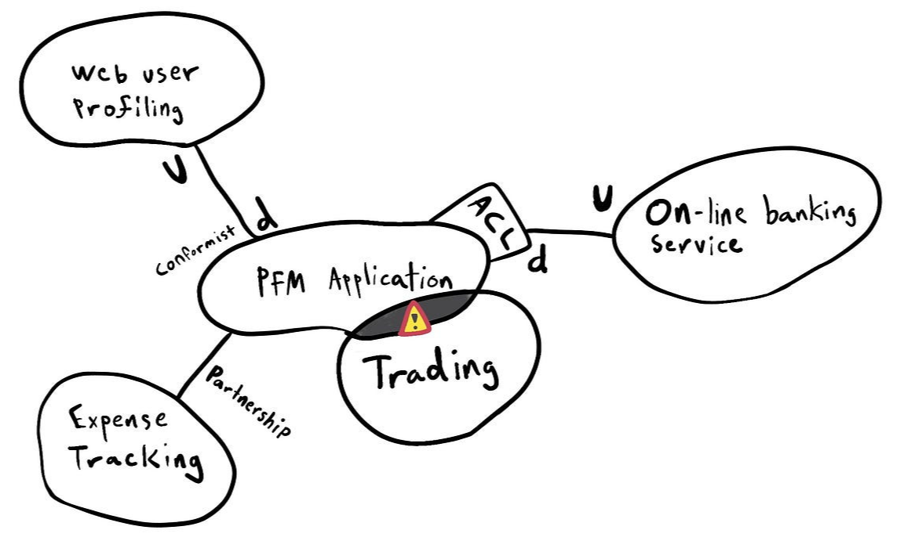

export { default as default } from "./../../components/post-layout";

# Domain Mapping

1. **Define the Scope:** Identify the specific domain or area of interest.
2. **Identify Key Elements:** List all relevant entities, concepts, or components within the domain.
3. **Map Relationships:** Draw connections between these elements to show their relationships and interactions.
4. **Review and Refine:** Analyze the map for completeness and accuracy, and adjust as needed.
5. **Share and Discuss:** Present the map to stakeholders for feedback and further insights.
