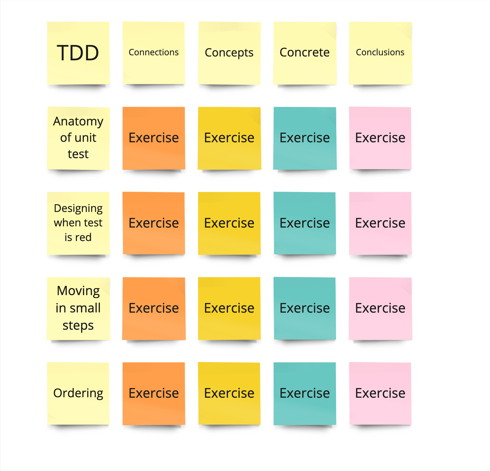

export { default as default } from "../../../../components/post-layout";

# Teaching with 4C

One fast way to make a workshop that is super engaging is with the 4C method.

The 4C method is from ["Training from the Back of the Room!" by Sharon L. Bowman](https://www.amazon.co.uk/Training-Back-Room-Aside-Learn/dp/0787996629/ref=sr_1_1?crid=3CAASM0OM1NXY&dib=eyJ2IjoiMSJ9.Gtw-BQDMnn-xExmd4aS3JXvkRoiSO3wQ-eiIfNFOwkIPEE8sFORjmWVGH2U1Hpmp2hRvw4PNv_C23-hzwv_U0EH-bKxUn9F50_9owJwRIRYq0vhdx2hSE_K_g6m4i7xB0uA7QWTpJi_dbKAmDsdO9w0qiBsUD4-RrfiKR1w2BxJhpS4H2g2Gx607TOkxO9UbphuqTDRZcEKUo3uUR_XrM5DmRvVGV-8bqEROiib81EU.STMZFT7D4phgzBT7Fr8FWIh1j6dQk9yaJJhcJi4H7wM&dib_tag=se&keywords=Training+from+the+Back+of+the+Room!&nsdOptOutParam=true&qid=1727357526&sprefix=training+from+the+back+of+the+room+%2Caps%2C90&sr=8-1)

The 4C's refer to a way to structure your workshops into short chunks that are:
* **Connections:** Load whatever your participants know about this subject already into working term memory.
* **Concepts:** Have your students learn the concepts they need for a new practice then teach each other what they learned
* **Concrete:** Apply what you have learned to some concrete practice
* **Conclusions:** Wrap up in such a way so the participants are thinking about where they will apply this technique.

To make this easier you can use a grid like this

You create this by putting your topic in the top right, then underneath it come up with parts of that topic. Next for each of the parts come up with a connections exercise, concept exercise, concrete exercise, and conclusions. Keep each exercise between 10min and 20min.