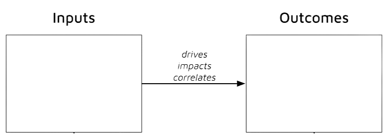

export { default as default } from "./../../components/post-layout";

# Inputs and Outcomes

**Purpose:**
Why do we exist?

**Future Aspiration:**
What do we want to achieve in the future?

**Impact:**
What change or difference do we want to make?

1. **Understand Purpose:** Reflect on why your organization exists.
2. **Envision the Future:** Imagine your ideal future state.
3. **Identify Key Elements:** Highlight core values and long-term goals.
4. **Draft and Refine:** Write and refine a concise, inspirational statement.
5. **Finalize:** Agree on and finalize the vision statement.
6. **Embed in Culture:** Integrate the vision into all organizational activities and communication
