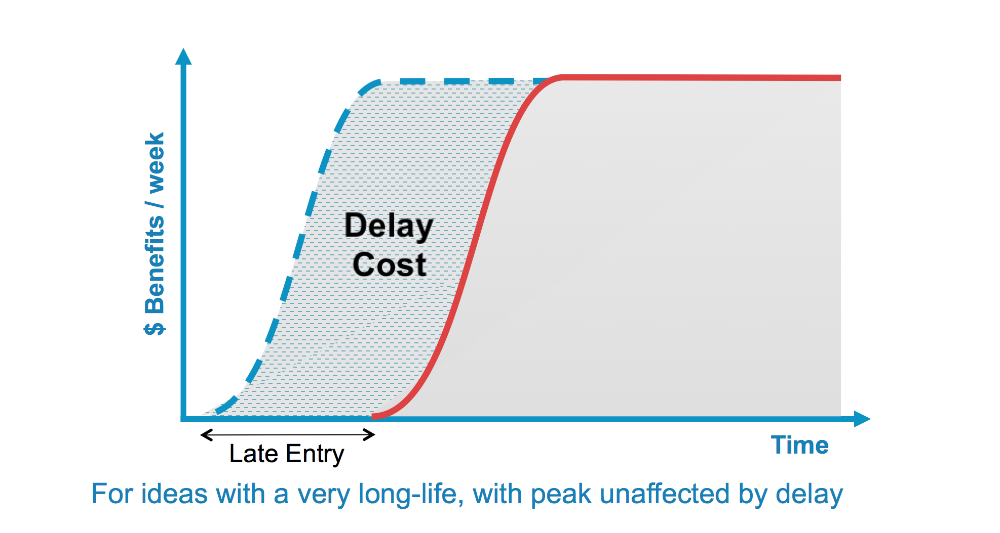
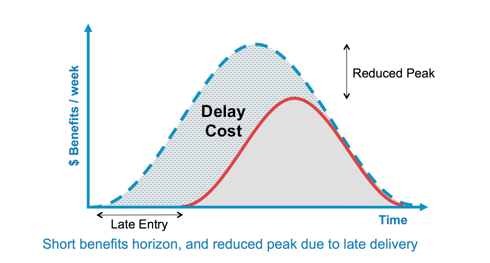
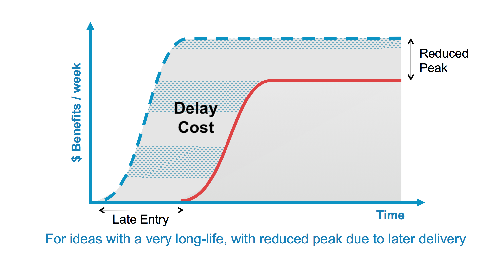
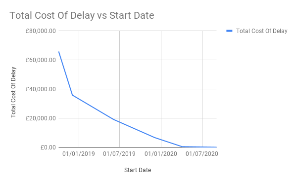
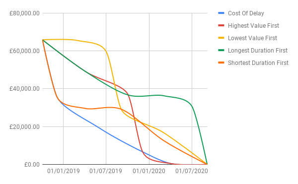

export { default as default } from "./../../../components/post-layout";

# Cost of Delay

How much money a potential feature might make a company relates to when the company finishes working on the feature. If you miss the winter quarter, your winter fashion line won't make much money. Cost of delay is a framework to apply this thinking to prioritisation of work.

Cost of delay is the intersection between urgency and value. It takes these values and gives you a framework to use these two values to calculate what order you should do your work. It is an attempt to move prioritisation to a more quantifiable approach rather than gut feel.

## Qualitative Cost Of Delay Over Duration

The fastest way to get started using this framework without any math is to use this table.

1. Create cards that represent your work
1. Place them along the Value Axis to represent the monetary value to the organisation
1. Move them the distance along the Urgency Axis that shows how soon the work needs to be done to retain the value
1. Prioritise work following the numbers on the grid, 1 being the first, 5 being last.

## Quantifying Cost Of Delay

We know how the cost of delay works without numbers, but what happens if we have a situation which is a bit more complicated.

Like with the previous table we need to know two things, value and priority.

### Value

Calculating what the value of a feature is in monetary terms can be intimidating, but it can be simplified by thinking of all the things that fit into these 4 categories:

- Increase Revenue
- Protect Revenue
- Reduce Costs
- Avoid Costs

Create a figure for each of these values. If your figure is only "probably" going to happen, multiply that figure by the probability. Put that all together, and your calculation looks a bit like this:

> Total Value = (Increase Revenue _ Increase Revenue Probability) + (Protect Revenue _ Protect Revenue Probability) + (Reduce Revenue _ Reduce Revenue Probability) + (Avoid Revenue _ Avoid Revenue Probability)

### Urgency

In the most common urgency pattern, like the one we modelled in the simple activity above a delay doesn't affect the overall value.

_Credit: [Black Swan Farming: Urgency Profiles](http://blackswanfarming.com/urgency-profiles/)_

In this scenario, the cost of delay is the benefits of delivering the feature.

A less common urgency pattern is that the total value is affected by the delivery date.

_Credit: [Black Swan Farming: Urgency Profiles](http://blackswanfarming.com/urgency-profiles/)_

Alternatively, this can look like this for longer-lived features.

_Credit: [Black Swan Farming: Urgency Profiles](http://blackswanfarming.com/urgency-profiles/)_

For this, you need to record the Peak Reduction Cost too.

### A note about fixed deadlines

Fixed deadlines that are external, like regulation changes, meaning the cost of delay is 0 until the date the work needs to start to deliver on time. In other words, you complete the work at the latest possible time.

### Putting it together

First work out the total value

> Total Value = Increased Revenue _ Increased Revenue Probability
> Total Value += Protected Revenue _ Protected Revenue Probability
> Total Value += Reduced Costs _ Reduced Revenue Probability
> Total Value += Avoided Costs _ Avoided Revenue Probability

Then use that to calculate the cost of delay.

> Cost of Delay = (Total Value / Duration) + Peak Reduction Cost

Next put that value next to every feature, and the higher the cost, the higher the priority.

For example, we have a new feature we think are worth £100,000.00 and take 5 months to deliver, and if we don't deliver on time, it loses £10,000 over the overall benefit.

So to plug that into the calculation.

> 30000 = (£100,000 / 5 months) + £10,000

Complete this for all the things you want to prioritise, and you get a backlog that maximises business value.

## Comparing to other ordering methods

Lets say we have 5 features

| Total Value | Duration (Months) |
| ----------- | ----------------- |
| £60,000.00  | 2                 |
| £75,000.00  | 6                 |
| £100,000.00 | 6                 |
| £2,000.00   | 5                 |
| £25,000.00  | 4                 |

We can calculate the cost of delay for this

| Start Date | Finish Date | Total Value | Duration (Months) | Cost Of Delay | Total Cost Of Delay |
| ---------- | ----------- | ----------- | ----------------- | ------------- | ------------------- |
| 04/10/2018 | 04/12/2018  | £60,000.00  | 2                 | £30,000.00    | £65,816.67          |
| 04/12/2018 | 04/06/2019  | £100,000.00 | 6                 | £16,666.67    | £35,816.67          |
| 04/06/2019 | 04/12/2019  | £75,000.00  | 6                 | £12,500.00    | £19,150.00          |
| 04/12/2019 | 04/04/2020  | £25,000.00  | 4                 | £6,250.00     | £6,650.00           |
| 04/04/2020 | 04/09/2020  | £2,000.00   | 5                 | £400.00       | £400.00             |
| 04/09/2020 | 04/09/2020  | £0.00       | 0                 | £0.00         | £0.00               |

If we graph this burn down it looks like this

If we contrast this to other potential orderings of these stories, cost of delay mitigates much of the risk of a delay

## Other resources

- [Black Swan Farming: Cost of Delay](http://blackswanfarming.com/cost-of-delay/)
- [Cost of Delay – a key economic metric](http://www.ontheagilepath.net/2017/03/cost-of-delay-a-key-metric.html)
- [Determining value using Cost of Delay](https://medium.com/@MagnusDahlgren/determining-value-using-cost-of-delay-266cd94630c6)
- [Calculating Cost of Delay](https://medium.com/@alexjp/calculating-cost-of-delay-3110c16827e9)
- [Cost of Delay Presentation for RBS](https://docs.google.com/presentation/d/1O6N9SuSivhmtX4kKhdENG8ZQG0VdRAGc6LHmYtWze5o)
- [ScrumAlliance Webinar on Cost of Delay](https://www.scrumalliance.org/learn-about-scrum/community-webinars/webinar-replays/collaboration-at-scale/cost-of-decision-delays)
