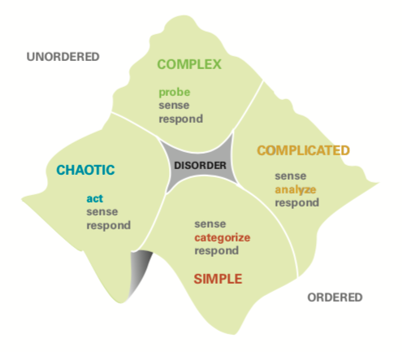

export { default as default } from "./../../../components/post-layout";

# Cynefin

Cynefin is a framework which allows us to analyse a situation (or context) and enables us to categorise the situation, helps us to orient and respond and indicates an appropriate meta-strategy.

```admonish Quote
Cynefin, pronounced kuh-nev-in, is a Welsh word that signifies the multiple factors in our environment and our experience that influence us in ways we can never understand.
(from Cognitive Edge)
```

## How Does It Work?

Cynefin is a sense-making framework, rather than a classification framework; the goal is to start with the attributes of your situation or context:

- Is it reliable and predictable or unpredictable?
- Are there a lot of unknown unknowns
  - or just known unknowns that require analysis to resolve?
- Is there extreme urgency that requires activity and precludes time for analysis (or anything else))

Then, a determination of the type of context (or domain for decision making) can be made &mdash; Chaotic, Obvious/Simple, Complex or Complicated. It is expected that over time, the context may change &mdash; moving chaotic->complex->complicated->simple as a product/process/etc matures, but perhaps jumping to Complex with external disruption or even chaotic with extreme events.

The diagrams depict a 'cliff' between simple and chaotic &mdash; this is intended to depict that while simple is the easiest (and most comfortable) context, it may lead to complacency and the wider world can shift dramatically leading to chaos.



### Disorder

Centre section of the cynefin framework. It's the state of not knowing which type of context applies

- By definition it's hard to see when this domain applies
- Occurs when multiple people argue where the problem belongs.

### Complex

It is often a new domain and requires probing/experimentation in order to understand enough to respond. The primary concern is that there are many unknown unknowns.

### Complicated

There is some familiarity with the problem we are trying to solve. It is not second nature however there is a known way of dealing with it. There are potentially many 'good' solutions.

### Simple

It is obvious how to solve these problems, and typically obvious 'best' solution.

### Chaotic

The problem is too confusing or urgent to apply a knowledge based response. Emphasis is on acting first and sense and responding later.

## How do I use it?

1. Lead the decision maker(s) through a set of questions to ask.
2. Based on the answers, discuss with the decision maker(s) which context seems to be the most appropriate.
3. The context will help the decision maker(s) to identify the appropriate meta-strategy.
4. Help decision maker(s) compare the meta-strategy to their natural decision making tendencies.

## When should I do this?

To help people to make better decisions when

- They encounter a new situation / opportunity raises.
- They want to re-assess in which context we are in (people,systems and tools) and to help to think about potential external changes / risks.

## Further Reading

[Cynefin Framework - wikipedia page](https://en.wikipedia.org/wiki/Cynefin_framework)

[Cynefin Framework - HBR Leaders framework for decision making](https://hbr.org/2007/11/a-leaders-framework-for-decision-making)

[Cynefin Framework - Liz Keogh](https://lizkeogh.com/cynefin-for-everyone/)

[Cynefin Framework Introduction - Cognitive edge video by Dave Snowden](https://fast.wistia.net/embed/iframe/bocmcxuuvz?dnt=1#?secret=pLoQ41pXmt)

[Cynefin and AK](https://docs.google.com/presentation/d/1kwiq2Izu5eFn64z41hQZSKjxTiXRYgT8XxdtRgljFQw)
