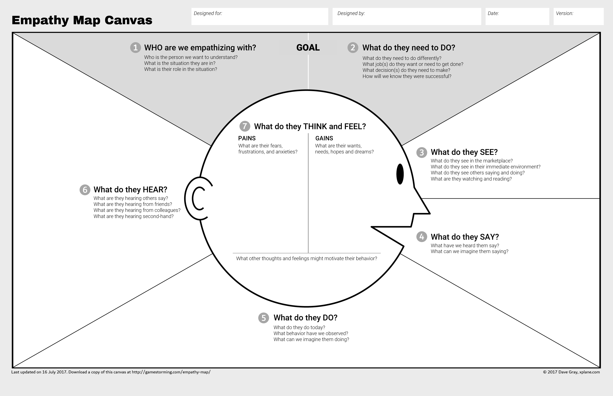

export { default as default } from "./../../../components/post-layout";

# Empathy Mapping

Empathy Mapping helps build empathy for another person, by attempting to understand their experiences and actions.

```admonish info
This is an activity from the [Gamestorming - A toolkit for innovators, rule-breakers and changemakers](https://www.goodreads.com/book/show/9364936-gamestorming) book
```

## How Does It Work?

First think about the problem that you want to Empathy Map for, its usually a specific feature, or activity, current or proposed. You can do it alone or with a group of people of any size, though typically no more than nine.

Empathy Mapping starts with a template the looks like this or very similar.


_From [Gamestorming - A toolkit for innovators, rule-breakers and changemakers](https://gamestorming.com/update-to-the-empathy-map/)_

It can be printed out and drawn on (see Further Reading), but a whiteboard with a similar layout works just as well.

If you're worried about it becoming tedious, you limit the time per persona to 10min.

### How do I use it?

1. Start with the Goal. The Goal should be an observable behaviour.
2. Move around the map clockwise trying and try to see what it feels like to be the persona.
3. After finishing with all others, move to the "Think and Feel" section.

You can stop here, or alternatively you can take these goals and use them as inputs to other activities. [For example "Affinity Mapping"](https://generalassemb.ly/design/user-experience-design/affinity-mapping) to create customer segments, following that up with developing a [Value Proposition Canvas](https://strategyzer.com/canvas/value-proposition-canvas) to help you create a service.

## When should I do this?

Any time you want to relate to someone, for example

- Trying to choose between projects
- Prioritizing one stream of work over another
- Creating new functionality
- Making a presentation
- Writing a blog post

### Further Reading

- [The Value Proposition Canvas](https://strategyzer.com/canvas/value-proposition-canvas)
- [Gamestorming: A Playbook for Innovators, Rulebreakers, and Changemakers](https://www.amazon.co.uk/Gamestorming-Playbook-Innovators-Rulebreakers-Changemakers/dp/0596804172)
- [Nine Labs - Facililitation Guide](https://www.ninelabs.com/blog/empathy-maps-the-business-of-putting-users-first/)
- [Gamestorming - Facililitation Guide and Downloadable Resources](https://medium.com/the-xplane-collection/updated-empathy-map-canvas-46df22df3c8a)\*
