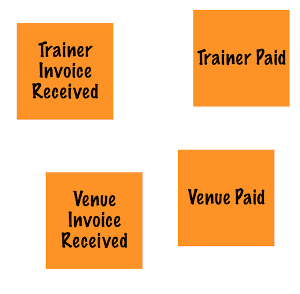
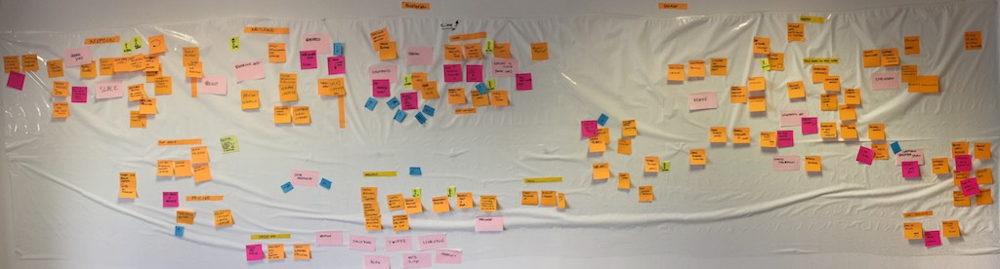
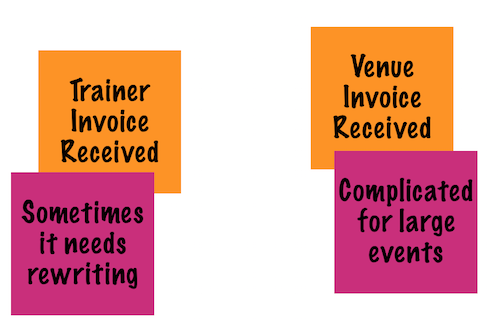
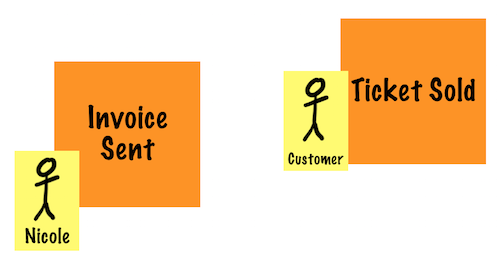
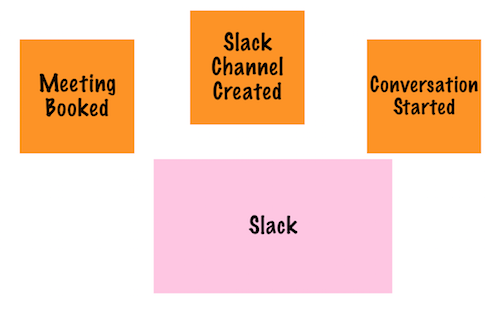
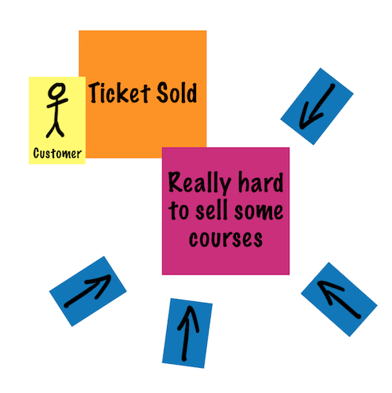
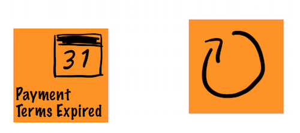
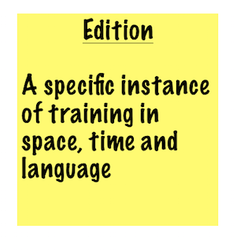
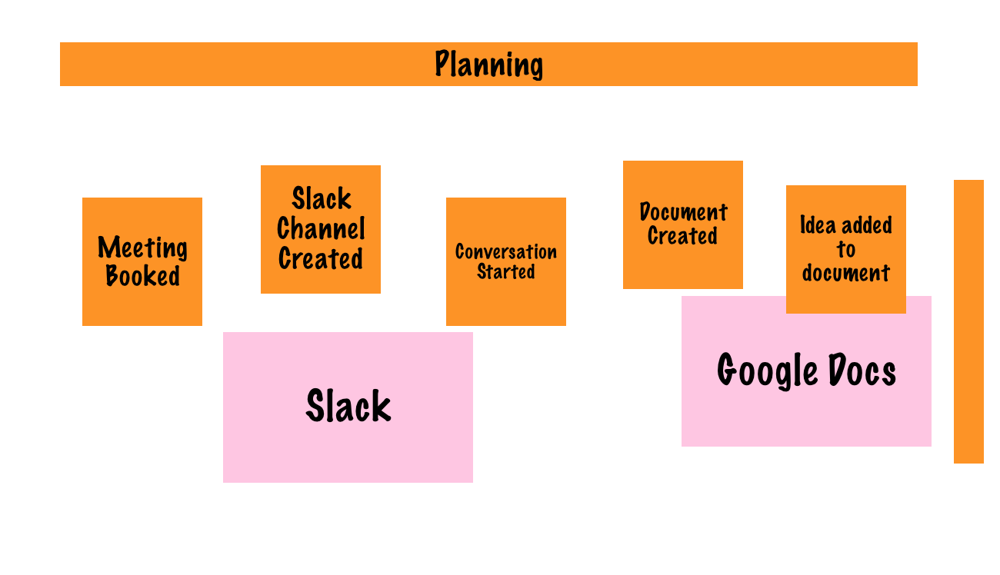
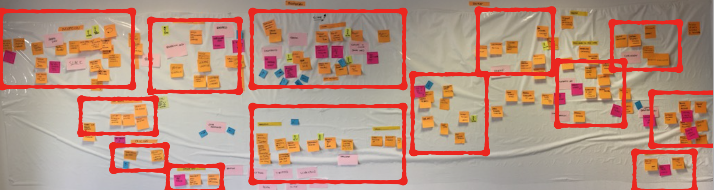

export { default as default } from "./../../../components/post-layout";

# Event Storming

Event Storming is a practice that has come out of the
[DDD](../methodologies/domain-driven-design.md) community. Its use,
however, extends far beyond the context of DDD.

## Why Event Storming

We use Big Picture Event Storming because:

- It enables us to learn complex domains quickly
- It helps our clients understand their own business at a deeper level
- It allows us to focus on behaviours rather than data
- The outputs of event storming can be used directly for modelling software
- It enables us to easily identify gaps in domain knowledge

## Introduction

At its essence, it is the use of PostIt notes to discuss a domain or process
using events. It is not limited to a specific purpose, and therefore can be
used for:

- Discovery (Big Picture Event Storming)
- Process Modelling (Process Level Event Storming)
- Software Modelling (Aggregate Level Event Storming)
- Retrospectives
- other things you might thing of...

Learning Event Storming the way Alberto Brandolini has developed it is a
reasonably deep process (i.e. there are lots of different colours of PostIt
notes and various structures and workflows to understand and follow) -
particularly when it comes to using it for modelling. However, you can get
value out of it very quickly with just a few simple concepts.

The rest of this article introduces a few basic concepts and provides just
enough information on Big Picture Event Storming to make it useful for you.
For more in-depth training, we aim to add an Ak learning path. In the meantime,
check out the [website](https://www.eventstorming.com/) and read the
[book](https://www.eventstorming.com/book/).

## What is an Event?

An event is something that happens. For Event Storming, events are written as
past tense actions on orange PostIt notes.

## Big Picture Event Storming

Big Picture Event Storming is a discovery mechanism. It provides an efficient
way for everyone involved to get a deeper understanding of the whole domain.

### When to run a session?

- Starting a new engagement
- When knowledge is fragmented between many people
- Understanding existing processes
- Thinking of how a new system might behave

With experience, you'll begin to recognise times when you think it would be
useful.

### What will I get out of it?

Everyone who attends the session is likely to learn something useful. Some
examples of things you might learn include:

- Understanding of the whole domain
- Identification of bottlenecks and issues
- Identification of separate processes
- Identification of subdomains
- Identification of organisation structure
- Identification of key value streams
- Identification of potential areas for improvement

### Who should attend?

Big Picture Event Storming is a collaborative process which involves a larger
group of people than the other types of Event Storming. For the session to be
successful, anyone with useful context should attend (it's better to have too
many people than not enough). Sessions can contain up to 20 people - maybe even
more.

### How long will it take

Ideally somewhere between half a day and a full day. For a simpler domain, you
should still get good value in 2 hours.

### What do I need?

- A large amount of wall space (at very least 4m, the more the better)
- A roll of paper (something like
  [Ikea drawing paper](https://www.ikea.com/gb/en/p/mala-drawing-paper-roll-70461088/))
- Some tape (to attach the paper to the wall)
- A selection of PostIt notes (ideally a lot of square ones of a few colours +
  a range of other shapes and sizes)
- Sharpies (a least one per person)
- Some 3m tape is also useful

### Setup

1. Attach the paper to the wall (running horizontally across the length of
   the wall and two or three levels deep)
2. Indicate time running left to right (draw an arrow at the top of the paper)
3. Explain an `event` to the attendees (optionally write one on an orange PostIt
   and display it off to the side somewhere)

### Running the Session

As the facilitator, it's your job to:

- Ensure everyone understands what they are doing (i.e. understands how to write
  an event)
- Ensure everyone is comfortable and taking part
- Follow the processes that people are documenting and ask when you think there
  is missing knowledge
- Add additional information to the wall when you think it's necessary
- Introduce new concepts when they will be useful
- Ensure breaks are taken

The following steps don't have to be done one after the other, but rather, you
might choose to add them into the process as time goes on. You may even decide
not to do some of them or change the order.

#### Adding Events

To begin the session you need to encourage everyone to start writing any events
they can think of on to orange PostIt notes and put them on the wall.
Absolutely anything goes which it comes to putting events on the wall - so long
as they are relevant to the domain in some way.

People from different departments will probably create sets of events relevant
to their job.

The session should start completely free form, but as time goes on the
participants should be encouraged to create a bit more order (i.e. sequence
events by time and separate streams). It's important that the goal not be to
aim for perfection but rather to get some useful visualisations.

#### The Reverse Walk

Once the adding of events has slowed down, it's worth walking through them
backwards. Start with the events furthest to the right and ask what events need
to occur to cause these ones to happen. By walking through the wall from right
to left and looking for causation events it helps to identify steps which are
missing.

#### Adding Issues

During the session, conversations about issues will start to come up. e.g.

- "Pete is often too busy to do this"
- "The suppliers can be really slow"
- "We often send the wrong part by mistake"

When these issues are identified, capture them on a purple PostIt and stick it
by the event.

As a facilitator, it's important to let these conversations happen, but also to
capture them and move on - you don't want to spend to whole day arguing about
one issue.

#### Adding Actors

Another thing to think about is who generates or cares about these events. Use
small yellow PostIts to annotate the actors involved. You can attach actors to
specific events or groups of events.

#### Adding External Systems

Sets of events might be generated by actions performed with a specific system
(e.g. PayPal, Trello, The Supplier, Xero). Use large pink PostIts to show them.

#### Adding Value

Use small red and green PostIts to indicate positive value or failure events.
These might include things such as:

- Made money or lost money
- Happy customer or unhappy customer
- Happy staff or unhappy staff
- Good press or bad press
- etc.

#### Arrow Voting

Towards the end of the session (once everything mapped out, and lots of
conversation has happened) then a round of arrow voting can be very valuable.
For this, give everyone two or three small PostIt notes and ask them to draw an
arrow on each one (you could use fancy arrow shaped PostIts) and stick them on
the wall point at the areas which they feel are of most concern.

The definition of concern is reasonably free-form here; it includes things like:

- Bottleneck
- Loses money
- Fails often
- Too slow

The clusters of arrows will often indicate the places to get the most value
through improvement. Improvement could involve things like building software,
using off the shelf software, hiring more people, changing supplier, etc.

#### Other Possible Things to Add

This process doesn't have to be completely structured as laid out above. Feel
free to adjust the process and annotate the wall in any way you find useful.

Some possibilities are:

##### Time-based events

Annotate things which timeout, re-occur or happen at specific times.

##### Special Terms

If there's a term which is unique to the domain, add a brief description on a
PostIt note somewhere.

##### Processes

If groups of PostIts form a specific process, use some 3M tape to label it.
You can also use verticle strips to indicate the beginning and end of them.

### Analysing the Wall

When you step back and look at the wall, there should be apparent clustering.
These clusters will indicate processes and subdomains. This is very useful to
understand where the real separates of behaviour exist in the domain.

### What happens if I don't have many orange PostIts?

Just pick another colour ;-)

### Archiving

Photographs are good (panoramic works well).

You can also remove the paper strips off the wall and roll them up with all the
PostIts attached.

## Resources

- [Event Storming Website](https://www.eventstorming.com/)
- [Event Storming Book](https://www.eventstorming.com/book/)
- [50,000 Orange Stickies Later - Talk by Alberto Brandolini](https://www.youtube.com/watch?v=1i6QYvYhlYQ)
- [Workshops](https://www.eventstorming.com/#events)
