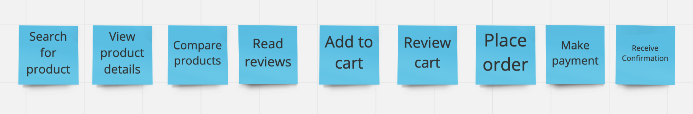
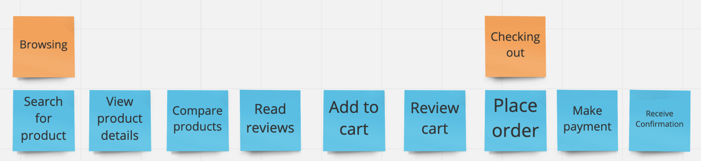
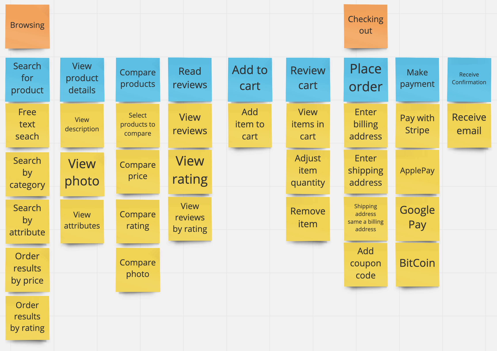
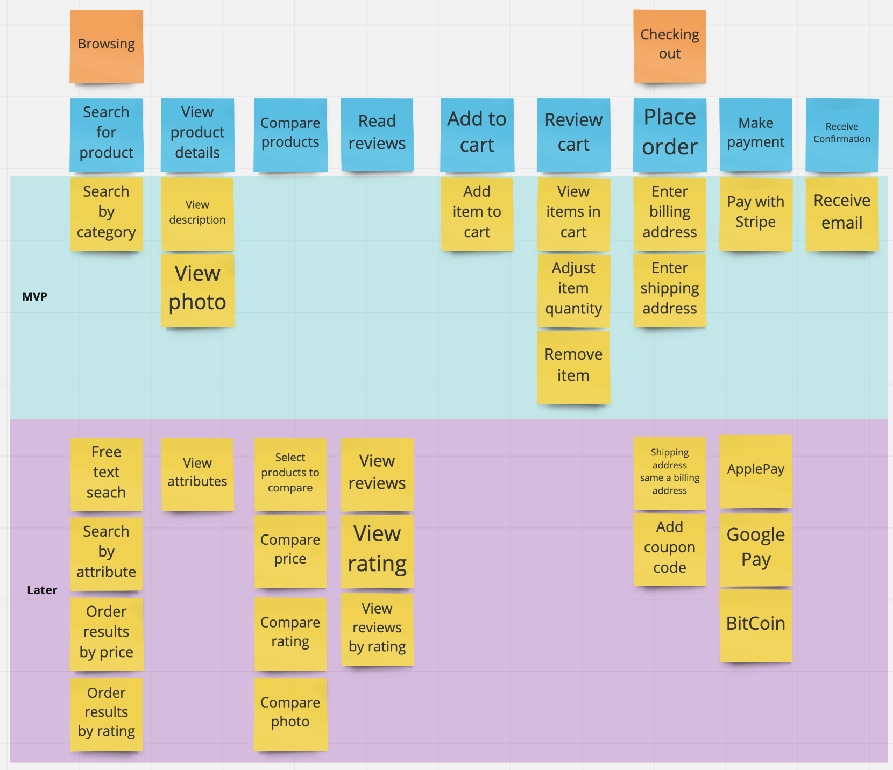
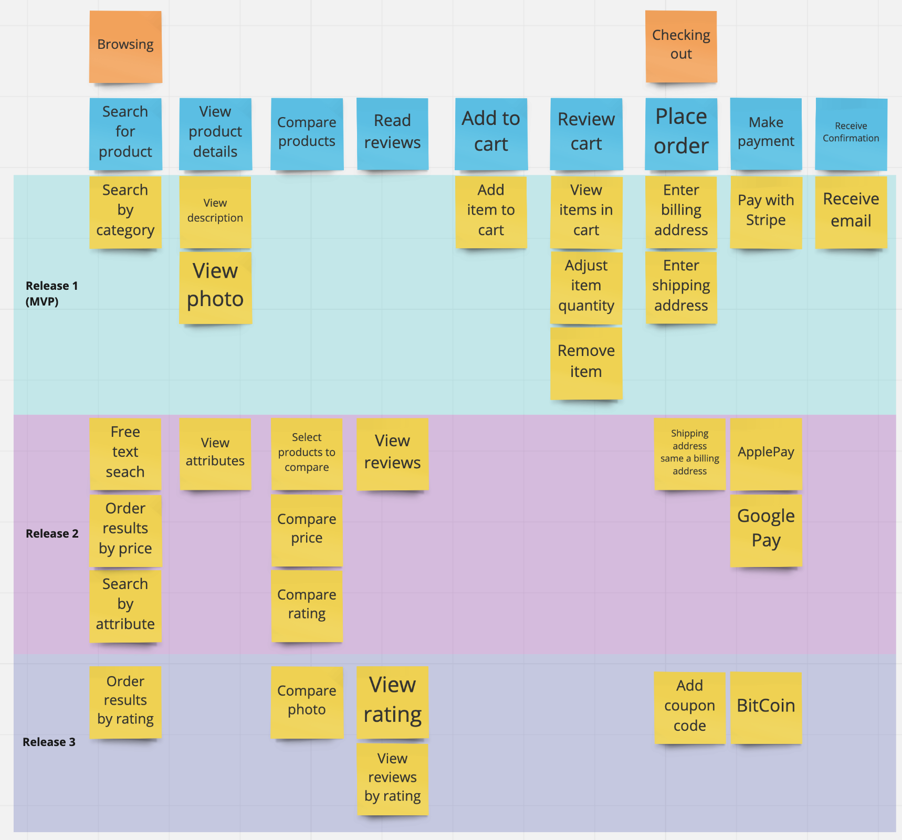
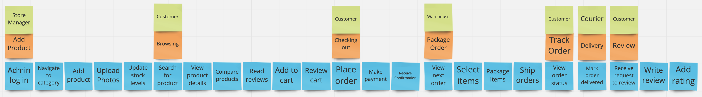

export { default as default } from "./../../../components/post-layout";

# User Story Mapping

User Story Mapping is a tool to get from an idea to a backlog of work by telling
the stories of how users will use the system.

There is a [great book](https://www.amazon.co.uk/User-Story-Mapping-Discover-Product/dp/1491904909)
on the subject which is recommended to learn User Story Mapping in depth,
therefore, this article serves as a quick primer or reference on the basics.

## Running a User Story Mapping Session

### 1. Building the backbone

With User Story Mapping we want to tell the story of users' journeys through the
system. Choosing a key journey (e.g. a customer buying a product), write down
the steps (at a resonably high level) that the relevant users must take.

### 2. Highlight the activities

A single activity that a user might perform may consist of multiple steps, use
a different colour Post It note/index card to label the activities.

### 3. Add the details for each step

For each step there may be:

- Things which absolutely have to happen.
- Alternative choices.
- Things what can be built later.
- Nice to have features.

Capture all of these details vertically below each step.

### 4. Priorites details

For each column move the details which are required to complete the journey to
the top of each column.

### 5. Prioritise remaining details

You may want to create groups of features which constitute releases.

## Notable Tips

### Multiple Users

It's likely that most story maps will include an interaction between multiple
users, the examples above were kept small due to page size. A real backbone may
look more like this:

## Resources

### Tools

There are digital tools which can be used for remote User Story Mapping.

- [Stories On Board](https://storiesonboard.com)
- [Miro](https://miro.com)

### Books

- [User Story Mapping](https://www.amazon.co.uk/User-Story-Mapping-Discover-Product/dp/1491904909) by Jeff Patton
