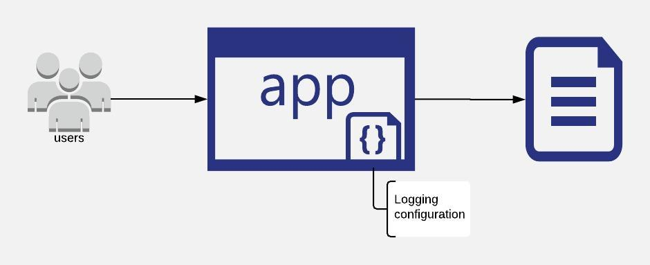
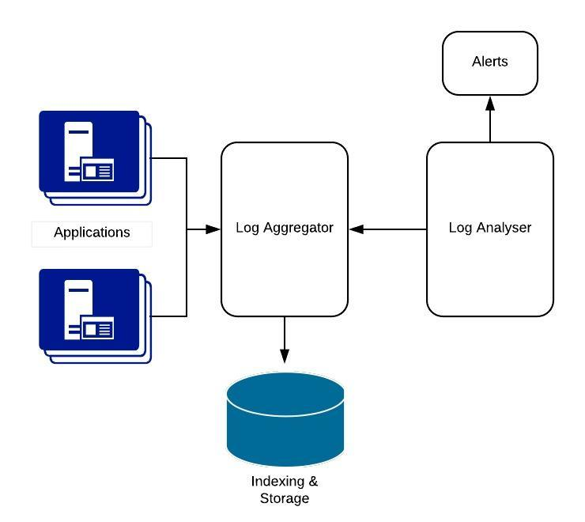

export { default as default } from "./../../../../components/post-layout";

# Logging

Logs are records of the events that take place in a running application. Logging is the act of recording the information about an acitivy or transaction or process taking place in an application. They provide visibility into the running system and gather information about the state of the system.

## Why do we need to log

Logs give an insight on what is happening in a running application. Gaining this insight will provide better understanding on how the system is behaving and can be used as a feedback about the application which in turn can make the application better.

## The Traditional Way

Traditionally logging was done in files. Everything that transpired in the system was written to a file. The main purpose of logging was to collect the application activity data and save it to a file. And so it cannot distinguish between general activity and bad logs. It was left up to the reader of the log to make such intelligent decisions. It also would not alert you of any security infiltration. Logging was designed to do a simple task of writing application outputs into a file and it did it well.

On a positive note logging was automated, in the sense that it gets automatically written to a file. The drawback is that it creates an overwhelming amount of logs and if the logging system is not configured properly it will write all the huge amount of data into a single file. This inturn will be very difficult to view or search for specific log entry in the file. And even if the configuration was set to have a maximum size for the log files, depending on the amount or level of logging, there may be an overwhelming number of files in the server and is again challenging to understand the logs or find a specific log entry. Log management ended up being a massive task in itself with engineers with logging expertise being required which required time, expertise and resources devoted to it in order to do it well and get the benefits out of it.

Logging is usually done as an afterthought. I have noticed the most often an application will have minimal logging and once there is an issue, the developers will add more logging while making the fix. This is terrible because, with minimal logging, it would have taken far too long for the developer to figure out what went wrong. One reason for this was many would consider logging slowed down the software. With synchronous file I/O, slow disk storage and even slower network this was to an extend true and so engineers had to be careful on how much logging needs to take place. However, with asynchronous file I/O, storage becoming much faster and cheaper and network speeds dramatically increasing, the performance characteristics of logging landscape is much different.

## The Cloud-native Way

The way logging is done in the cloud-native way requires a shift in the mind-set and approach. Logs should be treated as time-ordered **streams of events**. And the application should not be concerned about how logs are stored or routed. This concept is quite different from the traditional way. Earlier, developers were concerned and spend a lot of time controlling the storage, destination and configuration of logging. A configuration file (or config related code) was used to set up the location of the log files, the rolling of the log, the size of each log file, the naming of the log file etc.

> Treat logs as streams of events. This concept is not new, but is required to succeed.

In the cloud-native approach, the application should not have have knowledge of the system it is running on, so cannot make file related configurations. A cloud-native application thus writes all its log entries to the standard out or the standard error. The application should not be concerned with the management of the logging but rather on what and when to log along with the other business rules. This does not mean that the developers should ignore taking care of logging but rather the concern of logging is moved away from the application to a separate service/provider that can process, aggregate, analyse and store logs. This can be the cloud provider itself or service that be used within the cloud provider's platform.

This decoupling of the logging management from the application can be a huge advantage. The code becomes simpler and lighter as it does not have the responsibility of log management. Besides, if there is a need to change the log service, it can be done much easier without touching the application. The processing, analysing and storage of logs can rely on industry-standard tools which generally can do a better job.

> Decouple the application from the log management

Another important point in the cloud-native approach is the scaling up and down of applications depending on the needs. If the logs were stored in a traditional fashion in files, it will be very difficult to read logs from each of the multitude of servers. And once the application is scaled down, the logs might be lost forever as access to particular servers is not available anymore. When you have a fixed number of instances on a fixed number of servers, storing logs on disk seems to make sense. However, when your application can dynamically go from 1 running instance to 1000, and you have no idea where those instances are running, you need your cloud provider to deal with aggregating those logs on your behalf.

By having good logs, it helps in improving observability and understanding the application much better. Good logs also enables the developers to set up monitoring easily.

Reference:  
[12 Factor App - Logs](https://12factor.net/logs)
