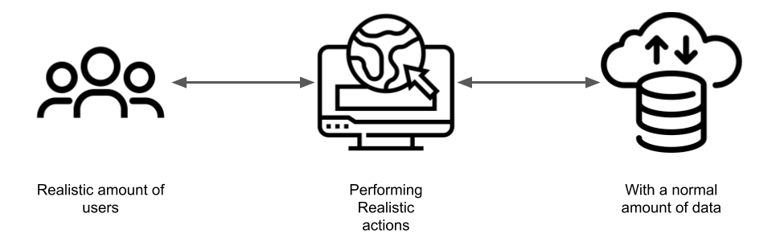
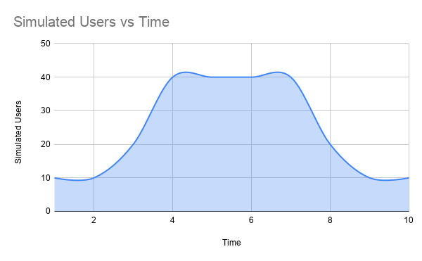
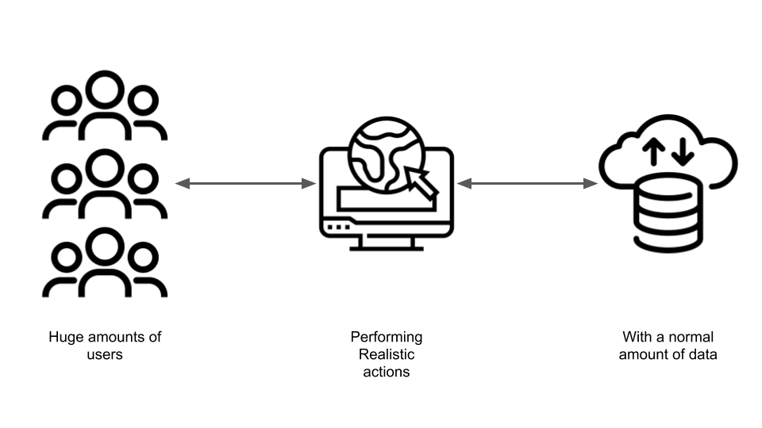
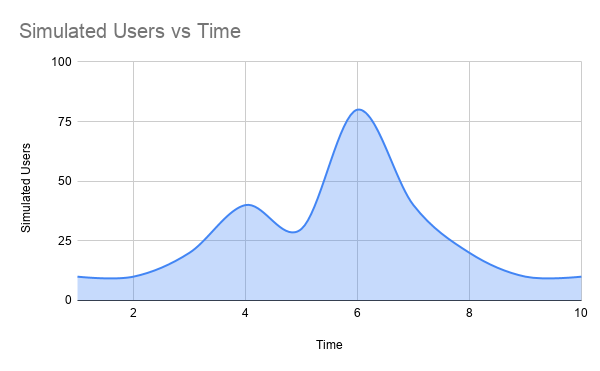
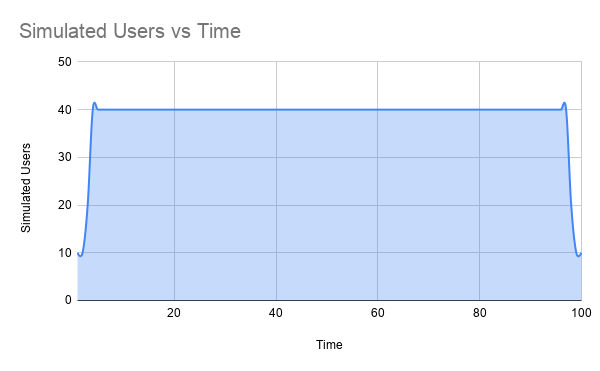
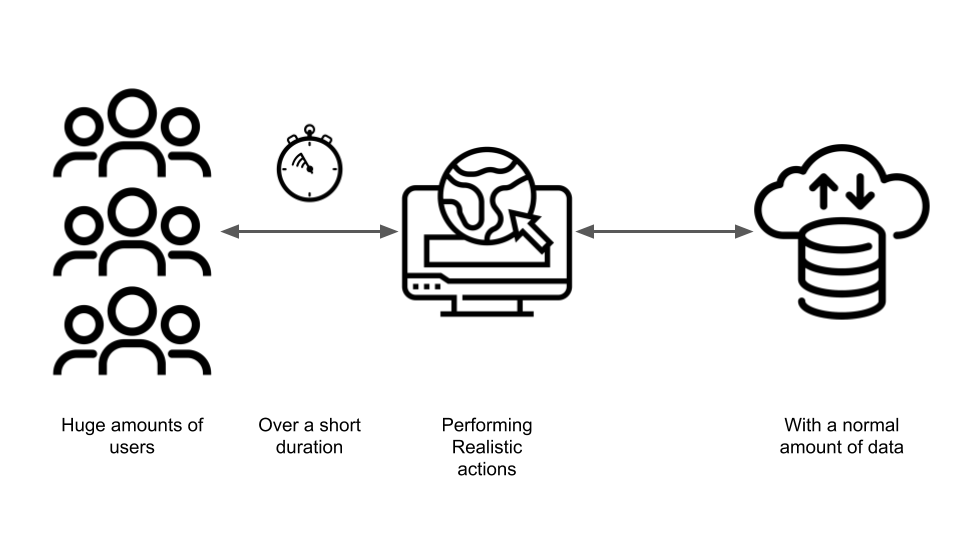
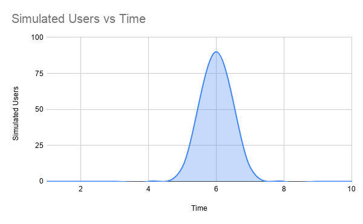
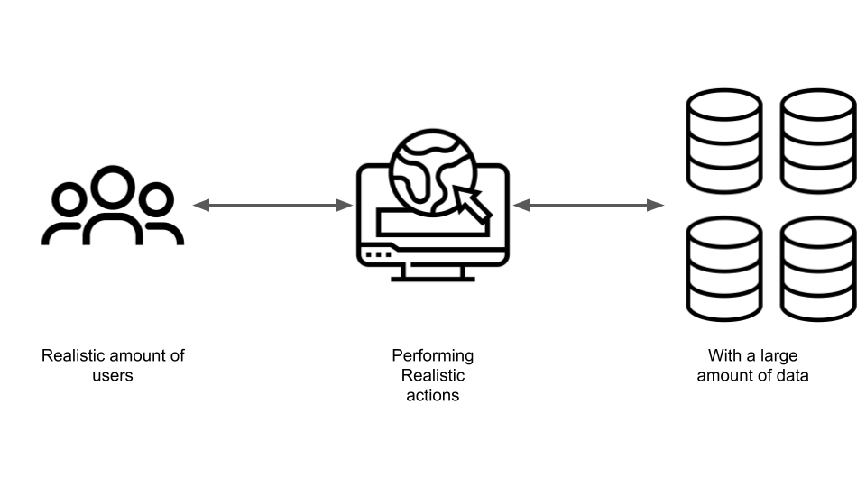
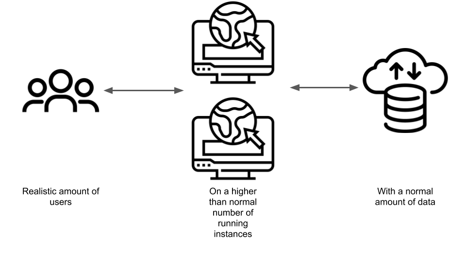

export {default as default} from './../../../components/post-layout';

# Performance Testing

```admonish info
This article is a stub. You can help Armakuni by expanding it.
```

## Business Case

Typically when people want some load testing done they will approch us and say something along the lines of "We have a big influx of users coming soon, we want to make sure that we can handle it".

Lets face it, although we're competitive in our field, consultants are expensive. To get to the point of "We want to find out if we have a problem using these expensive people", you will have already reached "we're pretty certain we do and we want their help fixing it". 

Hiring us to do performance testing is really attempting to achieve these other goals

### Short term 

```admonish tip
Metrics are most effective if collaboratively decided upon
```


#### Know how bad the situation Is

What can we really handle. This serves a few purposes
 
* A management stick to get more money for improving performance, 
* A confidence builder, will it be "all right on the night"
 
 
```admonish tip
The situation is rarely good. 
```
 
##### Suggested Metrics
 
You will need to agree with the user what requests they're expecting, and what a normal user journey looks like. This can then be converted into what requests are generated.
 
```admonish tip
People will talk in terms of "concurrent users". This means hugely different things to different people, be sure to dig into their definition.
```

 
* Edge Loadbalancer 500 count given *X* number of users following the following expected user journeys over *Y* period
* Edge Loadbalancer connection duration given *X* number of users following the following expected user journeys over *Y* period
* Browser page load times given *X* number of users following the following expected user journeys over *Y* period
* Length of E2E Tests page loads given *X* number of users following the following expected user journeys over *Y* period


```admonish tip
Don't rely on the results of the load test as indicators of performance. Use real world measures, like loading the page in a browser, or mobile app. Load test results do not represent the real user experience
```


#### Know where the problem lies

Which component is it in. If you have a problem you want to start fixing it. To fix it you need to know what to fix. 

##### Suggested Metrics

* Automatic instrumentation such as tracing
* Service endpoint load times
* Service endpoint errors
* Host CPU
* Host Memory
* Inode usage
* Event lifetime (how long after triggering do the downstream actions of an event loop through queues)
* Queue size
* Queue in/out rate
* Service gateway metrics
* Manual instrumentation such as timers and counters

#### How much will it cost me to fix this

Know how much it would cost to throw resources at the problem until it goes away. This is almost always the first step in solving the load testing problem, and in the short term can be cheaper than actually fixing the problem

##### Suggested Metrics

* Cost per user given current performance
* Total cost per hour to reach performance desired
* eNPS of customer satisfaction happiness
* Cost of delay to resolving performance problems

### Longer Term Goals

Along with the shorter term "oh crap fix it" goals, there comes a series of longer term, developer life improvement goals.

#### Reduce costs associated with achieving performance

No one really wants the hack. Sometimes it's expedient but really we want a solid solution to the problem. 

##### Suggested Metrics

Same as knowing how much it will cost to throw hardware at the problem.

* Cost per user given current performance
* Total cost per hour to reach performance desired
* eNPS of customer satisfaction happiness
* Cost of delay to resolving performance problems

#### Performance as a first class concern of teams

Now we have fixed the problem once, we don't want it getting this bad again. We want some form of monitoring to identify slowness proactively, and to alert based on the application slowing down on production.

##### Suggested Metrics

* Time to recovery of code with performance problems being deployed

## Important Terms

* **RPS** Requests per second
* **VUsers** Virtual user, are the number of concurrent simulated users. One user may make many concurrent request, but has one set of session data (such as cookies)
* **Closed Model** A closed model is limited by a maximum number of requests per second. For example, if you have 10 users on your site, it prevents the 11th user from trying to connect, and maintains a steady 10 users on the site
* **Open Model** A open model is not limited by a maximum number of requests per second. For example, if you add users to your test at 1 user per second, if your site starts struggling at 10, it will still add the 11th a second.
* **Test Script** A definition of how the load test should be run in an runnable form. Sometimes XML sometimes code, sometimes other esoteric formats.

## Types of Performance Testing





* **Load testing** - Can the application handle this load we expect





* **Stress testing** - What is the breaking point of the application? It might also include only testing individual services or crippling the system in some way.




* **Endurance testing** (or **Soak Testing**) - Can the application handle an expected load for a longer duration




* **Spike testing** - Can we handle a user spike




* **Volume testing** - With a large amount of data in the system, what happens?




* **Scalability testing** - What happens when running more concurrent instances than normal 