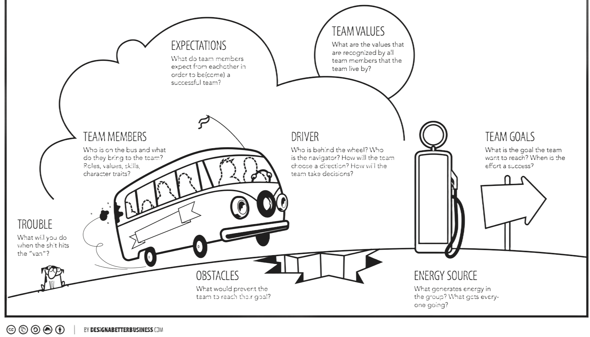

export { default as default } from "../../../../components/post-layout";

# Team Charter

1. Go through each section one by one, encouraging open discussion and input from all team members.
1. Write down the agreed-upon points in each corresponding section of the canvas.

    **Team Members:** List who is on the team and what each member brings in terms of roles, values, skills, and character traits.

    **Expectations:** Discuss and write down what team members expect from each other to become a successful team.

    **Team Values:** Identify and note the core values that all team members recognize and agree to live by.

    **Driver:** Determine who will lead the team (the driver), who will guide (the navigator), how the team will choose its direction, and how decisions will be made.

    **Team Goals:** Define the main goal the team wants to achieve, and outline what success looks like and when it should be reached.

    **Energy Source:** Identify what generates energy and motivation in the group, and what keeps everyone going.

    **Obstacles:** Discuss potential obstacles that could prevent the team from reaching their goal and how to overcome them.

    **Trouble:** Plan how the team will handle crises or unexpected problems when they arise.
1. Review the completed canvas to ensure everyone is aligned and understands the content.
1. Keep the canvas visible and refer back to it regularly to stay on track and address any changes or challenges.