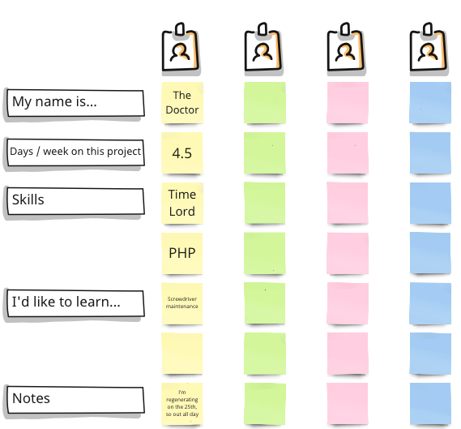

export { default as default } from "../../../../components/post-layout";

# Team Overview

To fill out the Team Overview template, follow these steps for each team member:

1. My name is...
    * Write the name of the team member in the corresponding row under this section.
2. Days / week on this project
    * Specify the number of days per week the team member will be dedicated to the project.
3. Skills
    * List the key skills the team member brings to the project. Include technical skills, soft skills, and any relevant expertise.
4. I'd like to learn...
    * Note any specific skills or areas the team member is interested in learning or improving upon during the project.
5. Notes
    * Add any additional information or special notes about the team member that might be relevant to the project. For example, availability, planned absences, or unique circumstances.

Once all sections are filled out, review the completed template together to ensure everyone understands each other's roles, availability, and learning interests.