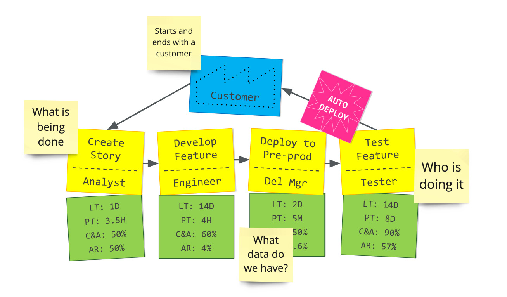

export { default as default } from "./../../components/post-layout";

# Value Stream Mapping

1. **Select the Process:** Identify and define the specific process or product line to be mapped, ensuring it has a clear start and end point.
2. **Gather Data:** Collect detailed information on lead time, process time, and complete and accurate for each step of the process.
3. **Create Current State Map:** Use diagrams to visually represent the current process flow, including all steps, delays, and information flows.
4. **Analyze the Current State:** Examine the map to identify areas of waste, such as excess inventory, waiting times, and unnecessary movements or processes.
5. **Design Future State Map:** Develop a new map that eliminates identified wastes and inefficiencies, streamlines steps, and optimizes the flow of materials and information.
6. **Implement Changes:** Put the new process design into practice, train staff on the changes, and establish metrics to monitor the effectiveness of the improvements.
