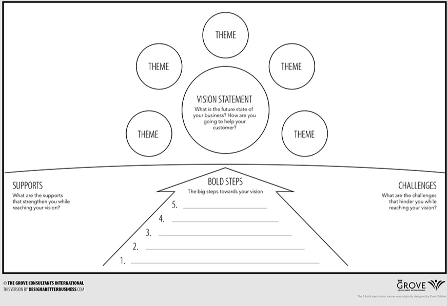

export { default as default } from "../../../../components/post-layout";

# 5 Bold Steps

1. **Visualize the Future:** Imagine the future state where the goal has been achieved and describe it in detail.
2. **Identify Bold Steps:** Brainstorm and identify five significant, bold steps that will drive the organization towards the desired future state.
3. **Prioritize Steps:** Discuss and prioritize these steps based on their impact and feasibility.
4. **Create Action Plans:** For each bold step, develop detailed action plans outlining the necessary tasks, resources, timelines, and responsibilities.
