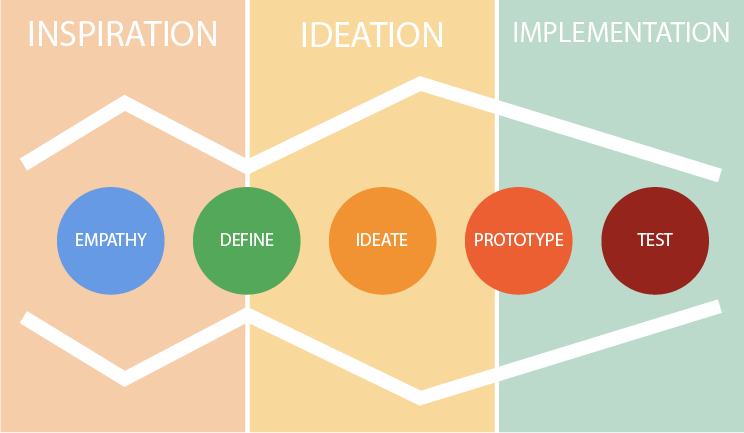

export { default as default } from "./../../../components/post-layout";

# Activities

On this page you will find a list of situations and suggestions for activities to do in meetings or with clients. They are grouped using the Design Thinking methodology

## I want to...

This will separate activities into the 6 phases of design thinking

[Source](https://www.nngroup.com/articles/design-thinking/)

[Source](https://stormz.me/en/designthinking)

The idea is

1. **Empathise** with the the people experiencing the problem, and understand them and their needs.
1. Combine your research and **define** the core problem
1. Generate some **ideas** on how to solve that problem
1. **Prototype** that some variations on that idea
1. **Test** and feedback which prototypes have worked

### Empathise

Conduct research to develop an understanding of your users. After this step you should have more ideas of things you could do.

- Empathy Mapping [[AK Way](../lean-agile/empathy-mapping.md)]
- Big Picture Event Storming [[AK Way](../lean-agile/event-storming.md)]
- Interest-Influence Grid [[Bright Hub Project Management](https://www.brighthubpm.com/resource-management/81140-what-is-the-power-influence-grid-or-matrix/)]
- Service Blueprints [[Practical Service Design](http://www.practicalservicedesign.com/download-the-guide/)] [[Nielsen Norman Group](https://www.nngroup.com/articles/service-blueprints-definition/)]

### Define

Combine your research and observe where your users problems exist. After this step you should have closed in on the problem you're going to solve.

- Value Stream Mapping [[AK Way](../working-with-clients/demonstrating-value.md#value-stream-mapping)]
- Cynefin [[AK Way](../lean-agile/cynefin.md)]
- Impact Mapping [[Impact Mapping](https://www.impactmapping.org/)]
- Wardley Mapping [[Wardley Maps](https://leadingedgeforum.com/insights/filter/wardley-mapping)]
- Quick Cost of Delay [[AK Way](../lean-agile/cost-of-delay.md)]
- Full Cost of Delay [[AK Way](../lean-agile/cost-of-delay.md)]
- 5 Dysfunctions of a Team
- Westrum

### Ideate

Generate a range of crazy, creative ideas. After this step you should have more of a range of options of things you could build.

- Mind Maps [[Wikipedia](https://en.wikipedia.org/wiki/Mind_map)]
- Product Canvas [[Roman Plicher](https://www.romanpichler.com/blog/the-product-canvas/)]

### Prototype

Build real tactile representations of your ideas. After this step you should have a real tactile thing you can test.

- _See everything under "[Technology Tools](../technology-tools/index.md)" and "[Service Development](../service-development/index.md)"_

### Test

Return to your users for feedback. After this step you should have an idea if your prototype solved the problem or not.

- IPM Retrospective [[Fun Retrospectives](http://www.funretrospectives.com/)]
- Engagement Diaries [[AK Way](engagement-diaries.md)]
- Metrics [[AK Way](metrics.md)]
- Writing a blog [[AK Way](../learning-and-development/writing-a-blog.md)]
- Delivering a talk [[AK Way](../learning-and-development/delivering-a-talk.md)]
- 4 Accelerate Metrics
