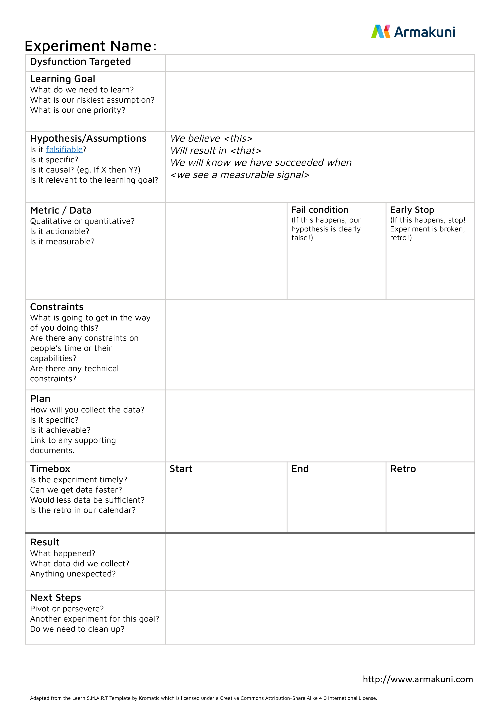

export { default as default } from "../../../../components/post-layout";

# Use experiments to introduce change

In some cases a team might not be confident in a change that you want to recommend. This is fair enough, change is scary, especially if psychological safety is low. One way to tackle is to be really methodological in your approach by borrowing from the scientific method.

Propose your change in the usual forum, usually a stantup, or retrospective, but explain you want to do it as an "experiment".

Have the team collaboratively fill this in.

Nominate someone to be in charge of running the experiment, and someone to be responsible for sharing the results of the experiment.

Wrap it up with a [Experiment Retrospective](/practices/xp-and-agility/we-measure-everything/experiment-retrospective/)

This method is powerful because "metrics trump vibes", it creates an artifact that can be shared with others, and it creates a forum to discuss how to do it safely.

You can even do it if you're not personally in the team, so long as you check in regularly as to how it's going.
