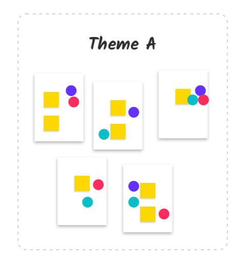

export { default as default } from "../../../../components/post-layout";

# Dot Voting on Agreements

**How to do dot voting:**

- Each team member receives a set number of dots or votes.
- They vote on which proposed working agreements they believe are most important.
- The top-voted agreements are adopted by the team.

