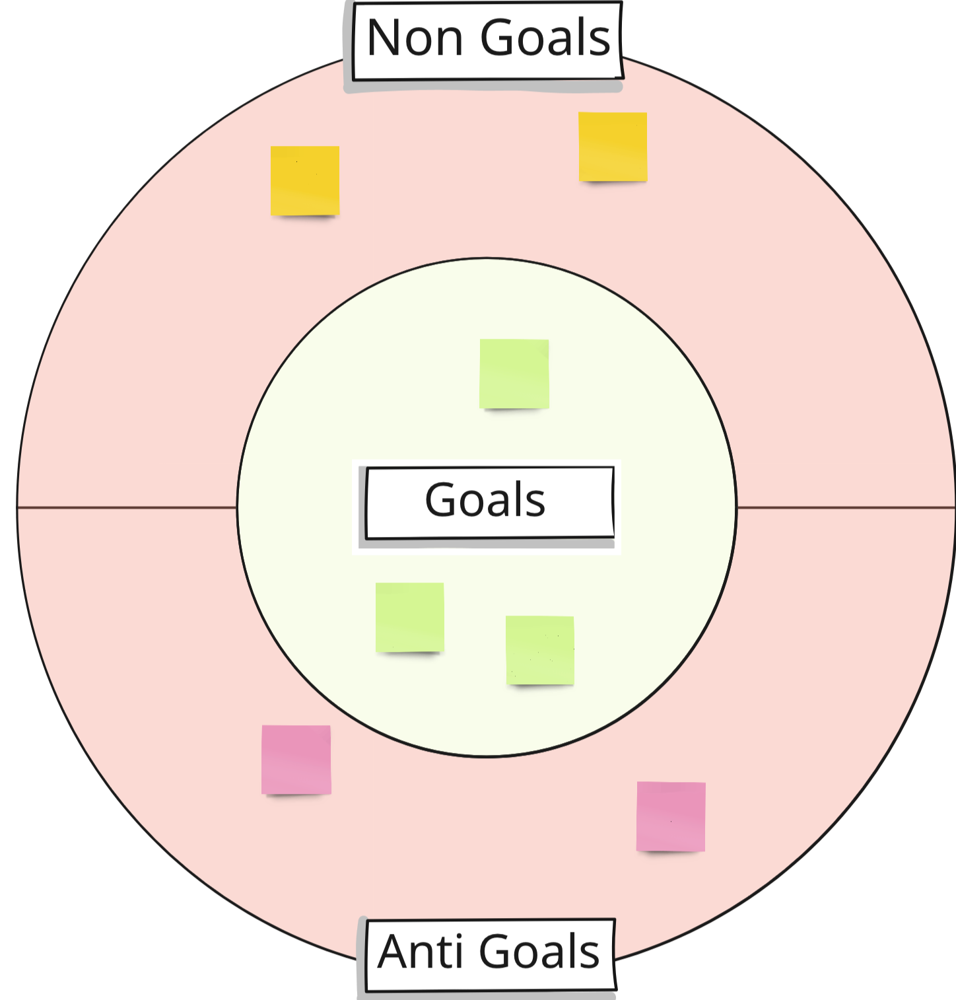

export { default as default } from "../../../../components/post-layout";

# Goals & Non-Goals

Clarify your team's vision, prioritize efforts, and establish boundaries for a project.

**Goal** - It's a priority. We'll achieve it **this** iteration cycle.

**Non goal** - It's valuable, but we won't do it this iteration cycle.

**Anti-goal** - It's not valuable. We actively don't want to do this.

