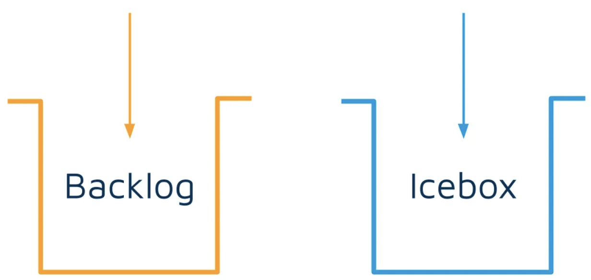

export { default as default } from "../../../../components/post-layout";

# Backlog and Icebox

Roles & Responsibilities:

- **Product Owner (PO):** Focuses on understanding and meeting customer needs, creating user stories, and collaborating with the Tech Lead on story design.
- **Tech Lead (TL):** Ensures technical quality, sustainability, and balance with the PO's influence.

**Iteration Board:**

- **Icebox:** A holding area for potential work items.
- **Backlog:** Prioritized work items ready for development.

**Process:**

- **Icebox:** Ideas are initially placed here by anyone.
- **Backlog:** Stories move here after PO and TL agreement and meeting the "definition of ready". Chores can be added directly by the TL. Bugs go directly to the top of the Backlog.

**Key Points:**

- **Balance of power:** Chores are introduced to counterbalance the PO's influence and ensure technical quality.
- **Communication:** Collaboration between PO and TL is essential for successful iteration.
